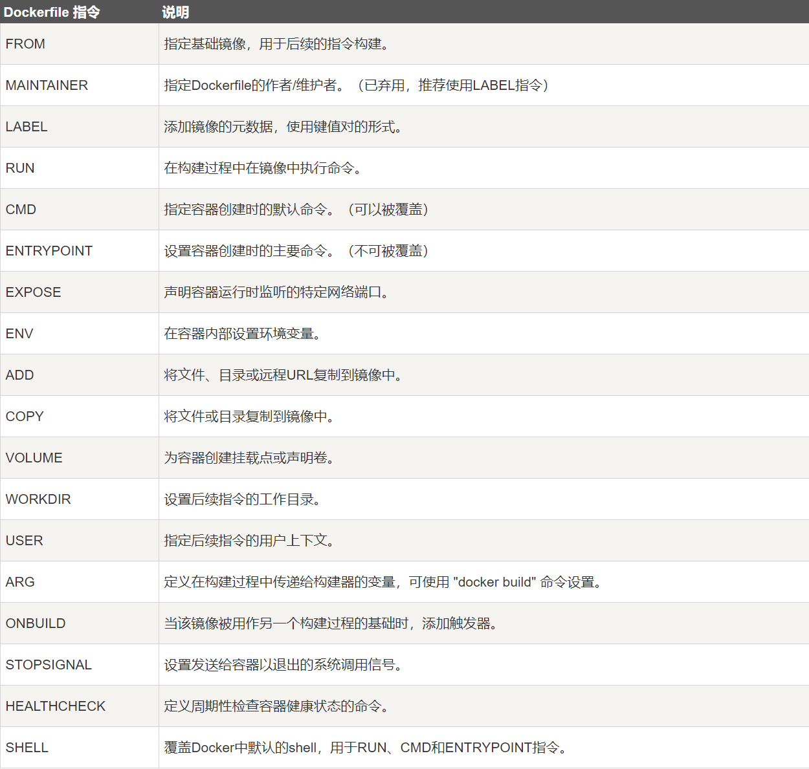

# Docker基本操作

## Docker基本命令

```sh
docker run 启动一个新容器。
docker start 启动一个已经停止的容器。
docker stop 停止正在运行的容器。
docker ps 列出所有正在运行的容器。
docker ps -a列出所有容器（包括已经停止的）。
docker images 列出所有镜像。
docker pull 拉取一个镜像到本地。
docker push 将一个本地的镜像推送到远程仓库。
docker rm 删除一个已经停止的容器。
docker rmi 删除一个镜像。
docker exec 在正在运行的容器中执行命令。
docker exec -it 容器名 bash进入容器
docker inspect 查看容器或镜像的详细信息。
docker build 根据 Dockerfile 创建镜像。
docker-compose 用于多容器的编排和管理。
```


运行一个容器

```sh
docker run --name containerName -p 80:80 -d nginx
```

- docker run ：创建并运行一个容器
- --name : 给容器起一个名字，比如叫做mn
- -p ：将宿主机端口与容器端口映射，冒号左侧是宿主机端口，右侧是容器端口
- -d：后台运行容器
- nginx：镜像名称，例如nginx


## 基于java17构建Java项目

* 新建一个空的目录，然后在目录中新建一个文件，命名为Dockerfile，将要构建的项目放在目录下。实例中为Middleware-Practice-0.0.1-SNAPSHOT.jar

* 编写Dockerfile文件：

  

  ```dockerfile
  FROM openjdk:17-jdk-alpine
  WORKDIR /app
  COPY ./Middleware-Practice-0.0.1-SNAPSHOT.jar /app
  EXPOSE 8080
  ENTRYPOINT java -jar /app/Middleware-Practice-0.0.1-SNAPSHOT.jar
  ```

- 使用docker build命令构建镜像

  ```sh
  使用当前目录的 Dockerfile 创建镜像，标签为 hello-world
  --tag, -t: 镜像的名字及标签
  docker build -t hello-world .
  ```

- 使用docker run创建容器并运行

```sh
docker run --name Myhello-wolrd -p8080:8080 -d hello-world
```


小结：

1. Dockerfile的本质是一个文件，通过指令描述镜像的构建过程

2. Dockerfile的第一行必须是FROM，从一个基础镜像来构建

3. 基础镜像可以是基本操作系统，如Ubuntu。也可以是其他人制作好的镜像，例如：openjdk:17-jdk-alpine
