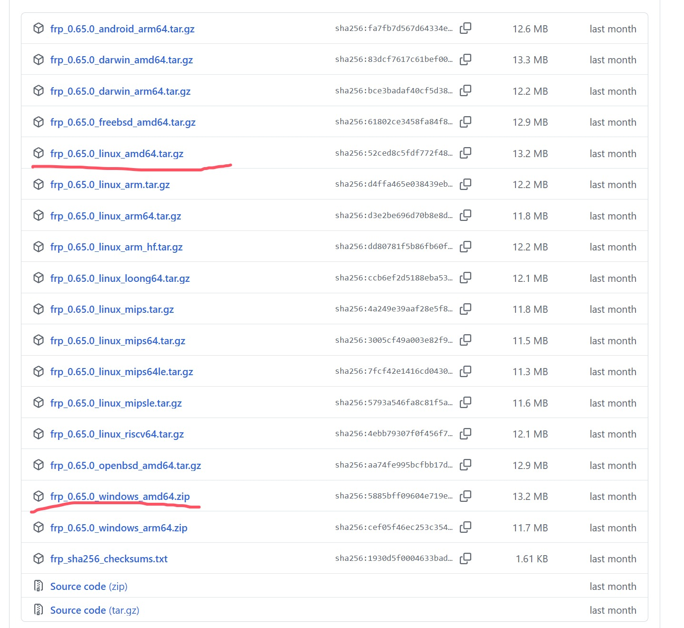
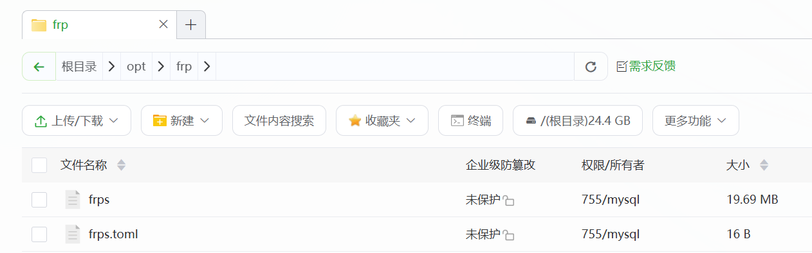
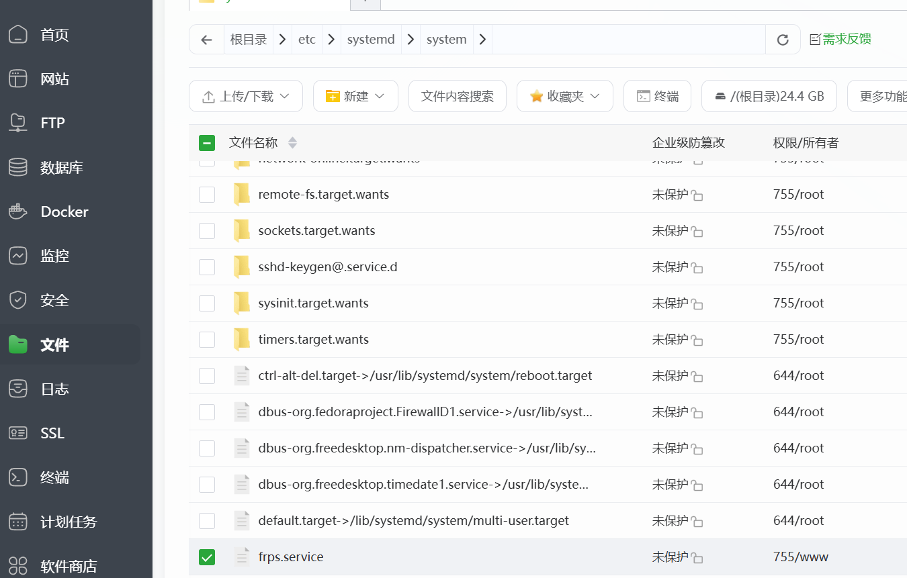
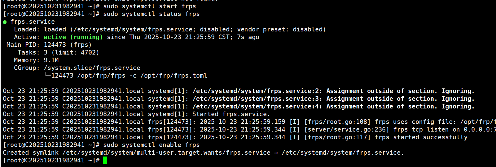
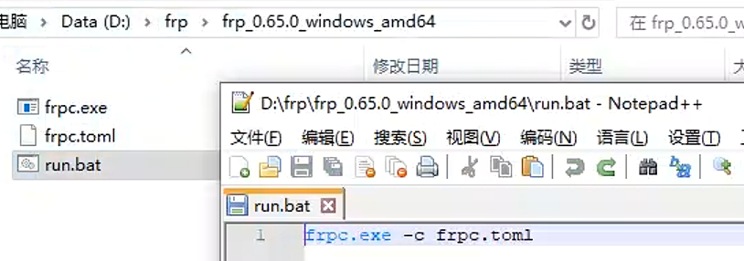
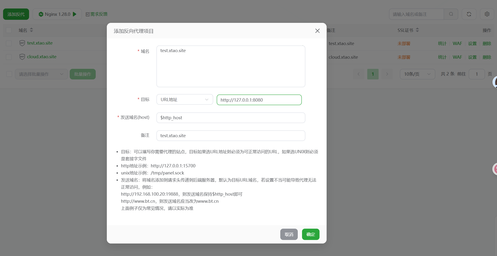

# Frp内网穿透搭建

## 介绍

* frp是一个简单高效的内网穿透工具，将服务端部署在具有公网 IP 的机器上，客户端部署在内网或防火墙内的机器上，通过访问暴露在服务器上的端口，反向代理到处于内网的服务。可用于搭建网站、网盘、MC联机等。
* 本文主要介绍使用frp搭建网盘服务，并通过公网访问。


## 下载

官方文档：https://gofrp.org/zh-cn/
Github：https://github.com/fatedier/frp

因为具有公网IP的服务器为Linux系统，本地网盘服务是windows系统，所以我们俩个都要下



## 服务端部署
下载完后，在具有公网IP的服务器上部署，我使用的是宝塔面板。
1. 安装 systemd
```sh
# 使用 yum 安装 systemd（CentOS/RHEL）
yum install systemd

# 使用 apt 安装 systemd（Debian/Ubuntu）
apt install systemd
```

2. 上传、解压文件到任意目录，为了方便重命名了文件夹，我这里路径为/opt/frp目录，这里可以删除frpc、frpc.toml(frp-client)文件夹，仅保留frps、frps.toml(frp-service)服务器的内容。

在 frps.toml 文件中添加以下内容，以指定 HTTP 请求的监听端口为 8080
```sh
bindPort = 7000
vhostHTTPPort = 8080
```

3. 在 /etc/systemd/system 目录下创建一个 frps.service 文件，用于配置 frps 服务。

写入内容
```sh
[Unit]
# 服务名称，可自定义
Description = frp server
After = network.target syslog.target
Wants = network.target

[Service]
Type = simple
# 启动frps的命令，需修改为您的frps的安装路径
# 我这里为 /opt/frp/frps -c /opt/frp/frps.toml
ExecStart = /path/to/frps -c /path/to/frps.toml

[Install]
WantedBy = multi-user.target
```

4. 使用 systemd 命令管理 frps 服务
```sh
# 启动frp
sudo systemctl start frps
# 停止frp
sudo systemctl stop frps
# 重启frp
sudo systemctl restart frps
# 查看frp状态
sudo systemctl status frps
```

5. 设置 frps 开机自启动
```sh
sudo systemctl enable frps
```   
如图，表示frp服务端启动成功



## 客户端部署
在本地windows端部署frp客户端
1. 解压文件，并删除frps、frps.toml。新建一个run.bat文本用于启动frp,如下。


2. 配置frpc.tmol
```sh
# 服务器公网IP
serverAddr = "xxx.xx.xxx.xxx"
serverPort = 7000

[[proxies]]
name = "cloud" # 隧道名
type = "http"  # 类型
localIP = "127.0.0.1" # 本地IP
localPort = 5212 # 本地服务端口
customDomains = ["cloud.xtao.site"] # 自定义域名访问

[[proxies]]
name = "tets"
type = "http"
localIP = "127.0.0.1"
localPort = 5213
customDomains = ["test.xtao.site"]
```

3. 双击run.bat启动服务
4. 域名解析，将 `cloud.xtao.site` 和 `test.xtao.site` 的域名 A 记录解析到服务器的 IP 地址 `x.x.x.x`。如果服务器已经有对应的域名，您还可以将 CNAME 记录解析到原始域名。
5. 通过浏览器访问
使用浏览器访问 `http://cloud.xtao.site:8080` 即可访问内网机器上的 5212 端口服务，访问 `http://test.xtao.site:8080` 可以访问内网机器上的 5213 端口服务。
::: tip
当然，test.xtao.site和cloud.xtao.site可以是两个完全不同的域名
:::

6. 如果你认为需要加上端口比较麻烦，可以使用nginx反向代理实现无端口访问。
   * 在宝塔中安装nginx，启动nginx,添加反向代理如下


## 总结
frp可以通过借助拥有外网IP的机器，实现外网访问内网中的服务。过程如下，浏览器输入域名后，DNS解析到服务器地址，nginx反向代理会根据你访问的域名匹配server块(如果使用的是ip访问,而且你也没有为ip设置server块,则会匹配默认server块,如果没有默认则会转发到第一个server块)，反向代理都转发到了`127.0.0.1:8080`即frp用于接收内网穿透的 HTTP 流量的端口。通过内网穿透结合客户端中`customDomains` 的配置即可访问到本地不同的web服务。
```sh
# 宝塔nginx默认块
server
{
    listen 80;
    server_name _; # 用下划线表示“不匹配任何域名”
    index index.html;
    root /www/server/nginx/html;
}
```
