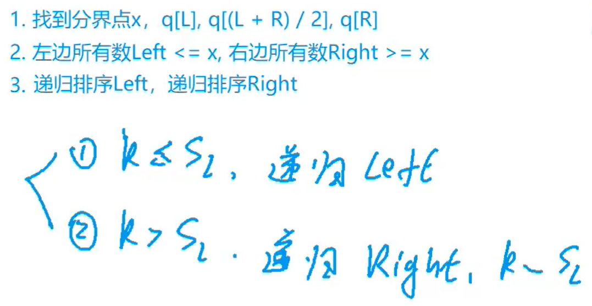
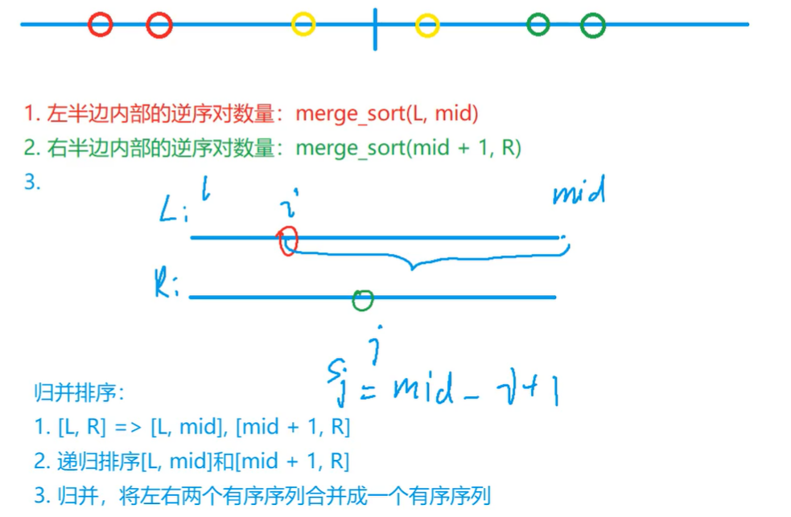
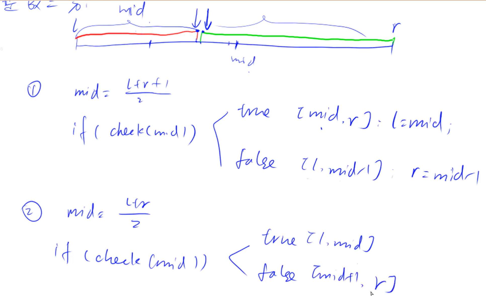
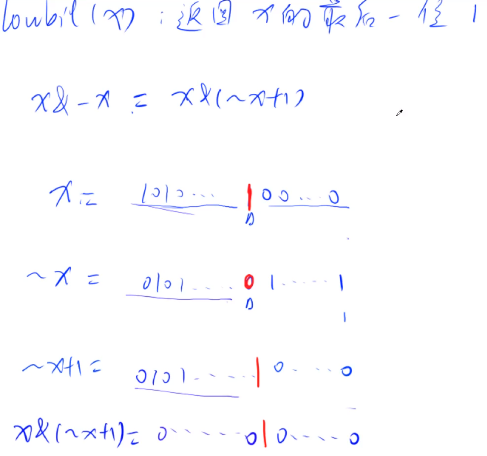
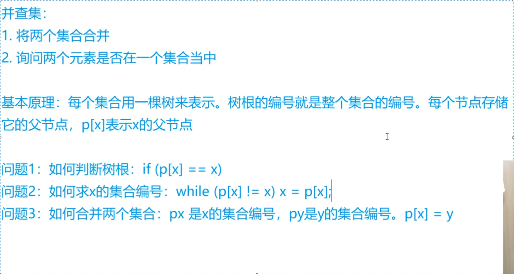
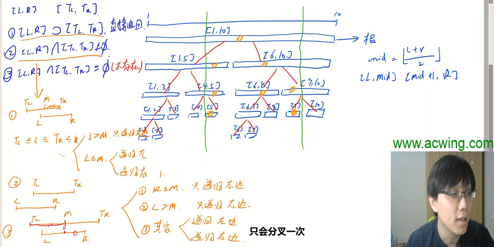
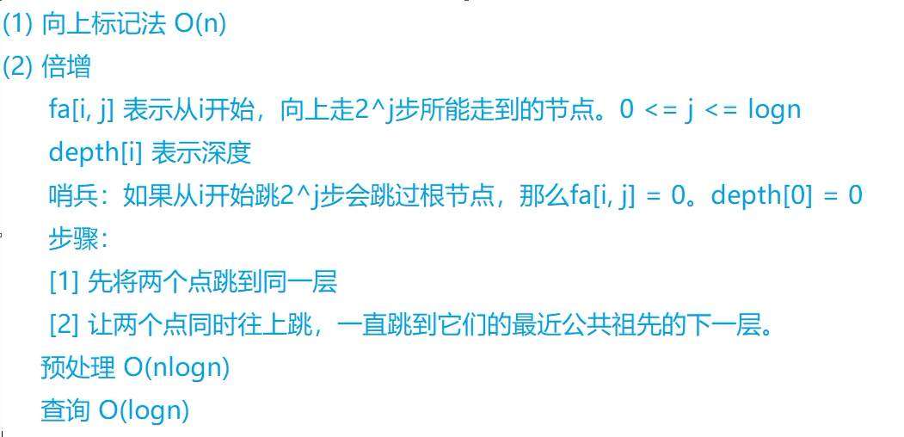
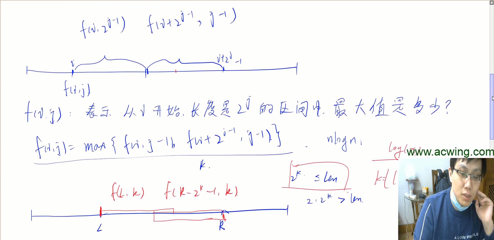
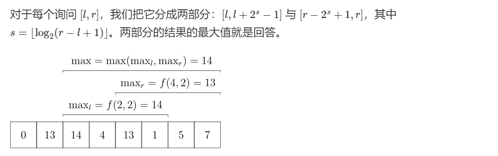

# 基础算法

## 快速排序

```c++
#include <cstdio>
#include <iostream>
using namespace std;

const int N = 1e5 + 10;

int n;
int q[N];

void quick_sort(int q[], int l, int r) {
    if (l >= r) return;
    //x取左边界时，即x = q[l] 或 x = q[(l + r) >> 1]，
    //必须要用j，因为(q, l, i - 1),(q, i, r)如果左边不动，在左边界相遇最后i = j = 左边界,
    //第二个范围相当于(q, l,  r);相当于没动，进入死循环，
    //而(q, l, j)(q, j + 1, r),第二个会少一个数，不会进入死循环
    //同理，x取右边界，即x = [r] 或 x = [l + r + 1>> 1]，必须用i
    /*
    用i则不能取到左边界，把x取值改成向上取整
    用j则不能取到右边界，把x取值改成向下取整
    取到边界会导致递归死循环
    */
    int x = q[(l + r + 1) >> 1], i = l - 1, j = r + 1;
    while (i < j) {
        do i++; while (q[i] < x);
        do j--; while (q[j] > x);
        if (i < j) swap(q[i], q[j]);
    }
    quick_sort(q, l, i - 1);
    quick_sort(q, i, r);
}

int main()
{
    scanf("%d", &n);
    for (int i = 0; i < n; i++) {
        scanf("%d", &q[i]);
    }

    quick_sort(q, 0, n - 1);

    for (int i = 0; i < n; i++) {
        printf("%d ", q[i]);
    }

    return 0;
}
```

**快速选择排序：求第K小的数**



```c++
int quick_select(int l, int r, int k)  {
    if (l >= r) return a[l];
    
    int i = l - 1, j = r + 1, x = a[l + r >> 1];
    while (i < j) {
        do i++; while(a[i] < x);
        do j--; while(a[j] > x);
        if (i < j) swap(a[i],a[j]);
    }
    int sl = j - l + 1;
    if (sl >= k) {
        return quick_select(l, j, k);
    } else {
        return quick_select(j + 1, r, k - sl);
    }
}
```


## 归并排序

```c++
#include <cstdio>
#include <iostream>
#include <cstring>
#include <algorithm>
using namespace std;

const int N = 1e5 + 10;
int q[N],temp[N];
int n;

void merge_sort(int q[], int l, int r) {
    if (l >= r) return;
    //划分
    int mid = l + r >> 1;
    merge_sort(q, l, mid);
    merge_sort(q, mid + 1, r);
    //归并
    int i = l, j = mid + 1, k = 0;
    while (i <= mid && j <= r) {
        if (q[i] <= q[j]) {
            temp[k++] = q[i++];
        } else {
            temp[k++] = q[j++];
        }
    }
    while (i <= mid) {
        temp[k++] = q[i++];
    }
    while (j <= r) {
        temp[k++] = q[j++];
    }
    for (i = l, j = 0; i <= r; i++, j++) {
        q[i] = temp[j];
    }

}

int main()
{
    scanf("%d", &n);
    for (int i = 0; i < n; i++) {
        scanf("%d", &q[i]);
    }

    merge_sort(q, 0, n - 1);

    for (int i = 0; i < n; i++) {
        printf("%d ", q[i]);
    }

    return 0;
}
```

**求逆序对数量**



```c++
#include <iostream>
using namespace std;

typedef long long LL;
const int N = 1e5 + 10;
int n;
int a[N], temp[N];

LL merge_sort(int a[], int l, int r) {
    if (l >= r) return 0;
    int mid = (l + r) >> 1;
    int lCount = merge_sort(a, l, mid);
    int rCount = merge_sort(a, mid + 1, r);
    
    //归并
    LL res = lCount + rCount;
    int i = l, j = mid + 1, k = 0;
    while (i <= mid && j <= r) {
        if (a[i] <= a[j]) {
            temp[k++] = a[i++];
        } else {
            temp[k++] = a[j++];
            res += mid - i + 1;//核心
        }
    }
    while (i <= mid) temp[k++] = a[i++];
    while (j <= r) temp[k++] = a[j++];
    //
    for (i = l, j = 0; i <= r; i++, j++) {
        a[i] = temp[j];
    }
    return res;
}

int main()
{
    cin >> n;
    for (int i = 0; i < n; i++) {
        cin >> a[i];
    }
    LL count = merge_sort(a, 0, n - 1);
    cout << count;
    
    return 0;
}
```


## 整数二分



检查函数是否满足某种性质

找到符合性质的最大的数或最小的数


```c++
bool check(int x) {/* ... */} // 检查x是否满足某种性质

// 区间[l, r]被划分成[l, mid]和[mid + 1, r]时使用：
//区间不断向左缩，r = mid，绿色的线，找到满足某种性质的最小的数
int bsearch_1(int l, int r)
{
    while (l < r)
    {
        int mid = l + r >> 1;
        if (check(mid)) r = mid;    // check()判断mid是否满足性质
        else l = mid + 1;
    }
    return l;
}
// 区间[l, r]被划分成[l, mid - 1]和[mid, r]时使用：
//区间不断向右缩，l = mid;，红色的线，找到满足某种性质的最大的数
int bsearch_2(int l, int r)
{
    while (l < r)
    {
        int mid = l + r + 1 >> 1;
        if (check(mid)) l = mid;
        else r = mid - 1;
    }
    return l;
}
```

```c++
#include <iostream>
#include <cstdio>
#include <string>
#include <algorithm>
using namespace std;

const int N = 1e5 + 10;
int a[N];
int n, q, x;

int main()
{
    scanf("%d%d", &n, &q);
    for (int i = 0; i < n; i++) {
        scanf("%d", &a[i]);
    }
    while (q--) {
        scanf("%d", &x);
        int l = 0, r = n - 1;
        while (l < r) {
            int mid = l + r >> 1;
            if (a[mid] >= x) {
                r = mid;//mid不断更新为r,如果向上取整可能会取为r相当于没变
            } else {
                l = mid + 1;
            }
        }
        //满足>=x最小的数不是x,即不存在x
        if (a[l] != x) {
            cout << "-1 -1" << endl;
        } else {
            cout << l << " ";
            int l = 0, r = n - 1;
            while (l < r) {
                int mid = l + r + 1 >> 1;
                if (a[mid] <= x) {
                    l = mid;
                } else {
                    r = mid - 1;
                }
            }
            cout << l << endl;
        }
        
    }
    
}
```


## 小数二分

```c++
bool check(double x) {/* ... */} // 检查x是否满足某种性质

double bsearch_3(double l, double r)
{
    //保留4小数1e-6，5位小数1e-7，6位小数1e-8
    const double eps = 1e-6;   // eps 表示精度，取决于题目对精度的要求
    while (r - l > eps)
    {
        double mid = (l + r) / 2;
        if (check(mid)) r = mid;
        else l = mid;
    }
    return l;
}
```


## 高精度加法

```c++
vector<int> add(vector<int> a, vector<int> b) {
    vector<int> c(a.size() + b.size(), 0);
    for (int i = 0; i < a.size(); i++) c[i] += a[i];
    for (int i = 0; i < b.size(); i++) c[i] += b[i];
    
    for (int i = 0; i < c.size() - 1; i++) {
        c[i + 1] += c[i] / 10;
        c[i] = c[i] % 10;
    }
    while (c.size() > 1 && c.back() == 0) c.pop_back();
    return c;
}
```

```c++
vector<int> add(vector<int>& A, vector<int>& B) {
    if (A.size() < B.size()) return add(B,A);
    
    vector<int> C;
    int t = 0;//进位
    for (int i = 0; i < A.size(); i++) {
        A[i] += t;
        if (i < B.size()) A[i] += B[i];
        C.push_back(A[i] % 10);
        t = A[i] / 10;
    }
    if (t) {
        C.push_back(t);
    }
    return C;
}
```


## 高精度减法

```c++
// C = A - B, 满足A >= B, A >= 0, B >= 0
vector<int> sub(vector<int>& A, vector<int>& B) {
    int t = 0;//借位
    vector<int> C;
    for (int i = 0; i < A.size(); i++) {
        A[i] -= t;
        if (i < B.size()) A[i] -= B[i];
        C.push_back((A[i] + 10) % 10);
        if (A[i] < 0) t = 1;
        else t = 0;
    }
    while (C.size() > 1 && C.back() == 0) C.pop_back();
    return C;
}
```


## 高精度×低精度

```c++
vector<int> mul(vector<int> &A, int b) {
    int t = 0;
    vector<int> C;
    for (int i = 0; i < A.size() || t; i++) {
        if(i < A.size()) t += A[i] * b;
        C.push_back(t % 10);
        t /= 10;
    }
    while (C.size() > 1 && C.back() == 0) C.pop_back();
    return C;
}
```


## 高精度×高精度

```c++
vector<int> mul(vector<int> a, vector<int> b) {
	vector<int> c(a.size() + b.size() + 10, 0);
	for (int i = 0; i < a.size(); i++) {
		for (int j = 0; j < b.size(); j++) {
			c[i + j] += a[i] * b[j];//+=
		}
	}
	for (int i = 0; i + 1 < c.size(); i++) {
		c[i + 1] += c[i] / 10;
		c[i] = c[i] % 10;
	}
	while (c.size() > 1 && c.back() == 0) c.pop_back();
	return c;
}
```


## 高精度÷低精度

```c++
vector<int> div(vector<int> &A, int b, int &r) {//余数引用
    vector<int> C;
    for (int i = A.size() - 1; i >= 0; i--) {//从高位开始除
        r = r * 10 + A[i];
        C.push_back(r / b);
        r = r % b;
    }
    reverse(C.begin(), C.end());
    while (C.size() > 1 && C.back() == 0) C.pop_back();
    return C;
}
```


## 一维前缀和

```
S[i] = a[1] + a[2] + ... a[i]
s[0] = 0;
求前缀和s[i] = s[i - 1] + a[i]
a[l] + ... + a[r] = S[r] - S[l - 1]
```


## 二维前缀和

```
求前缀和s[i][j] = s[i - 1][j] + s[i][j - 1] - s[i - 1][j - 1] + a[i][j];

S[i, j] = 第i行j列格子左上部分所有元素的和
以(x1, y1)为左上角，(x2, y2)为右下角的子矩阵的和为：
S[x2, y2] - S[x1 - 1, y2] - S[x2, y1 - 1] + S[x1 - 1, y1 - 1]

s[x2][y2] - s[x2][y1 - 1] - s[x1 - 1][y2] + s[x1 - 1][y1 - 1]
```


## 一维差分

```
给区间[l, r]中的每个数加上c：B[l] += c, B[r + 1] -= c
```

```
知识点1：差分与前缀和是一组相反的操作，假设给定一个数组 A ，其前缀和数组表示A[i]及其之前所有数的和。其差分数组则表示该数组的前缀和为A[i]，即假设B的前缀和数组为A，则B是A的差分数组。

知识点2：假设给定一个数组 A ，其差分数组为 B， 如果对A数组的某个区间 [l, r]上每个数都加一个数c， 其等价于 B 数组中 B[l] += c，且 B[r + 1] -=c。因为A[l]表示B[l]的前缀和，则如果B[l]多加一个c（B[l] += c），则A[l]（B[1] + B[2] + ...B[l] + c）, A[l+1], …, A[r], A[r + 1], …, A[n] 都将多加一个c。而我们只需要 [l, r] 上加c，所以对于 A 在 [r+1, n]区间上的值再减去 c，即对应于 B[r + 1] -= c。

知识点3：在初始化时，我们可以理解为在0数组上，依次插入一个c = A[i]，则只需要对差分数组执行 B[i] += A[i], B[i + 1] -= A[i]即可

知识点4：最终所有m个操作后，得到的是对差分数组B的操作，分别求其各个位置的前缀和即得到A数组

知识点5：本题其实可以直接按照原始的方法，依次遍历 A 数组的 [l, r] 区间，并执行 A[i] += c，但每次的操作的时间复杂度都是O(n)，使用差分数组，则可以将每次操作转换为一个公式即可，即时间复杂度变为 O(1)。更直观的来说，修改前缀和的某个连续区间范围内的值，可以转化为只需要修改其差分数组的某两个值。
```

```c++
#include <iostream>
using namespace std;

const int N = 1e5 + 10;

int n, m;
int a[N], b[N];
 
 void insert(int l, int r, int c) {
     b[l] += c;
     b[r + 1] -= c;
 }
 
int main()
{
    scanf("%d%d", &n, &m);
    for (int i = 1; i <= n; i++) {
        scanf("%d", &a[i]);
    }
    //构造差分数组b
    //第一次a1 -a1
    //第二次a1 a2-a1 -a2
    //第三次a1 a2-a1 a3-a2 -a3
    //第四次a1 a2-a1 a3-a2 a4-a3 -a4
    //b数组的前缀和是a,b构成a的差分数组
    for (int i = 1; i <= n; i++) {
        insert(i, i, a[i]);
    }
    //利用前缀和求
    //for (int i = i; i <= n; i++) {
    //    b[i] = a[i] - a[i - 1];
    //}
    
    while (m--) {
        int l, r, c;
        scanf("%d%d%d", &l, &r, &c);
        insert(l, r, c);
    }
    //求a
    for (int i = 1; i <= n; i++) {
        b[i] = b[i - 1] + b[i];
        printf("%d ", b[i]);
    }
    return 0;
}
```

```c++
for (int i = 1; i <= n; i++) {
        insert(i, i, a[i]);
    }
```

其实是假定a数组最开始都是0，那么b数组初始时就是a数组的差分数组了，对于每一个a[i]，相当于插入了一个数，可以直接调用insert函数即可。
当然也可以从差分数组的定义出发，for(int i=1;i<=n;i) b[i]=a[i]-a[i-1]; 用这一行替换上一行，效果一样，只是上边的把a数组当成全为0，读入的a[i]再插入，这一个把读入后的当做a数组。


## 二维差分

```
给以(x1, y1)为左上角，(x2, y2)为右下角的子矩阵中的所有元素加上c：
S[x1, y1] += c, S[x2 + 1, y1] -= c, S[x1, y2 + 1] -= c, S[x2 + 1, y2 + 1] += c
```


```c++
#include <iostream>
using namespace std;

const int N = 1010;
int n, m, q;
int a[N][N], b[N][N];

void insert(int x1, int y1, int x2, int y2, int c) {
    b[x1][y1] += c;
    b[x2 + 1][y1] -= c;
    b[x1][y2 + 1] -= c;
    b[x2 + 1][y2 + 1] += c; 
}

int main()
{
    scanf("%d%d%d",&n, &m, &q);
    for (int i = 1; i <= n; i++) {
        for (int j = 1; j <= m; j++) {
            scanf("%d", &a[i][j]);
        }
    }
    
    //构造差分数组b
    for (int i = 1; i <= n; i++) {
        for (int j = 1; j <= m; j++) {
            insert(i, j, i, j, a[i][j]);
        }
    }
    //利用前缀和公式,a为b的前缀和
    // for (int i = 1; i <= n; i++) {
    //     for (int j = 1; j <= m; j++) {
    //         b[i][j] = a[i][j] - a[i - 1][j] - a[i][j - 1] + a[i - 1][j - 1];
    //     }
    // }
    
    while (q--) {
        int x1, y1, x2, y2, c;
        scanf("%d%d%d%d%d", &x1, &y1, &x2, &y2, &c);
        insert(x1, y1, x2, y2, c);
    }
    for (int i = 1; i <= n; i++) {
        for (int j = 1; j <= m; j++) {
            b[i][j] = b[i - 1][j] + b[i][j - 1] - b[i - 1][j - 1] + b[i][j];
            printf("%d ", b[i][j]);
        }
        printf("\n");
    }
    
    return 0;
}
```


## 双指针算法

```c++
for (int i = 0, j = 0; i < n; i ++ )
{
    while (j < i && check(i, j)) j ++ ;
    // 具体问题的逻辑
}
```

```
常见问题分类：
    (1) 对于一个序列，用两个指针维护一段区间
    (2) 对于两个序列，维护某种次序，比如归并排序中合并两个有序序列的操作
```


## 位运算

```
求n的第k位数字: ((n >> k) & 1)
返回n的最后一位1：lowbit(n) = n & -n  //求1的个数
```




## 离散化

```c++
vector<int> alls; // 存储所有待离散化的值
sort(alls.begin(), alls.end()); // 将所有值排序
alls.erase(unique(alls.begin(), alls.end()), alls.end());   // 去掉重复元素

//离散化 将所有去重后待离散化的值映射到1 - alls.size()上
//每一个去重后的值对应一个1 - alls.size()下标
//建立新索引，来缩小目标区间，使得可以进行一系列连续数组可以进行的操作比如二分，前缀和等…

// 二分求出x对应的离散化的值
int find(int x) // 找到第一个大于等于x的位置
{
    int l = 0, r = alls.size() - 1;
    while (l < r)
    {
        int mid = l + r >> 1;
        if (alls[mid] >= x) r = mid;
        else l = mid + 1;
    }
    //因为使用前缀和，其下标要+1可以不考虑边界问题
    return r + 1; // 映射到1, 2, ...n
}
```

```c++
//对非递减数组进行去重,unique()函数的底层原理
vector<int>::iterator unique(vector<int>& arr) {
    int j = 0;
    for (int i = 0; i < arr.size(); i++) {
        if (!i || arr[i] != arr[i - 1]) {
            arr[j++] = arr[i];
        }
    }
    return arr.begin() + j;
}
```


## 区间合并

```c++
// 将所有存在交集的区间合并
void merge(vector<pair<int, int>> &arr)
{
    sort(arr.begin(), arr.end());
    // 左右端点初始化，-无穷
    int start = -2e9, end = -2e9;
    vector<pair<int, int>> res;
    
    for (auto item : arr) {
        if(item.first > end) {
            if(start != -2e9) res.push_back({start, end});// 初始的[-无穷，-无穷]区间要跳过，不能装入
            start = item.first;//更新区间
            end = item.second;//更新区间
        } else {
            end = max(end, item.second);
        }
    }
    // 有两个作用，1.是防止n为0，把[-无穷，-无穷]压入；2.是压入最后一个（也就是当前）的区间，若n>=1，if可以不要
    if (start != -2e9) {
        res.push_back({start ,end});//最后一段区间
    }
    arr = res;
}
```


# 数据结构

## 单链表

```c++
//下标相当于地址，idx相当于地址
int e[N], ne[N], idx;

void init()
{
    //e[0] = 0;
    ne[0] = -1;//将下标0作为头指针节点，不参与运算，但便于统一操作
    idx++;//从1开始分配地址
}

void add(int k, int x)
{
    e[idx] = x;
    ne[idx] = ne[k];
    ne[k] = idx++;
}

void remove(int k) {
    ne[k] = ne[ne[k]];//cur->next = cur->next->next;
}

for (int i = ne[0]; i != -1; i = ne[i]) {
        cout << e[i] << " ";
    }
```


## 双链表

```c++
// val[]表示节点的值，l[]表示节点的左指针，r[]表示节点的右指针
int val[N], l[N], r[N];
int cur;//下标相当于地址，cur相当于地址

void init() {
    //0是左端点，1是右端点
    cur = 2;
    r[0] = 1;//初始时0的右端点为1
    l[1] = 0;//1的左端点为0
}

//在第k个数的右边插入x
void insert_list(int k, int x) {
    val[cur] = x;
    r[cur] = r[k];
    l[cur] = k;
    l[r[k]] = cur;
    r[k] = cur;
    cur++;
}

void delete_list(int k) {
    r[l[k]] = r[k];
    l[r[k]] = l[k];
}

//遍历
for (int i = r[0]; i != 1; i = r[i]) {
        cout << val[i] << " ";
}
```

1. 之所以在 “D”, “IL”, “IR” 要用`` k+1`` 的原因是 双链表的起始点是2. 所以，每个插入位置k的真实位置应该为 ``k-1+2 = k+1``
2. 0, 1 节点的作用是边界。0为左边界，1为右边界。他俩在这里有点类似保留字的作用。正因如此，我们的cur也是从2开始
3. 最后遍历输出结果的 ``for (int i = r[0]; i != 1; i = r[i])``。从 r[0] 开始是因为 0 为左边界，而终止条件 i==1是因为1为右边界（如果碰到，说明已经遍历完毕）


## 栈

```c++
// tt表示栈顶
int stk[N], tt = 0;

// 向栈顶插入一个数
stk[ ++ tt] = x;

// 从栈顶弹出一个数
tt -- ;

// 栈顶的值
stk[tt];

// 判断栈是否为空，如果 tt > 0，则表示不为空
if (tt > 0){

}
```


## 队列

```c++
//普通队列
// hh 表示队头，tt表示队尾
int q[N], hh = 0, tt = -1;

// 向队尾插入一个数
q[ ++ tt] = x;

// 从队头弹出一个数
hh ++ ;

// 队头的值
q[hh];

// 判断队列是否为空，如果 hh <= tt，则表示不为空
if (hh <= tt){

}
```

```c++
//循环队列
// hh 表示队头，tt表示队尾的后一个位置
int q[N], hh = 0, tt = 0;

// 向队尾插入一个数
q[tt ++ ] = x;
if (tt == N) tt = 0;

// 从队头弹出一个数
hh ++ ;
if (hh == N) hh = 0;

// 队头的值
q[hh];

// 判断队列是否为空，如果hh != tt，则表示不为空
if (hh != tt){

}
```


## 单调栈

```c++
常见模型：找出每个数左边离它最近的比它大/小的数
int stk[N], tt;
for (int i = 1; i <= n; i ++ )
{
    while (tt && check(stk[tt], i)) tt -- ;
    stk[ ++ tt] = i;
}
```


## 单调队列

```c++
常见模型：找出滑动窗口中的最大值/最小值
int hh = 0, tt = -1;
for (int i = 0; i < n; i ++ )
{
    while (hh <= tt && check_out(q[hh])) hh ++ ;  // 判断队头是否滑出窗口
    while (hh <= tt && check(q[tt], i)) tt -- ;
    q[ ++ tt] = i;
}
```

本质上就是删除那些没有必要的元素，形成一个候选集


## Trie树/字典树/前缀树

```c++
//son[父亲地址][儿子的名字] = 儿子地址
//count[]存储以每个地址结尾的单词数量
//cur分配地址
int son[N][26], count[N], idx;
char str[N];

// 插入一个字符串
void Insert(char *str) {
    int p = 0;
    for (int i = 0; str[i]; i++) {
        int c = str[i] - 'a';
        if (!son[p][c]) son[p][c] = ++idx;
        p = son[p][c];
    }
    count[p]++;
}

// 查询字符串出现的次数
int Query(char *str) {
    int p = 0;
    for (int i = 0; str[i]; i++) {
        int c = str[i] - 'a';
        if (!son[p][c]) return 0;
        p = son[p][c];
    }
    return count[p];
}
```


## 并查集



```c++
(1)朴素并查集：

    int p[N]; //存储每个点的祖宗节点

    // 返回x的祖宗节点
    int find(int x)
    {//只要当前节点不是根节点，就返回当前节点的父节点的祖宗节点
        if (p[x] != x) p[x] = find(p[x]);
        return p[x];
    }

    // 初始化，假定节点编号是1~n
    for (int i = 1; i <= n; i ++ ) p[i] = i;

    // 合并a和b所在的两个集合：
    p[find(a)] = find(b);


(2)维护size的并查集：

    int p[N], size[N];
    //p[]存储每个点的祖宗节点, size[]只有祖宗节点的有意义，表示祖宗节点所在集合中的点的数量

    // 返回x的祖宗节点
    int find(int x)
    {
        if (p[x] != x) p[x] = find(p[x]);
        return p[x];
    }

    // 初始化，假定节点编号是1~n
    for (int i = 1; i <= n; i ++ )
    {
        p[i] = i;
        size[i] = 1;
    }

    // 合并a和b所在的两个集合：
    size[find(b)] += size[find(a)];
    p[find(a)] = find(b);


(3)维护到祖宗节点距离的并查集：

    int p[N], d[N];
    //p[]存储每个点的祖宗节点, d[x]存储x到p[x]的距离

    // 返回x的祖宗节点
    int find(int x)
    {
        if (p[x] != x)
        {
            int u = find(p[x]);
            d[x] += d[p[x]];
            p[x] = u;
        }
        return p[x];
    }

    // 初始化，假定节点编号是1~n
    for (int i = 1; i <= n; i ++ )
    {
        p[i] = i;
        d[i] = 0;
    }

    // 合并a和b所在的两个集合：
    p[find(a)] = find(b);
    d[find(a)] = distance; // 根据具体问题，初始化find(a)的偏移量
```


## 堆

```c++
// h[N]存储堆中的值, h[1]是堆顶，x的左儿子是2x, 右儿子是2x + 1
// ph[k]存储第k个插入的点在堆中的位置
// hp[k]存储堆中下标是k的点是第几个插入的
//	ph(point->heap) 可以获得第几个插入的元素现在在堆的那个位置
//  hp(heap->point) 堆中的位置是第几个插入的
int h[N], ph[N], hp[N], size;

// 交换两个点，及其映射关系
// h[x] 表示树中位置 x 的元素
// ph[k] = x 表示第 k 个插入的元素在树中存放的位置 x
// 此时如果要交换 ph 中的两个元素需要知道树中位置 x 是第几个被插入的, 于是便引入了数组 hp
// hp[x] = k 表示树中位置 x 存放的为第 k 个插入的元素
void heap_swap(int a, int b)
{
    swap(ph[hp[a]],ph[hp[b]]);
    swap(hp[a], hp[b]);
    swap(h[a], h[b]);//值输入
}

void down(int u)
{
    int t = u;
    if (u * 2 <= size && h[u * 2] < h[t]) t = u * 2;
    if (u * 2 + 1 <= size && h[u * 2 + 1] < h[t]) t = u * 2 + 1;
    if (u != t)
    {
        heap_swap(u, t);//下标输入
        down(t);
    }
}

void up(int u)
{
    while (u / 2 && h[u] < h[u / 2])
    {
        heap_swap(u, u / 2);
        u >>= 1;
    }
}

// O(n)建堆
for (int i = n / 2; i; i -- ) down(i);
```


## 一般哈希 

```c++
(1) 拉链法
const int N = 1e5 + 3; //取一个大于题目范围的质数作为模，减少冲突
int h[N], e[N], ne[N];
int idx;

// 向哈希表中插入一个数
void insert(int x) {
    int k = ((x % N) + N) % N;
    e[idx] = x;
    ne[idx] = h[k];
    h[k] = idx;
    idx++;
}
// 在哈希表中查询某个数是否存在
bool find(int x) {
    int k = ((x % N) + N) % N;
    for (int i = h[k]; i != -1; i = ne[i]) {
        if (e[i] == x) {
            return true;
        }
    }
    return false;
}
```

```c++
(2) 开放寻址法
const int N = 2e5 + 3;//一般开2-3倍原数组，防止塞满了，导致死循环
const int null = 0x3f3f3f3f;//取一个大于插入数值范围的数，表示这个位置没有插入任何数
int h[N];

// 如果x在哈希表中，返回x的下标；如果x不在哈希表中，返回x应该插入的位置
int find(int x) {
    int k = ((x % N) + N) % N;
    while (h[k] != null && h[k] != x) {
        k++;
        if (k == N) k = 0;//找到末尾了从0开始
    }
    return k;
}
```


1. 取模的模数，一般是质数（不容易冲突），且一般先模再加再模(处理负数)(讲究顺序,例:-10^9^先加N即10^5^的话再模，还是负数)
2. 拉链法：头插法(数组模拟)
3. 开放寻址法(蹲坑法): 通常开数组为目标数组大小的2-3倍，find函数的功能(寻找坑位)，其返回值:若原本存在，返回存在位置的下标，若原本不存在，返回可以插入的位置下标。
4. 有关无穷大设置，在算法竞赛中，我们常采用0x3f3f3f3f来作为无穷大。0x3f3f3f3f主要有如下好处：

* 0x3f3f3f3f的十进制为1061109567，和INT_MAX一个数量级，即10^9^数量级，而一般场合下的数据都是小于10^9^的。
* 0x3f3f3f3f * 2 = 2122219134，无穷大相加依然不会溢出。
* 可以使用memset(array, 0x3f, sizeof(array))来为数组设初值为0x3f3f3f3f，因为这个数的每个字节都是0x3f


## 字符串哈希

```
核心思想：将字符串看成P进制数，P的经验值是131或13331，取这两个值的冲突概率低
最后字符串很长计算出来的值会超过ULL
小技巧：取模的数用2^64，这样直接用unsigned long long存储，溢出的结果就是取模的结果

typedef unsigned long long ULL;
ULL h[N], p[N]; // h[k]存储字符串前k个字母的哈希值, p[k]存储 P^k mod 2^64

// 初始化
p[0] = 1;
for (int i = 1; i <= n; i ++ )
{
    h[i] = h[i - 1] * P + str[i];//str[i]是字符串的话要映射成数字
    p[i] = p[i - 1] * P;
}

// 计算子串 str[l ~ r] 的哈希值
ULL get(int l, int r)
{
    return h[r] - h[l - 1] * p[r - l + 1];
}
```


## 线段树

最多只会递归一边，分叉一次，复杂度为递归深度$O(logn)$



```c++
int w[N];

struct Node{
	int l, r;
	int sum;
}tr[N * 4];

// 通过子节点来更新父节点，向上更新 
void pushup(int u) {
	tr[u].sum = tr[u << 1].sum + tr[u << 1 | 1].sum;
}

// 建树 
void build(int u, int l, int r) {
	if (l == r) tr[u] = {l, r, w[l]};
	else 
	{
		tr[u] = {l, r};
		int mid = l + r >> 1;
		build(u << 1, l, mid), build(u << 1 | 1, mid + 1, r);
		pushup(u); 	
	}
}

int query(int u, int l, int r) { // 区间查询 
	if (tr[u].l >= l && tr[u].r <= r) return tr[u].sum;
	
	int sum = 0; // 相关操作 
	int mid = tr[u].l + tr[u].r >> 1;
    //区间不变,因为l <= mid时，r也可能比mid小，此时如果把r更新成mid，那就会错误地把要查询的区间变长 
    //比如原区间是1-10，你要求2-3区间的和，也就是query(1,2,3)，此时mid是5，如果将r更新成mid，就变成query(2,2,5)，就不对了
	if (l <= mid) sum += query(u << 1, l, r); 
	if (r > mid) sum += query(u << 1 | 1, l, r);  
	return sum;
}

// 将数组第x的位置修改为v 
void modify(int u, int x, int v) { // 单点修改,不需要懒标记
	if (tr[u].l == x && tr[u].r == x) tr[u].sum += v;
	else
	{
		int mid = tr[u].l + tr[u].r >> 1;
		if (x <= mid) modify(u << 1, x, v);
		else modify(u << 1 | 1, x, v);
		pushup(u); // 该更后一定要记得更新父节点 
	}
}
```

```c++
int w[N];

struct Node{
	int l, r;
	ll sum, add;// add 懒标记,延迟更新
}tr[N * 4];

void pushup(int u) {
	tr[u].sum = tr[u << 1].sum + tr[u << 1 | 1].sum;
}

void pushdown(int u) {
	auto &root = tr[u], &left = tr[u << 1], &right = tr[u << 1 | 1];
	if (root.add) {
		left.sum += (ll)(left.r - left.l + 1) * root.add, left.add += root.add;
		right.sum += (ll)(right.r - right.l + 1) * root.add, right.add += root.add;
		root.add = 0;
	}
}

void build(int u, int l, int r) {
	if (l == r) tr[u] = {l, r, w[l], 0};
	else 
	{
		tr[u] = {l, r};
		int mid = l + r >> 1;
		build(u << 1, l, mid), build(u << 1 | 1, mid + 1, r);
		pushup(u);
//		cout << "tree:" << u << " " << tr[u].sum << endl;
	}
}

void modify(int u, int l, int r, int v) {// 区间修改
	if (tr[u].l >= l && tr[u].r <= r) {
		tr[u].sum += (ll)(tr[u].r - tr[u].l + 1) * v;
		tr[u].add += v; 
	}
	else
	{
		pushdown(u); // 将父节点信息同步到子节点，保证子节点sum正确,实现延迟更新
		int mid = tr[u].l + tr[u].r >> 1;
		if (l <= mid) modify(u << 1, l, r, v);
		if (r > mid) modify(u << 1 | 1, l, r, v);
		pushup(u);
	}
}

ll query(int u, int l, int r) {
	if (tr[u].l >= l && tr[u].r <= r) return tr[u].sum;
	else
	{
//		cout << "tree:" << u << " " << tr[u].sum << endl;
		pushdown(u);
		ll sum = 0;
		int mid = tr[u].l + tr[u].r >> 1;
		if (l <= mid) sum += query(u << 1, l, r);
		if (r > mid) sum += query(u << 1 | 1, l, r);
//		cout << "tree:" << u << " " << sum << endl;
		return sum; 
	}
}
```


## C++ STL简介

```markdown
vector, 变长数组，倍增的思想
    size()  返回元素个数
    empty()  返回是否为空
    clear()  清空
    front()/back()
    push_back()/pop_back()
    begin()/end()
    []
    支持比较运算，按字典序

pair<int, int>
    first, 第一个元素
    second, 第二个元素
    支持比较运算，以first为第一关键字，以second为第二关键字（字典序）

string，字符串
    size()/length()  返回字符串长度
    empty()
    clear()
    substr(起始下标，(子串长度))  返回子串
    c_str()  返回字符串所在字符数组的起始地址

queue, 队列
    size()
    empty()
    push()  向队尾插入一个元素
    front()  返回队头元素
    back()  返回队尾元素
    pop()  弹出队头元素

priority_queue, 优先队列，默认是大根堆
    size()
    empty()
    push()  插入一个元素
    top()  返回堆顶元素
    pop()  弹出堆顶元素
    定义成小根堆的方式：priority_queue<int, vector<int>, greater<int>> q;

stack, 栈
    size()
    empty()
    push()  向栈顶插入一个元素
    top()  返回栈顶元素
    pop()  弹出栈顶元素

deque, 双端队列
    size()
    empty()
    clear()
    front()/back()
    push_back()/pop_back()
    push_front()/pop_front()
    begin()/end()
    []

set, map, multiset, multimap, 基于平衡二叉树（红黑树），动态维护有序序列
    size()
    empty()
    clear()
    begin()/end()
    ++, -- 返回前驱和后继，时间复杂度 O(logn)

    set/multiset
        insert()  插入一个数
        find()  查找一个数
        count()  返回某一个数的个数
        erase()
            (1) 输入是一个数x，删除所有x   O(k + logn)
            (2) 输入一个迭代器，删除这个迭代器
        lower_bound()/upper_bound()
            lower_bound(x)  返回大于等于x的最小的数的迭代器
            upper_bound(x)  返回大于x的最小的数的迭代器
    map/multimap
        insert()  插入的数是一个pair
        erase()  输入的参数是pair或者迭代器
        find()
        []  注意multimap不支持此操作。 时间复杂度是 O(logn)
        lower_bound()/upper_bound()

unordered_set, unordered_map, unordered_multiset, unordered_multimap, 哈希表
    和上面类似，增删改查的时间复杂度是 O(1)
    不支持 lower_bound()/upper_bound()， 迭代器的++，--

bitset, 圧位
    bitset<10000> s;
    ~, &, |, ^
    >>, <<
    ==, !=
    []

    count()  返回有多少个1

    any()  判断是否至少有一个1
    none()  判断是否全为0

    set()  把所有位置成1
    set(k, v)  将第k位变成v
    reset()  把所有位变成0
    flip()  等价于~
    flip(k) 把第k位取反
```


# 搜索与图论

## 树与图的存储

* 树是一种特殊的图，与图的存储方式相同。
* 对于无向图中的边ab，存储两条有向边a->b, b->a。
* 因此我们可以只考虑有向图的存储。

(1) 邻接矩阵：`g[a][b]`存储边a->b

(2) 邻接表：

```c++
// 对于每个点k，开一个单链表，存储k所有可以走到的点。h[k]存储这个单链表的头结点
int h[N], e[N], ne[N], idx;

// 添加一条边a->b
void add(int a, int b)
{
    e[idx] = b, ne[idx] = h[a], h[a] = idx ++ ;
}

// 初始化
idx = 0;
memset(h, -1, sizeof h);
```


## 树与图的遍历

时间复杂度 O(n+m), n 表示点数，m 表示边数

### (1) 深度优先遍历

```c++
int dfs(int u)
{
    st[u] = true; // st[u] 表示点u已经被遍历过

    for (int i = h[u]; i != -1; i = ne[i])
    {
        int j = e[i];
        if (!st[j]) dfs(j);
    }
}
```


### (2) 宽度优先遍历

```c++
queue<int> q;
st[1] = true; // 表示1号点已经被遍历过
q.push(1);

while (q.size())
{
    int t = q.front();
    q.pop();

    for (int i = h[t]; i != -1; i = ne[i])
    {
        int j = e[i];
        if (!st[j])
        {
            st[j] = true; // 表示点j已经被遍历过
            q.push(j);
        }
    }
}
```


## 拓扑排序

```c++
bool topsort()
{
    int hh = 0, tt = -1;

    // d[i] 存储点i的入度
    for (int i = 1; i <= n; i ++ )
        if (!d[i])
            q[ ++ tt] = i;

    while (hh <= tt)
    {
        int t = q[hh ++ ];

        for (int i = h[t]; i != -1; i = ne[i])
        {
            int j = e[i];
            if (-- d[j] == 0)
                q[ ++ tt] = j;
        }
    }

    // 如果所有点都入队了，说明存在拓扑序列；否则不存在拓扑序列。
    return tt == n - 1;
}
```


## 朴素dijkstra算法

```c++
#include <bits/stdc++.h>
using namespace std;

const int N = 510;
int g[N][N], dis[N];//稠密图用邻接矩阵,dis表示到原点的距离
bool st[N];//st 表示下标顶点是否被更新过(加入了最短路径里)，
int n, m;

int dijkstra()
{
    memset(dis, 0x3f, sizeof dis);
    dis[1] = 0;//初始化原点的距离为1
    
    for (int i = 0; i < n - 1; i++) {//n-1迭代 
        int t = 0;
        for (int j = 1; j <= n; j++) {
            if(!st[j] && dis[j] < dis[t]) {
                t = j;//找到没有被更新过的点集中到原点距离最小的顶点
            }
        }
        //用这个点更新其他所有顶点(或者未被确定为最短路径的顶点)到原点的最短路径
        for (int j = 1; j <= n; j++) {
            dis[j] = min(dis[j], dis[t] + g[t][j]);//判断经过t点距离是否变短了
        }
        st[t] = true;
        
    }
    
    //判断终点是否被纳入最短路径的点集中
    if (dis[n] == 0x3f3f3f3f) {
        return -1;
    } else {
        return dis[n];
    }
}


int main()
{
    cin >> n >> m;
    memset(g, 0x3f, sizeof g);
    int a, b, c;
    for (int i = 0; i < m; i++) {
        cin >> a >> b >> c;
        g[a][b] = min(g[a][b], c);
    }
    cout << dijkstra() << endl; 
    return 0;
}
```


## 堆优化版dijkstra

```c++
#include <bits/stdc++.h>
using namespace std;

#define x first
#define y second
typedef pair<int, int> pii;
const int N = 2e5 + 10;
int n, m;
int h[N], e[N], w[N], ne[N], idx;//w[i]存储权重
bool st[N];
int dis[N];//到原点的距离

void insert(int a, int b, int c) {
    // 有重边也不要紧，假设1->2有权重为2和3的边，再遍历到点1的时候2号点的距离会更新两次放入堆中
    // 这样堆中会有很多冗余的点，但是在弹出的时候还是会弹出最小值2+x（x为之前确定的最短路径），
    // 并标记st为true，所以下一次弹出3+x会continue不会向下执行。
    e[idx] = b;
    w[idx] = c;
    ne[idx] = h[a];
    h[a] = idx++;
}

int dijkstra()
{
    // 这里heap中为什么要存pair呢，首先小根堆是根据距离来排的，所以有一个变量要是距离，
    // 其次在从堆中拿出来的时候要知道知道这个点是哪个点，不然怎么更新邻接点呢？所以第二个变量要存点。
    priority_queue<pii, vector<pii>, greater<pii>> heap;
    memset(dis, 0x3f, sizeof dis);
    
    dis[1] = 0;
    //小根堆按要距离排序,找到离原点距离最小的顶点
    heap.push({0, 1});
    
    while (!heap.empty()) {
        auto tmp = heap.top();
        heap.pop();
        
        int distance = tmp.x;
        int vertex = tmp.y;
        if (st[vertex]) continue;
        st[vertex] = true;//从小根堆里最先取出来一定最短距离，表示这个点的最短距离已经确定，用这个点来更新它的邻接点距离
        
        for (int i = h[vertex]; i != -1; i = ne[i]) {
            int j = e[i];
            if (dis[j] > dis[vertex] + w[i]) {
                dis[j] = dis[vertex] + w[i];
                heap.push({dis[j], j});
            }
        }
        
    }
    
    if (dis[n] == 0x3f3f3f3f) return -1;
    else return dis[n];
    
}

int main()
{
    cin >> n >> m;
    int a, b, c;
    memset(h, -1, sizeof h);//一定要记得初始化头节点
    for (int i = 0; i < m; i++) {
        cin >> a >> b >> c;
        insert(a, b, c);
    }
    cout << dijkstra() << endl;    
    
    return 0;
}
```


## spfa算法

```c++
int dis[N];// 存储每个点到1号点的最短距离
bool st[N];// 存储每个点是否在队列中

void spfa() {
    memset(dis, 0x3f, sizeof dis);
    dis[1] = 0;

    queue<int> que;//存哪些节点被更新过
    st[1] = true;
    que.push(1);

    while (!que.empty()) {
        int t = que.front();
        que.pop();

        st[t] = false;

        for (int i = h[t]; i != -1; i = ne[i]) {
            int j = e[i];
            if (dis[j] > dis[t] + w[i]) {
                dis[j] = dis[t] + w[i];
                if (!st[j]) {//被更新过且不在队列中
                    st[j] = true;
                    que.push(j);
                }
            }
        }
    }
}
```


## spfa判断图中是否存在负环

```c++
int h[N], e[M], ne[M], w[M], idx;//邻接表存储所有边
int dis[N], st[N], cnt[N];//dist[x]存储1号点到x的最短距离，cnt[x]存储1到x的最短路中经过的点数
int n, m;//点数，边数

bool spfa() {
    queue<int> que;//不用初始化dis,全为0,最开始更新负权边
    for (int i = 1; i <= n; i++) {//直接更新所有点
        que.push(i);
        st[i] = true;
    }
    
    while (!que.empty()) {
        int t = que.front();
        que.pop();
        st[t] = false;
        for (int i = h[t]; i != -1; i = ne[i]) {
            int j = e[i];
            if (dis[j] > dis[t] + w[i]) {
                dis[j] = dis[t] + w[i];
                //  被更新了表示t->j经过了一个点，如果经过了n个点，共n+1个点，表示有负权回路
                cnt[j] = cnt[t] + 1;
                if (cnt[j] >= n) return true;
                
                if (!st[j]) {
                    st[j] = true;
                    que.push(j);
                }
            }
        }
    }
    return false;
}
```


## prim算法求最小生成树

```c++
const int INF = 0x3f3f3f3f;
int g[N][N];
int dist[N]; // 存储其他点到当前最小生成树的距离
bool st[N];

int prim() {
    // 初始化入选点集
    memset(dist, 0x3f, sizeof dist);
    
    int res = 0;
    for (int i = 0; i < n; i++) {
        int t = -1;
        for (int j = 1; j <= n; j++) {
            // 找到点集外到点集距离最小的点
            if (!st[j] && (t == -1 || dist[j] < dist[t])) {
                t = j;
            }
        }
        
        if (i && dist[t] == INF) return INF;
        
        if (i) res += dist[t];
        st[t] = true;
        for (int j = 1; j <= n; j++) {// 更新点集外的点到集合的距离
            dist[j] = min(dist[j], g[t][j]);
        }
    }
    return res;
}
```


## Kruskal算法求最小生成树

```c++
#include <bits/stdc++.h>
using namespace std;

const int N = 1e3 + 10, M = 3 * N;
int p[N];
int n, m;

struct Edge {
	int a, b, w;
}edge[M];

bool cmp(struct Edge &l, struct Edge &r) {
	return l.w < r.w;
}

int find(int x) {
	if (p[x] != x) {
		p[x] = find(p[x]);
	}
	return p[x];
}

int main()
{
	cin >> n >> m;
	for (int i = 0; i < m; i++) {
		cin >> edge[i].a >> edge[i].b >> edge[i].w;
	}
	
	sort(edge, edge + m, cmp);
	
	for (int i = 1; i <= n; i++) p[i] = i;
	
	int cnt = 0, res = 0;
	for (int i = 0; i < m; i++) {
		int a = edge[i].a, b = edge[i].b, w = edge[i].w;
		if (find(a) != find(b)) {
			cnt++;
			res += w;
			p[find(a)] = find(b);
		}
	}
	if (cnt != n - 1) cout << "-1";
	else cout << res; 
	return 0;
}
```


## 求LCA



```c++
// 倍增法
const int N = 5e5 + 10 , M = N * 2;
int depth[N], fa[N][25]; // depth为树的深度，fa为i节点向上跳2^j个距离后的节点 

void bfs(int root) {
	queue<int> que;
	memset(depth, 0x3f, sizeof depth);
	depth[0] = 0, depth[root] = 1; // 设置0为哨兵，fa中跳过了就为0
	que.push(root);
	
	while (!que.empty()) {
		int t = que.front();
		que.pop();
		
		for (int i = h[t]; i != -1; i = ne[i]) {
			int j = e[i];
			if (depth[j] > depth[t] + 1) {
				depth[j] = depth[t] + 1;
				que.push(j);
				
				fa[j][0] = t;
				for (int k = 1; k <= 20; k++) {
					fa[j][k] = fa[fa[j][k - 1]][k - 1]; //2^(k-1) + 2^(k-1)
				}
			}
		}
	}
}

int lca(int a, int b) {
	if (depth[a] < depth[b]) swap(a, b);
	for (int k = 20; k >= 0; k--) {
		if (depth[fa[a][k]] >= depth[b]) {
			a = fa[a][k];
		}
	}
	if (a == b) return a;
	for (int k = 20; k >= 0; k--) {
		if (fa[a][k] != fa[b][k]) {// 没有跳过 
			a = fa[a][k];
			b = fa[b][k];
		}
	}
	// 2进制拼凑必然跳到公共祖先的下一层 1 2 4 8 ，13步必然先跳8->2->1;
	return fa[a][0];  
}
```


## ST表





```c++
// RMQ 区间最大查询
const int N = 1e5 + 10, M = 20;
int a[N], f[N][M]; //f[i][j]表示从i开始长度为j的区间最大值 

//预处理
for (int j = 0; j < M; j++) {// 2^j 区间长度范围
    for (int i = 1; i + (1 << j) - 1 <= n; i++) {
        if (!j) f[i][j] = a[i];
        else f[i][j] = max(f[i][j - 1], f[i + (1 << (j - 1))][j - 1]); 
    }
}

// 查询
int query(int l, int r) {
	int len = r - l + 1;
	int k = log2(len);
	return max(f[l][k], f[r - (1 << k) + 1][k]);
}
```


# 数学知识

## 质数

- 1.质数和合数是针对所有大于1的 “自然数” 来定义的(所有小于等于1的数都不是质数).
- 2.所有小于等于1的整数既不是质数也不是合数.
- 3.质数和素数都是同一种性质,只是叫法不同.

```c++
//试除法判定质数
bool is_prime(int x)
{
    if (x < 2) return false;
    for (int i = 2; i <= x / i; i ++ )
        if (x % i == 0)
            return false;
    return true;
}
```

(1).”d|n”代表的含义是d能整除n,(这里的”|”代表整除).
(2).一个合数的约数总是成对出现的,如果d|n,那么(n/d)|n,因此我们判断一个数是否为质数的时候,
只需要判断较小的那一个数能否整除n就行了,即只需枚举d<=(n/d),即dd<=n,d<=sqrt(n)就行了.


## 试除法分解质因数

```c++
void divide(int x)
{
    for (int i = 2; i <= x / i; i ++ )//求小于等于sqrt(n)的质因数
        if (x % i == 0)
        {
            int s = 0;
            while (x % i == 0) x /= i, s ++ ;
            cout << i << ' ' << s << endl;
        }
    if (x > 1) cout << x << ' ' << 1 << endl;
    cout << endl;
}
```

- 一个合数分解而成的质因数最多只包含一个大于sqrt(n)的质因数
  (反证法,若n可以被分解成两个大于sqrt(n)的质因数,则这两个质因数相乘的结果大于n,与事实矛盾).
- 当枚举到某一个数i的时候,n的因子里面已经不包含2 ~ i-1里面的数,
  如果n%i==0,则i的因子里面也已经不包含2 ~ i-1里面的数,因此每次枚举的数都是质数.
- 算数基本定理(唯一分解定理):任何一个大于1的自然数N,如果N不为质数,那么N可以唯一分解成有限个质数的乘积 N=P1^a1^P2^a2^P3^a3^......Pn^an^，这里P1 < P2 < P3 ...... <Pn 均为质数，其中指数ai是正整数。


## 筛质数

诶氏筛法$O(nloglogn)$ 

- 原理:在朴素筛法的过程中只用质数项去筛.
- 时间复杂度:粗略估计:$O(n)$.实际:$O(nlog(logn))$.
- 1~n中,只计算质数项的话,”$1/2+1/3+1/4+1/5+…+1/n$”的大小约为$log(logn)$.

```c++
int primes[N], cnt;     // primes[]存储所有素数
bool st[N];         // st[x]存储x是否被筛掉

void get_primies(int n) {
    for (int i = 2; i <= n; i++) {
        if (st[i]) continue;
        cnt++;
        for (int j = i + i; j <= n; j += i) {//是质数就用这个质数取筛它的倍数
            st[j] = true;
        }
    }
}
```


线性筛法$O(n)$

- 核心:1~n内的合数p只会被其最小质因子筛掉.
- 原理:1~n之内的任何一个合数一定会被筛掉,而且筛的时候只用最小质因子来筛,然后每一个数都只有一个最小质因子,因此每个数都只会被筛一次,因此线性筛法是线性的.

**线性筛法中，i是质数就筛掉i与primes中所有质数的乘积；**

**i是非质数筛掉i与primes中所有<=（i的最小质因子）的乘积;**

```c++
void get_primies(int n) {
    for (int i = 2; i <= n; i++) {
        if (!st[i]) primes[cnt++] = i;
        for (int j = 0; primes[j] <= n / i; j++) {
            //i是非质数筛掉i与primes中所有<=i的最小质因子的乘积
            st[i * primes[j]] = true;
            //i是质数就筛掉i与primes中所有质数的乘积
            if (i % primes[j] == 0) break;
        }
    }
}
```


## 试除法求所有约数

```c++
vector<int> get_divisors(int x)
{
    vector<int> res;
    for (int i = 1; i <= x / i; i ++ )
        if (x % i == 0)
        {
            res.push_back(i);
            if (i != x / i) res.push_back(x / i);
        }
    sort(res.begin(), res.end());
    return res;
}
```


## 数个数和约数之和

```
如果 N = p1^c1 * p2^c2 * ... *pk^ck
约数个数： (c1 + 1) * (c2 + 1) * ... * (ck + 1)
约数之和： (p1^0 + p1^1 + ... + p1^c1) * ... * (pk^0 + pk^1 + ... + pk^ck)
```


## 欧几里得算法

```c++
int gcd(int a, int b)
{
    return b ? gcd(b, a % b) : a;
}
```


## 快速幂

```c++
ll fast_pow(int a, int b, int p) {
    ll res = 1 % p;
    while (b) {
        if (b & 1) res = res * (ll)a % p;
        a = a * (ll)a % p;//转化成ll防止溢出
        b = b >> 1;
    }
    return res;
}
```


