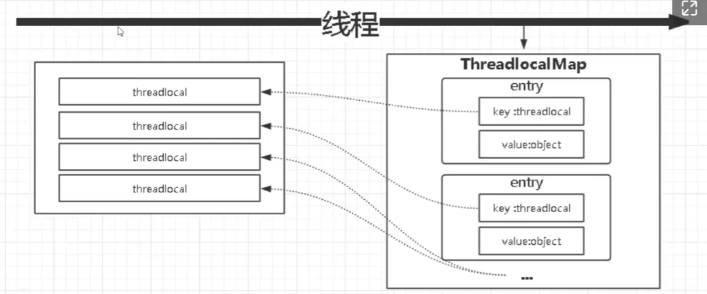
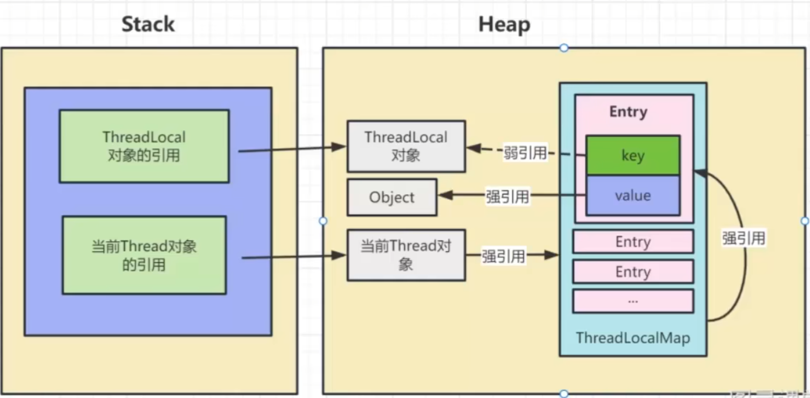

# JVM虚拟机

## ThreadLocal底层原理分析

### 什么是ThreadLocal?

ThreadLocal 是 Java 里一种特殊变量，它是一个线程级别变量，是每个线程独有的变量，每个线程只能访问自己内部的 ThreadLocal 对象。是线程安全的。

### ThreadLocal实现

每个线程上都有一个ThreadLocalMap对象。ThreadLocal就是操作当前线程的ThreadLocalMap的工具类。

当每次调ThreadLocal的set方法就是往ThreadLocalMap里放入Entry对象，ThreadLocalMap内部是通过数组实现的哈希表，Key为ThreadLocal对象, value为object缓存对象，每个Entry数组对象继承自弱引用，关联ThreadLocal对象，如果ThreadLocal对象不再使用，可以被GC回收掉。

但Entry对象的value值是通过线程强引用的，Entry的value值无法被回收，如果value值存入太大，可能会导致内存泄漏。

**解决方法** 调用ThreadLocal的remove方法清除Entry对象。

