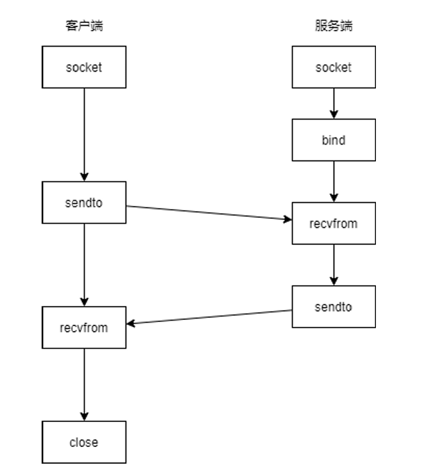
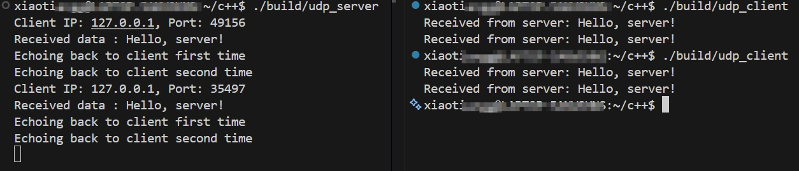

# Linux 网络编程

## 网络模型和协议
* 采用分层模型实现网络通讯和数据交换，OSI网络模型分为七层，从上到下分别是应用层、表示层、会话层、传输层、网络层、数据链路层和物理层。而目前广泛应用的是TCP/IP网络模型，从上到下分别是应用层、传输层、网路层、网络接口层。
* 一般在学习开发中，结合两者，采用五层网络模型，从上到下分别是应用层、传输层、网路层、数据链路层、物理层。本文基于五层模型进行学习理解。


### 物理层
* 负责比特流的传输，把 0 和 1 真实地发送到电缆、光纤、无线电中

### 数据链路层
* 保证在同一局域网(同一链路)内的设备之间可靠传输数据帧。交换机、网卡工作在这一层
* 核心功能包括封装成帧(Frame)，差错检测，MAC寻址(ARP, RRAP)，主要协议有Ethernet(以太网)
* 以太网帧的一般格式如下,地址是指主机的MAC地址，数据部分不足46字节的补0


#### ARP地址解析协议
* 负责将IP数据报中的IP地址转换为MAC地址填入帧头，通过广播向当前网段的主机发送ARP请求(who has x.x.x.x? tell x.x.x.x)，收到请求的目的主机会响应请求(x.x.x.x is at MAC)

* wireshark抓取的请求如图，前14个字节为以太网头，数据部分包含28字节，源地址，广播地址FF:FF:FF:FF:FF:FF(图中为定向arp request)，剩余18字节为PAD未显示

### 网络层
* 决定数据包从源到目的需要走哪条路，负责路由与转发，路由器，部分三层交换机工作在这一层
* 核心功能包括IP地址、路由选择、IP分片重组，主要协议有IP、ICMP、OSPF/RIP/BGP

#### IP
* IP地址采用**CIDR无分类域间路由选择**进行地址划分，采用网络前缀和主机号划分网段，特殊的IP地址如下

| IP网段 | 用途 |
| :----: | :----: |
| 0.0.0.0/8 | 作为源地址时表示本地主机；作为目的地址时，表示任意IP地址 |
| 10.0.0.0/8 | 局域网IP地址 |
| 172.16.0.0/12 | 局域网IP地址 |
| 192.168.0.0/16 | 局域网IP地址 |
| 127.0.0.0/8 | 本地回环地址 |
| 255.255.255.255/32 | 本地网络广播地址 |
* IP数据报格式如图

* 分片重组，由于IP数据报的长度限制65536字节，而数据链路层MTU为1500字节，因此IP数据包进入链路层时会进行分片，在网络中传输到目的主机，在网络层会进行重组

::: tip
因此一些协议会避免让数据报长度超过MTU，如TCP协议会在选项中设置最大段长度MSS为1460字节(MSS = MTU - TCP头 - IP头)

:::
* 通过路由表告诉设备收到的数据包该往哪个方向转发，实现跨网段、跨网络的通信。Linux使用`route -n`查看主机的路由表

#### NAT网络地址转换
NAT就是在离开内部网络的时候重写数据报的源地址为公网地址，进入内部网络的时候将目的地址从公网地址改成内网地址

#### ICMP网际控制报文协议
* ICMP（Internet Control Message Protocol）是一种网络层协议，主要用于传递控制消息与错误信息，用来让网络设备报告错误、测试连通性、控制网络行为。
* `ping`和`traceroute`（Windows下为`tracert`）

### 传输层
* 提供端到端通信，建立程序之间的“逻辑连接”，主要协议有TCP、UDP

#### TCP协议
* TCP是一个可靠、面向连接、字节流的协议


**序号：** 对于应用层的数据按字节进行编号，防止达到对端后发生乱序情况
**确认号：** 对已经发送的数据进行确认，表示确认号之前的数据已经到达，保证数据可靠到达
**数据偏移:** 表示TCP的报文头长度，(5 ~ 15) * 4(Base)= 20 ~ 60，TCP报文头至少20字节，最多60字节，TCP协议是一个可以扩展的协议

**标志位:**
* ***SYN:*** 建立连接请求，并设置序号
* ***ACK:*** 确认报文，设为`1`时，确认号有效
* ***FIN:*** 断开连接请求

**窗口：** 使用**滑动窗口机制**来实现**流量控制**和**拥塞控制**，发送方和接收方都维护一个滑动窗口，发送方窗口大小根据接收方窗口大小和当前网络状况动态调整，避免双方发送速率不一致或网络问题。

* TCP连接过程及状态变化


* 建立连接抓包如下


::: tip 
**Q1: 建立连接采用三次握手而不是两次的原因?** \
A1: 采用两次握手无法保证双方状态一致。 \
1.当客户端SYN请求未及时到达服务端时，客户端重发请求，服务器接受请求并建立连接，然后完成传输断开连接后，此时，第一次SYN请求延迟到达服务器时，服务器返回ACK并建立连接后，客户端并未建立连接。\
2.两次握手当服务端ACK返回丢失后，服务器不会重传ACK报文，会导致服务端已经建立连接，而客户端未建立连接。


**Q2: 断开连接为什么采用四次挥手?** \
A2: TCP是全双工通信，但TCP的关闭是单向的，两端都必须独立的关闭自己的发送方向，因此需要两次FIN+ACK，特殊情况下，当发送方也没有数据发送时，会合并第二三次挥手。

**Q3: 服务端可以主动断开连接吗?** \
A3: 可以，服务端断开连接后进入TIME_WAIT状态，持续2MSL的超时时间，此时服务器资源被浪费，一般情况下不主动断开连接。\
主动关闭连接(发送FIN)的一方会进入TIME_WAIT状态，与客户端服务端无关。

**Q4: 为什么需要TIME_WAIT状态?** \
A4: 1. 防止最后一个ACK丢失，对端重传FIN报文情况。如直接关闭，此时无法接收到对端重传FIN报文，导致两边状态不一致。2MSL ≈ ACK(丢失) + 重传FIN。 \
2. 等待2MSL(Maximum Segment Lifetime)让网络中延迟的报文自然消失，避免污染新连接。
:::

#### UDP协议
* UDP是一个无连接、不可靠、面向报文、高效的协议。
* 无连接：通信前无需建立连接，意味着支持一对一、一对多通信。
* 不可靠：不保证消息一定送达、消息有序、消息不重复。
* 面向报文：对于应用层传来的数据视为完整的数据包，交给IP层分片，一次发送就是一条消息
* 头部信息如下


### 应用层

## socket编程

### 地址信息
* 字节序：字节数据在内存中存放的数据，网络协议采用(TCP/IP)大端序，x86/x64、ARM架构通常采用小端序
* 大端序：高地址存低字节、低地址存高字节，如0x12345678，地址由低到高，存放12 34 56 78
* 小端序：高地址存高字节、低地址存低字节，如上，地址由低到高，存放78 56 34 12
```cpp
struct sockaddr_in {
    sa_family_t sin_family; /* address family: AF_INET */
    in_port_t sin_port;   /* port in network byte order */
    struct in_addr sin_addr;   /* internet address */
};
 /* Internet address. */
struct in_addr {
    uint32_t       
};

// 网络字节序与主机字节序转换 
// h --> host n --> net l --> 32bit s --> 16bit
uint32_t htonl(uint32_t hostlong);
uint16_t htons(uint16_t hostshort);
uint32_t ntohl(uint32_t netlong);
uint16_t ntohs(uint16_t netshort);

// #include <arpa/inet.h>
// 将字符串转换为网络地址二进制格式
int inet_aton(const char *cp, struct in_addr *inp);
int inet_pton(int af, const char *cp, void *buf);
// 将二进制网络地址转换为字符串格式
char *inet_ntoa(struct in_addr in);
const char *inet_ntop(int af, const void *cp, char buf, socklen_t len);

// 设置服务器地址
struct sockaddr_in server_addr;
memset(&server_addr, 0, sizeof(server_addr));
server_addr.sin_family = AF_INET;
server_addr.sin_port = htons(8080);  // 服务器端口

// 方式一 inet_pton/inet_addr赋值结果已是网络字节序
server_addr.sin_addr.s_addr = inet_addr("192.168.1.1");  // 服务器IP地址
inet_pton(AF_INET, "192.168.1.1", &server_addr.sin_addr); // 服务器IP地址
// 方式二 直接赋值主机字节序后转换为网络字节序
server_addr.sin_addr.s_addr = htonl(0xc0a80101); // 在内存中为01 01 A8 C0而hostl会进行字节序转换

// 验证地址和端口
char ip_buf[INET_ADDRSTRLEN];
printf("服务器地址：%s:%d\n", 
    inet_ntop(AF_INET, &server_addr.sin_addr, ip_buf, sizeof(ip_buf)),
    ntohs(server_addr.sin_port)); // 网络字节序→主机字节序，方便阅读
```

### 通过域名获取IP地址
```cpp
int main(int argc, char *argv[]) {
    struct hostent *host;
    host = gethostbyname("www.baidu.com");
    
    cout << "host name: " << host->h_name << endl;
    for (int i = 0; host->h_aliases[i] != nullptr; i++) {
        cout << "aliase: " << host->h_aliases[i] << endl;
    }
    cout << "address type: " << (host->h_addrtype == AF_INET ? "AF_INET" : "AF_INET6") << endl;
    cout << "address length: " << host->h_length << endl;
    char buf[128] = {0};
    for (int i = 0; host->h_addr_list[i] != nullptr; i++) {
        memset(buf, 0, sizeof(buf));
        inet_ntop(host->h_addrtype, host->h_addr_list[i], buf, sizeof(buf));
        cout << "address " << i + 1 << ": " << buf << endl;
    }
    return 0;
}
```

### 系统调用
* TCP通信流程图


```cpp
// domain AF_INET --> IPv4 AF_INET6 --> IPv6
// type SOCK_STREAM --> TCP SOCK_DGRAM --> UDP
// protocol IPPROTO_TCP --> TCP IPPROTO_UDP -->UDP
// 创建socket设备，返回设备的文件描述符
int socket(int domain, int type, int protocol);
// 通过connect由客户端随机选择一个端口与服务器进行通讯，完成TCP三次握手
int connect(int sockfd, const struct sockaddr *addr, socklen_t addrlen);
// 给套接字绑定IP和端口号
int bind(int sockfd, const struct sockaddr *addr, socklen_t addrlen);
// 开始监听客户端连接，操作系统知道是服务端的套接字，关闭发送、接受缓冲区，维护半连接、全连接队列
// backlog在早期unix系统中为SYN队列长度，现代系统(Linux 2.2+)中，仅指定ACCEPT (全连接队列)的最大长度
int listen(int sockfd, int backlog);
// 从已连接队列中取出连接，返回已连接的套接字
int accept(int sockfd, struct sockaddr *addr, socklen_t *addrlen);
// 在用户态与内核态之间传输数据，传输时机取决于内核
// 使用 read 和 write 可以实现同样的效果，相当于 flags 参数为 0。
// 有可能多个消息会在一次传输中被发送和接收（"粘包"），
// 也有有可能一个消息需要多个传输才能被完整的发送和接收("半包")。
ssize_t send(int sockfd, const void *buf, size_t len, int flags);
ssize_t recv(int sockfd, void *buf, size_t len, int flags);
// 关闭文件描述符
int close(int fd);
```
* UDP 通信流程图

```cpp
ssize_t sendto(int sockfd, const void *buf, size_t len, int flags, const struct sockaddr *dest_addr, socklen_t addrlen);
ssize_t recvfrom(int sockfd, void *buf, size_t len, int flags, struct sockaddr *src_addr, socklen_t *addrlen);
```

### socket实践
#### TCP
* 服务端
```cpp
int main() {
    signal(SIGPIPE, SIG_IGN); // 忽略SIGPIPE信号，防止写入已关闭的socket时程序崩溃
    int listenfd = socket(AF_INET, SOCK_STREAM, 0);

    int on = 1;
    setsockopt(listenfd, SOL_SOCKET, SO_REUSEADDR, &on, sizeof(on));

    struct sockaddr_in serverAddr;
    memset(&serverAddr, 0, sizeof(serverAddr));
    serverAddr.sin_family = AF_INET;
    serverAddr.sin_addr.s_addr = INADDR_ANY;
    serverAddr.sin_port = htons(8080);
    // 绑定地址和端口
    int ret = bind(listenfd, (struct sockaddr *)&serverAddr, sizeof(serverAddr));
    if (ret != 0) {
        cerr << "Failed to bind socket." << endl;
        return 1;
    }
    // 开始监听客户端连接
    listen(listenfd, 10);
    cout << "Server is listening on port 8080..." << endl;

    sockaddr_in clientAddr;
    socklen_t clientLen = sizeof(clientAddr);
    char buf[1024] = {0};
    while (1) {
        memset(&clientAddr, 0, sizeof(clientAddr));
        // 从全连接队列中取出一个连接
        int connfd = accept(listenfd, (struct sockaddr*)&clientAddr, &clientLen);
        if (connfd < 0) {
            cerr << "Failed to accept connection." << endl;
            return 1;
        }
        printf("Accepted connection from %s:%d\n", inet_ntoa(clientAddr.sin_addr), ntohs(clientAddr.sin_port));

        memset(buf, 0, sizeof(buf));
        recv(connfd, buf, sizeof(buf), 0);
        printf("Received message: %s\n", buf);
        // 回显消息
        send(connfd, buf, strlen(buf), 0);
        close(connfd);
    } 
    close(listenfd);
    return 0;
}
```
* 客户端
```cpp
int main() {
    signal(SIGPIPE, SIG_IGN); // 忽略SIGPIPE信号，防止写入已关闭的socket时程序崩溃
    int clientfd = socket(AF_INET, SOCK_STREAM, 0);

    struct sockaddr_in servaddr;
    memset(&servaddr, 0, sizeof(servaddr));
    servaddr.sin_family = AF_INET;
    servaddr.sin_addr.s_addr = inet_addr("127.0.0.1");
    servaddr.sin_port = htons(8080);
    // 连接服务端
    int ret = connect(clientfd, (struct sockaddr *)&servaddr, sizeof(servaddr));
    if (ret != 0) {
        cerr << "Failed to connect to server." << endl;
        return 1;
    }
    cout << "Connected to server successfully." << endl;
    // 发送消息
    char buf[1024] = "Hello from client";
    int bytes_sent = send(clientfd, buf, strlen(buf), 0);
    cout << "Sent " << bytes_sent << " bytes to server." << endl;

    bytes_sent = send(clientfd, buf, strlen(buf), 0);
    cout << "Sent " << bytes_sent << " bytes to server." << endl;

    bytes_sent = send(clientfd, buf, strlen(buf), 0);
    cout << "Sent " << bytes_sent << " bytes to server." << endl;

    memset(buf, 0, sizeof(buf));
    recv(clientfd, buf, sizeof(buf), 0);
    cout << "Received from server: " << buf << endl;
    while (1);
    close(clientfd);
    return 0;
}
```
1. 向一个已断开的连接中发送消息，第一次内核会返回RST报文，第二次会收到SIGPIPE信号直接终止进程，使用`signal(SIGPIPE, SIG_IGN)`防止已关闭的socket程序时崩溃
2. 粘包问题，多次发送可能对应一次或多次接收，接收次数是不确定的

3. 服务端主动断开连接会进入timewait状态，此时无法再次启动相同服务端，使用`intsetsockopt(int sockfd, int level, int optname, const void *optval, socklen_t optlen)`设置套接字属性


### UDP
* 服务端
```cpp
int main() {
    int socketFd = socket(AF_INET, SOCK_DGRAM, 0);

    sockaddr_in serverAddr;
    serverAddr.sin_family = AF_INET;
    serverAddr.sin_addr.s_addr = INADDR_ANY;
    serverAddr.sin_port = htons(8080);
    int ret = bind(socketFd, (sockaddr*)&serverAddr, sizeof(serverAddr));

    // 实现一对多，一个fd接收多个客户端的数据
    while (1) {
        // 必须recvfrom后才能获取客户端地址信息
        char buf[1024] = {0};
        sockaddr_in clientAddr;
        socklen_t addrLen = sizeof(clientAddr);
        recvfrom(socketFd, buf, sizeof(buf), 0, (sockaddr*)&clientAddr, &addrLen);
        printf("Client IP: %s, Port: %d\n", inet_ntoa(clientAddr.sin_addr), ntohs(clientAddr.sin_port));
        printf("Received data : %s\n", buf);

        printf("Echoing back to client first time\n");
        sendto(socketFd, buf, sizeof(buf), 0, (sockaddr*)&clientAddr, addrLen);
        printf("Echoing back to client second time\n");
        sendto(socketFd, buf, sizeof(buf), 0, (sockaddr*)&clientAddr, addrLen);
    }
    close(socketFd);
    return 0;
}
```
* 客户端
```cpp
int main() {
    int socketFd = socket(AF_INET, SOCK_DGRAM, 0);

    sockaddr_in serverAddr;
    serverAddr.sin_family = AF_INET;
    serverAddr.sin_addr.s_addr = INADDR_ANY;
    serverAddr.sin_port = htons(8080);
    sendto(socketFd, "Hello, server!", 14, 0, (sockaddr*)&serverAddr, sizeof(serverAddr));

    char buf[1024] = {0};
    recvfrom(socketFd, buf, sizeof(buf), 0, nullptr, nullptr);
    printf("Received from server: %s\n", buf);

    memset(buf, 0, sizeof(buf));
    recvfrom(socketFd, buf, sizeof(buf), 0, nullptr, nullptr);
    printf("Received from server: %s\n", buf);
    close(socketFd);
    return 0;
}
```
* UDP无法保证数据的可靠到达，需要交由上层来实现，如KCP、QUIC
* UDP是无连接的，可以实现一对多通信，
* 必须要服务端先接收数据才能知道客户端地址，面向报文，一次发送对应一次接收


### IO模型
* POSIX定义五种IO模型：**阻塞IO、非阻塞IO、IO多路复用、信号驱动IO、异步IO**
* **阻塞IO：** 阻塞等待数据就绪
* **非阻塞IO：** 如果数据未就绪，直接返回
* **IO多路复用：** 让内核监听多个FD，阻塞等待一个或多个FD就绪
* **信号驱动IO：** 数据就绪时通过发送信号，注册信号处理函数，调用信号处理函数
* **异步IO：** 由内核在后台执行IO，通过回调通知用户

#### IO多路复用
* 服务端通常使用IO多路复用，如select、poll、epoll
* 本质上是将多个阻塞点变为一个，避免单线程阻塞在单个FD中(如同时等待终端输入和网络数据)

**1. select**
```cpp
#include <sys/select.h>   // 核心头文件
int select(
    int nfds,               // 监控的最大 FD + 1
    // 三个传入传出参数，返回后仅保留已就绪的 FD
    fd_set *readfds,        // 待监控的「可读」FD 集合
    fd_set *writefds,       // 待监控的「可写」FD 集合
    fd_set *exceptfds,      // 待监控的「异常」FD 集合
    // 超时时间（阻塞/非阻塞控制）0:非阻塞、立即返回 NULL:永久阻塞，直到FD就绪
    struct timeval *timeout 
);
FD_ZERO(&set)       // 清空 FD 集合（初始化）
FD_SET(fd, &set)    // 将 FD 加入集合
FD_CLR(fd, &set)    // 将 FD 从集合中移除
FD_ISSET(fd, &set)  // 判断 FD 是否在集合中
```
**2. epoll**
```cpp
#include <sys/epoll.h>
// 升级版（推荐）：size 参数被忽略，仅需传大于 0 的值
int epoll_create1(int flags); 
// 操作 epoll 实例中的 FD 集合
int epoll_ctl(
    int epoll_fd,       // epoll_create 返回的 epoll 实例描述符
    int op,             // 操作类型：ADD（添加）MOD（修改）DEL（删除）
    int fd,             // 要监控的目标 FD（如套接字、STDIN）
    struct epoll_event *event  // 监控的事件类型 + 自定义数据
);
struct epoll_event {
    // EPOLLIN可读 EPOLLOUT可写 EPOLLET边缘触发
    uint32_t events;  // 要监控的事件（位掩码）
    epoll_data_t data;// 自定义数据（通常存 fd，方便后续处理）
};
// 自定义数据联合体（常用 fd 字段）
typedef union epoll_data {
    void *ptr;    // 自定义指针
    int fd;       // 目标 FD（最常用）
    uint32_t u32;
    uint64_t u64;
} epoll_data_t;
// 阻塞等待就绪 FD，返回就绪的 FD 列表
int epoll_wait(
    int epoll_fd,               // epoll 实例句柄
    struct epoll_event *events, // 输出参数：存储就绪的 FD 事件
    int maxevents,              // 最多接收的就绪事件数（需≤ events数组长度）
    int timeout                 // 超时时间（毫秒）
);
```
* `epoll`采用红黑树存储监控的FD，链表存储已经就绪的FD的集合
* 相比`select`升级如下
  1. 采用红黑树存储监听的FD，监控数量无限制，与内存有关
  2. 只需要初始化一次，无需重复设置监听集合
  3. 内核态中采用回调机制，将已就绪的FD加入到就绪链表
  4. 用户态只需遍历就绪链表获取就绪FD
* 水平触发，当内核缓冲区中还有数据时，epoll会一直通知，直到缓冲区被读完
* 边缘触发，每次接收数据，epoll只会通知一次，边缘触发时要一次性读完所有数据(使用循环配合非阻塞)，否则，如果没有新数据触发ET，将无法读取到剩下数据
* 水平触发由内核兜底，保证数据不会漏读。边缘触发将处理交给应用层，内核只负责通知状态变化，大幅减少事件触发次数，性能高

### select实现聊天室功能
* 通过select处理多个用户请求
* 服务端
```cpp
#include <iostream>
#include <sys/select.h>
#include <sys/socket.h>
#include <netinet/in.h>
#include <arpa/inet.h>
#include <cstring>
#include <unistd.h>
#include <signal.h>
using namespace std;

int main()
{
    signal(SIGPIPE, SIG_IGN); // Ignore SIGPIPE signals
    int sockfd = socket(AF_INET, SOCK_STREAM, 0);

    int on = 1;
    setsockopt(sockfd, SOL_SOCKET, SO_REUSEADDR, &on, sizeof(on));

    struct sockaddr_in serverAddr;
    memset(&serverAddr, 0, sizeof(serverAddr));
    serverAddr.sin_family = AF_INET;
    serverAddr.sin_port = htons(8080);
    serverAddr.sin_addr.s_addr = INADDR_ANY;
    int ret = bind(sockfd, (struct sockaddr *)&serverAddr, sizeof(serverAddr));
    if (ret != 0) {
        cerr << "Bind failed." << endl; 
        return 1;
    }   

    listen(sockfd, 10);
    cout << "Server listening on port 8080..." << endl;
    // 需要监听的文件描述符集合
    fd_set readfds;
    int maxfd = sockfd;
    // 记录所有已连接的客户端
    int connectedClients[FD_SETSIZE] = {0};
    while (1) {
        FD_ZERO(&readfds);
        FD_SET(sockfd, &readfds);
        FD_SET(STDIN_FILENO, &readfds);
        for (int i = 0; i <= maxfd; ++i) {
            if (connectedClients[i]) {
                FD_SET(i, &readfds);
            }
        }

        select(maxfd + 1, &readfds, nullptr, nullptr, nullptr);
        char buf[1024] = {0};
        // 有新的连接
        if (FD_ISSET(sockfd, &readfds)) {
            struct sockaddr_in clientAddr;
            clientAddr.sin_family = AF_INET;
            socklen_t clientAddrLen = sizeof(clientAddr);
            int connfd = accept(sockfd, (struct sockaddr*)&clientAddr, &clientAddrLen);
            if (connfd < 0) {
                cerr << "Accept failed." << endl;
                continue;
            }
            printf("Accepted connection from %s:%d, connected FD: %d\n", 
                inet_ntoa(clientAddr.sin_addr), ntohs(clientAddr.sin_port), connfd);
            // 加入现有连接
            connectedClients[connfd] = 1;
            maxfd = max(maxfd, connfd);
        } else if (FD_ISSET(STDIN_FILENO, &readfds)) {
            int ret = read(STDIN_FILENO, buf, sizeof(buf));
            if (ret == 0) {
                cout << "Standard input closed, shutting down server." << endl;
                break;
            }
            // read 会读取换行符，buf中包含换行符
            cout << "Input from stdin: " << buf;
            // Broadcast to all connected clients
            for (int i = 0; i <= maxfd; ++i) {
                if (connectedClients[i]) {
                    cout << "Sending to client " << i << ": " << buf;
                    int ret = send(i, buf, strlen(buf), 0);
                    cout << "Sent " << ret << " bytes to client " << i << endl;
                }
            }
        } else {
            // receieve message from client
            for (int i = 0; i <= maxfd; ++i) {
                if (connectedClients[i] && FD_ISSET(i, &readfds)) {
                    memset(buf, 0, sizeof(buf));
                    int ret = recv(i, buf, sizeof(buf), 0);
                    if (ret == 0) {
                        cout << "Client " << i << " disconnected" << endl;
                        connectedClients[i] = 0;
                        close(i);
                        continue;
                    }
                    cout << "Received from client " << i << ": " << buf;
                    // Echo back to all clients
                    for (int j = 0; j <= maxfd; ++j) {
                        if (connectedClients[j] && i != j) {
                            send(j, buf, strlen(buf), 0);
                        }
                    }
                }
            }
        }
    }

    close(sockfd);
    return 0;
}
```

* 客户端
```cpp
#include <sys/socket.h>
#include <iostream>
#include <cstring>
#include <unistd.h>
#include <netinet/in.h>
#include <arpa/inet.h>
using namespace std;

int main()
{
    // 创建TCP socket
    int client_fd = socket(AF_INET, SOCK_STREAM, 0);
    if (client_fd < 0) {
        cerr << "创建socket失败" << endl;
        return 1;
    }
    // 设置服务器地址
    struct sockaddr_in server_addr;
    memset(&server_addr, 0, sizeof(server_addr));
    server_addr.sin_family = AF_INET;
    server_addr.sin_port = htons(8080);  
    server_addr.sin_addr.s_addr = inet_addr("127.0.0.1");
    // 连接到服务器
    int ret = connect(client_fd, (struct sockaddr*)&server_addr, sizeof(server_addr));
    if (ret != 0) {
        cerr << "连接服务器失败" << endl;
        close(client_fd);
        return 1;
    }
    cout << "成功连接到服务器" << endl;

    fd_set readfds;
    char buf[1024] = {0};    
    while (1) {
        FD_ZERO(&readfds);
        FD_SET(client_fd, &readfds);
        FD_SET(STDIN_FILENO, &readfds);

        select(client_fd + 1, &readfds, nullptr, nullptr, nullptr);
        if (FD_ISSET(STDIN_FILENO, &readfds)) {
            memset(buf, 0, sizeof(buf));
            int ret = read(STDIN_FILENO, buf, sizeof(buf));
            if (ret == 0) {
                cout << "客户都端输入结束，关闭连接" << endl;
                break;
            }
            send(client_fd, buf, strlen(buf), 0);
            cout << "发送消息: " << buf;
        } else if (FD_ISSET(client_fd, &readfds)) {
            memset(buf, 0, sizeof(buf));
            int ret = recv(client_fd, buf, sizeof(buf), 0);
            if (ret == 0) {
                cout << "服务器关闭连接" << endl;
                break;
            }
            cout << "从服务器收到消息: " << buf;
        }
    }

    // 关闭socket
    close(client_fd);
    cout << "连接已关闭" << endl;
    return 0;
}
```
* **select存在的问题**
1. select中底层采用位图，位图大小`FD_SETSIZE`，监听的文件描述符有上限
2. select每次执行都需要重新设置监听集合
3. 在内核中，内核需要对所有的fd轮询是否就绪，即使只有少量fd就绪
4. 在用户态中，只知道就绪fd数量，还需要遍历集合检查就绪的fd

### epoll改进聊天室
```cpp
#include <iostream>
#include <sys/epoll.h>
#include <sys/socket.h>
#include <netinet/in.h>
#include <arpa/inet.h>
#include <cstring>
#include <unistd.h>
#include <signal.h>
#include <set>
#include <vector>
#include <fcntl.h>
#include <unordered_map>
using namespace std;
#define MAX_EVENTS 1024

int main()
{
    signal(SIGPIPE, SIG_IGN); // Ignore SIGPIPE signals
    int sockfd = socket(AF_INET, SOCK_STREAM, 0);

    int on = 1;
    setsockopt(sockfd, SOL_SOCKET, SO_REUSEADDR, &on, sizeof(on));

    struct sockaddr_in serverAddr;
    memset(&serverAddr, 0, sizeof(serverAddr));
    serverAddr.sin_family = AF_INET;
    serverAddr.sin_port = htons(8080);
    serverAddr.sin_addr.s_addr = INADDR_ANY;
    int ret = bind(sockfd, (struct sockaddr *)&serverAddr, sizeof(serverAddr));
    if (ret != 0) {
        cerr << "Bind failed." << endl; 
        return 1;
    }   

    listen(sockfd, 10);
    cout << "Server listening on port 8080..." << endl;

    int epollfd = epoll_create1(EPOLL_CLOEXEC);
    if (epollfd == -1) {
        cerr << "epoll_create1 failed." << endl;
        close(sockfd);
        return 1;
    }

    epoll_event ev;
    ev.events = EPOLLIN | EPOLLET; // 边沿触发
    ev.data.fd = sockfd;
    epoll_ctl(epollfd, EPOLL_CTL_ADD, sockfd, &ev);
    ev.data.fd = STDIN_FILENO;
    epoll_ctl(epollfd, EPOLL_CTL_ADD, STDIN_FILENO, &ev);

    epoll_event events[MAX_EVENTS];
    char buf[1024] = {0};
    unordered_map<int, time_t> connLastActive; // 所有连接的客户端FD集合
    while (1) {
        
        int readyFds = epoll_wait(epollfd, events, MAX_EVENTS, 3000);

        if (readyFds == -1) {
            cerr << "epoll_wait failed." << endl;
            break;
        } else if (readyFds == 0) {
            // Timeout, no events
            vector<int> toClose;
            for (const auto& [clientFd, lastActive] : connLastActive) {
                if (time(nullptr) - lastActive >= 10) { // 10秒无活动则关闭连接
                    toClose.push_back(clientFd);
                }
            }
            for (int fd : toClose) {
                cout << "Closing inactive connection, FD: " << fd << endl;
                ev.data.fd = fd;
                epoll_ctl(epollfd, EPOLL_CTL_DEL, fd, &ev);
                connLastActive.erase(fd);
                close(fd);
            }
            cout << "epoll_wait timeout, no events." << endl;
            continue;
        }
        for (int i = 0; i < readyFds; ++i) {
            int fd = events[i].data.fd;
            if (fd == sockfd) {
                struct sockaddr_in clientAddr;
                clientAddr.sin_family = AF_INET;
                socklen_t clientAddrLen = sizeof(clientAddr);
                int connfd = accept(sockfd, (struct sockaddr*)&clientAddr, &clientAddrLen);
                if (connfd < 0) {
                    cerr << "Accept failed." << endl;
                    continue;
                }
                printf("Accepted connection from %s:%d, connected FD: %d\n", 
                    inet_ntoa(clientAddr.sin_addr), ntohs(clientAddr.sin_port), connfd);

                ev.data.fd = connfd;
                epoll_ctl(epollfd, EPOLL_CTL_ADD, connfd, &ev);
                connLastActive[connfd] = time(nullptr);
                // int fstatus = fcntl(connfd, F_GETFL, 0);
                // fcntl(connfd, F_SETFL, fstatus | O_NONBLOCK); // 将文件描述符设置非阻塞

            } else if (fd == STDIN_FILENO) {
                memset(buf, 0, sizeof(buf));
                int ret = read(STDIN_FILENO, buf, sizeof(buf));
                if (ret == 0) {
                    cout << "Server input ended, shutting down." << endl;
                    for (const auto& [clientFd, lastActive] : connLastActive) {
                        close(clientFd);
                    }
                    close(sockfd);
                    close(epollfd);
                    return 0;
                }
                // Broadcast to all connected clients
                for (const auto& [clientFd, lastActive] : connLastActive) {
                    send(clientFd, buf, strlen(buf), 0);
                }
                cout << "Sent to clients: " << buf;
            } else if (events[i].events & EPOLLIN) {
                memset(buf, 0, sizeof(buf));
                int ret = recv(fd, buf, sizeof(buf), 0);
                if (ret == 0) {
                    cout << "Client disconnected, FD: " << fd << endl;
                    ev.data.fd = fd;
                    epoll_ctl(epollfd, EPOLL_CTL_DEL, fd, &ev);
                    connLastActive.erase(fd);
                    close(fd);
                    continue;
                }
                cout << "Received from client " << fd << ": " << buf << endl;
                
                // 模拟循环读取所有数据
                // memset(buf, 0, sizeof(buf));
                // ret = recv(fd, buf, sizeof(buf), 0);
                // ret = recv(fd, buf, sizeof(buf), MSG_DONTWAIT);
                // cout << "Received from client " << fd << ": " << buf << endl;

                connLastActive[fd] = time(nullptr); // 更新最后活跃时间
                // Echo back to all connected clients
                for (const auto& [clientFd, lastActive] : connLastActive) {
                    if (clientFd != fd) { // 不回显给发送者
                        send(clientFd, buf, ret, 0);
                    }
                }
            } 
        }
        
    }
    close(epollfd);
    close(sockfd);
    return 0;
}
```
* `epoll`轮询过程中要设置为非阻塞，否则循环读取`read`，当缓冲区读完时会阻塞，导致事件循环中断，无法处理后续FD
  1. 使用`fcntl`将文件描述符设为非阻塞
  2. 在`recv`中设置`MSG_DONTWAIT`非阻塞单次IO行为

