# Linux 系统编程

## vim 编辑器
### 视图切换
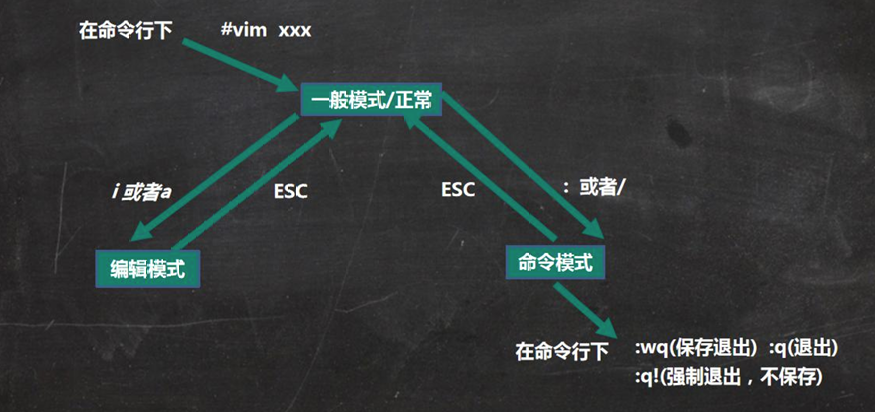

### 常用命令
* 正常模式
  ```bash
  移动光标
  gg 移动到第一行
  G 移动到最后一行

  删除
  dw 删除一个单词
  dd 删除一行

  复制
  yw 复制一个单词
  yy 复制一行

  p/P 粘贴
  u(undo) 撤销
  ctrl + r(recovery) 恢复
  ```
* 命令模式
  ```bash
  :w 将buffer里面的内容写入文本 即保存
  :q 退出
  :q! 不保存退出
  :Wq 保存退出
  /[单词] 查找 n: 切换下一个
  :set nu(number)/ nonu 设置/取消行号
  ```

## Linux 常用命令
* `man [命令]`查看命令手册
### 用户
```bash
// 用户
sudo useradd test // 添加用户
sudo userdel test // 删除用户
sudo password test // 设置密码
su test // 切换用户
exit // 退出切换用户
```

### 文件、目录
```bash
// 文件、目录
pwd(print working directory) // 可以查看当前工作目录
ls // 列出目录内容 -l 详细信息 
mkdir // 创建目录
redir // 删除空目录
touch // 创建文件
mv // 移动文件或目录，重命名文件
rm // 删除文件或目录 -r 递归删除 -f 强制删除
cat // 查看文件
tail // 查看文件后几行 -n 显示几行 -F 显示追加的数据

// 链接
ln [-s] 源文件 目标文件 // 默认硬链接，-s 软链接
硬链接指向相同的inode,当inode引用为0时，文件才会被删除，不能跨文件系统，不能指向目录
软链接有独立的inode,文件内容为源文件路径(可以不存在)，当源文件删除后软链接会失效，访问时提示“No such file or directory”，可跨文件系统，可指向目录
ln test h_link
ls -s test s_link

// 过滤
grep(Global Regular Expression Print)
grep [选项] 模式 [文件...] 
// -i 忽略大小写 -n 显示匹配的行号 -c 统计匹配的行数 -w 完全匹配
grep -ni "(" test.cpp
| // 管道符号，将前面结果输出给后面的命令
cat test.cpp | grep -wn "str"

// 查找
find [范围] 选项
// -name 查找指定文件名
find /home -name "*.cpp"
// -user 查找属于用户的文件
// -size 按照指定文件大小的查找 +n 大于 -n小于 单位k,M,G 
find . -size -500k

// 压缩(text archieve)
tar [主选项+辅选项] 包名 文件或目录
主选项（有且只能选择其中一个）
c：创建
r：追加 
x：释放
t：查看
辅选项：
f：指定包文件的名称
V：显示详细信息,显示打包过程方便查看进度
z：使用gzip算法压缩或解压缩包文件
-C：指定解压路径
压缩
tar czvf test.tar.gz *
解压
tar xvf test.tar.gz -C hh/
查看内容（不解压）
tar tvf test.tar.gz
```

### 权限
* `chmod [数字权限] 文件名/目录`
```bash
如-rw-r--r--
第1个字符：文件类型（- 普通文件、d 目录、l(link) 符号链接、b(block) 块设备、c 字符设备(键盘)、s 本地套接字）。
剩余9字符 三个字符一组，分别为用户所有者，用户所属组，其他用户权限，r 读 w 写 x 执行 - 无权限
文件默认 644 所有者读写，其他只读
目录默认 755 所有者全权限，其他可进入和查看
```
umask 文件创建掩码
原理：设置的是想去掉的权限，文件: (~umask)&666, 目录: (~umask)&777


## 编译
### 编译过程
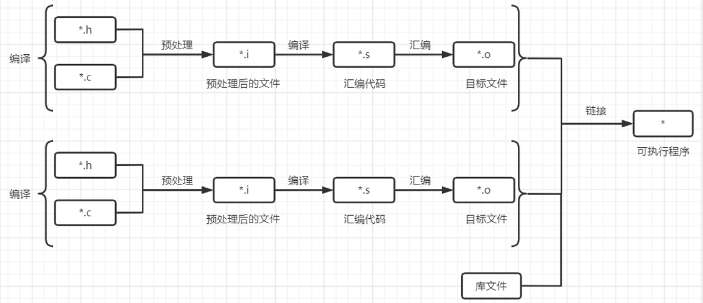
`gcc hello.c -o hello`编译链接，生成可执行程序，通过`./hello`运行
可选项 -g 产生调试信息，-Wall(warning all) 生成所有警告信息

### 条件编译
条件编译，就是在预处理阶段决定包含还是排除某些程序片段
```cpp
#ifdef 标识符
...
#endif
```
* 当标识符有被定义成宏时，保留 #ifdef 与 #endif 之间的代码；否则，在预处理阶段删除 #ifdef 与 #endif 之间的代码。等价于：
```cpp
#if defined(标识符)
...
#endif
```
#ifndef 相反

**作用：**
* 编写可移植的程序
* 为宏提供默认定义
* 避免头文件重复包含
  ```cpp
  #ifndef A
  #define A
  ...code
  #endif
  ```
  如果包含多个头文件，A只会被定义一次
* 临时屏蔽包含注释的代码

### 静态库与动态库
在类 Unix 系统上，静态库一般是以 .a 结尾，Windows 上一般是以 .lib 结尾；
在类 Unix 系统上，动态库一般是以 .so 结尾，Windows 上一般是以 .dll 结尾。
静态库是在链接阶段完成的，文件生成后，运行程序后会在每个进程都会保存一份，即使删除源文件，不会影响程序运行，占内存。
动态库是在程序运行阶段完成的，多个程序运行时共享一份代码，删除动态库后，程序无法运行

### Makefile
makefile定义了编译的规则，可以实现增量编译和自动编译，只编译更改的部分。
```bash
target: prerequisites
  commands
# target: 即为要生成的目标。
# prerequisites: 生成目标所依赖的其它文件。
# commands: 一般情况下为生成该目标所需执行的命令(可以是任意的shell命令)

# 如果prerequisites不写，则每次都会执行命令
clean:
  rm -f test 

# 如果存在名字为clean的文件，那么就不起作用了
# 将 clean 和 rebuild 添加到 .PHONY 的序列中，可以避免这种情况发生
# 即使目录下有clean文件，也会执行命令，target即为伪目标
.PHONY: clean
clean:
  rm -f test 
```


## 目录
学会使用`man [命令]`看文档，重点看SYNOPSIS概要，参数，返回值

### 查看当前工作目录
```cpp
#include <iostream>
#include <unistd.h>
using namespace std;

int main()
{
  // 查看当前工作目录
    char* cwd = getcwd(nullptr, 0);
    cout << cwd << endl;
    free(cwd);
    return 0;
}
```

### 切换目录
```cpp
#include <unistd.h>
#include <error.h>
#include <iostream>
using namespace std;

int main(int argc, char* argv[]) {
    if (argc != 2) {
        error(1, 0, "Usage: %s <directory_path>", argv[0]);
    }
    
    char* cwd = getcwd(nullptr, 0);
    puts(cwd);

    if (chdir(argv[1]) != 0) {
        error(1, errno, "chdir to %s failed", argv[1]);
    }

    cwd = getcwd(nullptr, 0);
    puts(cwd);
    free(cwd);
    return 0;
}
```
运行程序时，bash进程会fork一个子进程。子进程继承bash的工作目录，执行切换目录后，子进程目录改变，然后子进程退出，bash进程还是原来的工作目录
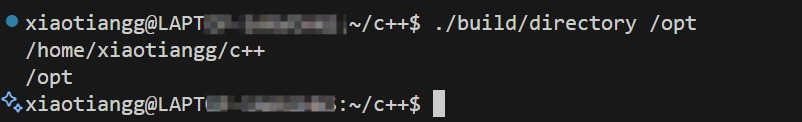

### 目录流
```cpp
// 打开一个目录，得到指向一个目录流的指针
DIR *opendir(const char *name);
DIR *fdopendir(int fd);
// 读取当前指向的目录项，返回一个struct dirent *，把读取位置移动到下一个位置
struct dirent *readdir(DIR *dirp);
// 关闭目录流
int closedir(DIR *dirp);
```
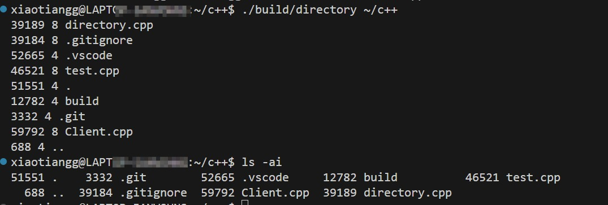


## 文件
### Linux管理文件的数据结构
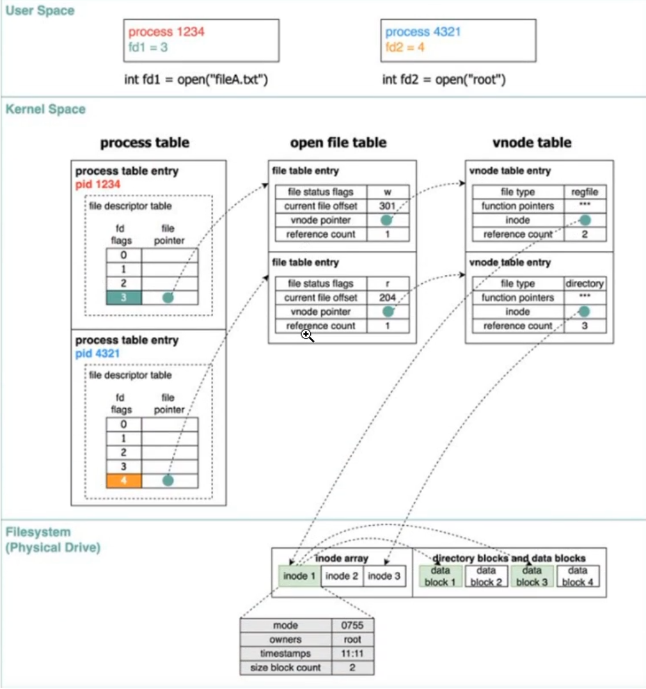
1. `inode`存放在磁盘上，记录了文件的元信息，如大小，权限，类型，所属文件系统等
2. `vnode`属于在内核，在内存中，是对`inode`的封装，一一对应，为文件系统提供统一的操作接口，包含文件状态信息，如`inode`指针、文件类型，同步锁等。
3. `open file table`，所有文件共享系统打开表，与`vnode`对应，包含打开模式，读写指针位置，引用(打开)次数，`vnode`指针，可以多个fd或多个进程共享。
4. `file descriptor`文件描述符，每个进程独有，保存打开文件的引用，系统通过它，进程就能访问文件、管道、socket、设备等所有I/O对象。
:::tip
一般fd索引0，1，2分别指向内核标准输入stdin、标准输出stdout、标准错误stderr
:::

### 打开文件
**打开文件过程**
1. 内核找到文件的`inode/vnode`,如果`vnode`不存在，则创建
2. 在系统**打开文件表**中创建表项，设置打开模式，读写指针位置，vnode指针
3. 在进程的**文件描述符表**中找到最小的可用项，指向打开文件表项
4. 返回`fd`表的索引

**释放文件**
1. fd 表，删除 fd 表项，断开到 open file entry 的指针
2. Open File Table，引用计数 -1；若为 0，释放该条目 
3. Vnode Table，引用计数 -1；若为 0，释放 vnode
4. Inode (Filesystem)不变，除非文件被 unlink 删除

```cpp
#include <fcntl.h>
#include <iostream>
using namespace std;

int main(int argc, char* argv[]) {
    if (argc < 2) {
        cerr << "Usage: " << argv[0] << " <filename>" << endl;
        return 1;
    }
    // 三选一O_RDONLY只读 O_WRONLY只写 O_RDWR读写
    // O_CREAT文件不存在则创建 O_EXCL若文件已存在则报错 
    // 有写权限 O_TRUNC清空文件内容 O_APPEND写操作追加到文件末尾
    int fd = open(argv[1], O_RDWR | O_CREAT | O_TRUNC, 0666);
    if (fd < 0) {
        cerr << "Failed to open file: " << argv[1] << endl;
        return 1;
    }
    cout << "File opened successfully, fd: " << fd << endl;
    close(fd);
    return 0;
}   
```

### 文件描述符复制dup&dup2
```cpp
int dup(int oldfd); // 返回新的文件描述符
int dup2(int oldfd, int newfd); // 指定新的文件描述符，会关闭newfd指向的文件
```
* 复制完成后，新的文件描述符和旧的都会指向同一个打开文件表项，即表项的引用 + 1

### 文件操作
**文件流和文件描述符**
文件流属于C标准库函数，工作在用户态，拥有用户态缓存，通常更快
文件描述符属于系统调用，工作在内核态，每次执行都要陷入内核，比较慢，直接从内核读写，无缓存
:::tip
fread本质上也是调用了read,一次从内核中读取大块数据，每次fread从缓存中取，提高性能
:::
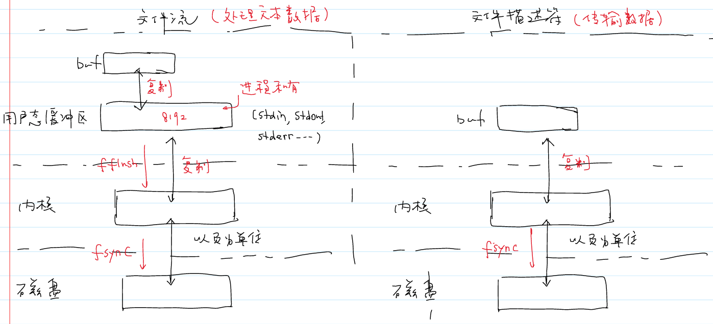

```cpp
ssize_t read(int fd, void *buf, size_t count);//文件描述符 缓冲区 长度
ssize_t write(int fd, const void *buf, size_t count);
// whence SEEK_SET,文件头开始偏移 offset 必须 > 0
// SEEK_CUR当前位置开始 SEEK_END文件末尾开始
off_t lseek(int fd, off_t offset, int whence);
int close(int fd);

// 当length < fileSize 时直接截断末尾EOF
// 当length > fileSize 时扩充部分为0，不占用空间，即内核不会分配额外的页(文件空洞)
int ftruncate(int fd, off_t length);
```
```cpp
#include <fcntl.h>
#include <unistd.h>
#include <iostream>
#include <sys/stat.h>
using namespace std;

int main(int argc, char* argv[]) {
    if (argc < 2) {
        cerr << "Usage: " << argv[0] << " <filename>" << endl;
        return 1;
    }
    int fd = open(argv[1], O_RDWR | O_CREAT | O_APPEND, 0666);
    if (fd < 0) {
        cerr << "Failed to open file: " << argv[1] << endl;
        return 1;
    }
    cout << "File opened successfully, fd: " << fd << endl;
    // 获取文件状态
    struct stat* fileInfo = new struct stat();
    fstat(fd, fileInfo);
    // 获取文件大小
    off_t fileSize = fileInfo->st_size;
    cout << "File size: " << fileSize << " bytes" << endl;
    // 读取文件内容
    char* buf = new char[1024];
    read(fd, buf, fileSize);
    cout << buf << endl;

    string data = "追加的内容";
    write(fd, data.c_str(), data.size());
    // 文件偏移量重置到文件开头
    lseek(fd, 0, SEEK_SET);
    // 获取文件更新后的状态
    fstat(fd, fileInfo);
    read(fd, buf, fileInfo->st_size);
    cout << buf << endl;

    close(fd);
    delete[] buf;
    delete fileInfo;
    return 0;
} 
```
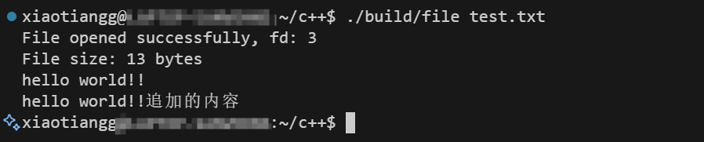
:::tip
文件写入后只是写入到内核的缓存区，标记为脏页，由内核决定什么时候刷新到磁盘，可以通过`int fsync(int fd)`将与fd相关的脏页立即刷新到磁盘
:::


### 文件信息
```cpp
//文件名 stat结构体指针
int stat(const char *file_name, struct stat *buf);   
//文件描述词  stat结构体指针
int fstat(int fd, struct stat *buf);      

struct stat {
    dev_t     st_dev;     /* 文件所在设备的设备号 */
    ino_t     st_ino;     /* 索引节点号（inode） */
    mode_t    st_mode;    /* 文件类型 + 访问权限 */
    nlink_t   st_nlink;   /* 硬链接数 */
    uid_t     st_uid;     /* 所有者 UID */
    gid_t     st_gid;     /* 所有者 GID */
    dev_t     st_rdev;    /* 特殊文件的设备号（如设备文件） */
    off_t     st_size;    /* 文件大小（字节） */
    blksize_t st_blksize; /* 最优 I/O 块大小 */
    blkcnt_t  st_blocks;  /* 占用磁盘块数（1块=512字节） */
    struct timespec st_atim;  /* 最后访问时间（秒+纳秒） */
    struct timespec st_mtim;  /* 最后修改时间（秒+纳秒） */
    struct timespec st_ctim;  /* 最后状态改变时间（秒+纳秒） */
#ifdef __USE_XOPEN2K8
    off_t     st_atime_nsec;  /* 访问时间纳秒（扩展成员） */
    off_t     st_mtime_nsec;  /* 修改时间纳秒（扩展成员） */
    off_t     st_ctime_nsec;  /* 状态改变时间纳秒（扩展成员） */
#endif
};
```

### mmap(内存映射)
* mmap(memory map)本质上是建立物理地址与虚拟地址的映射关系
将不同进程的虚拟内存映射到相同的物理内存，相比文件流和文件描述符，mmap只建立映射，不用将内核中数据拷贝到用户态
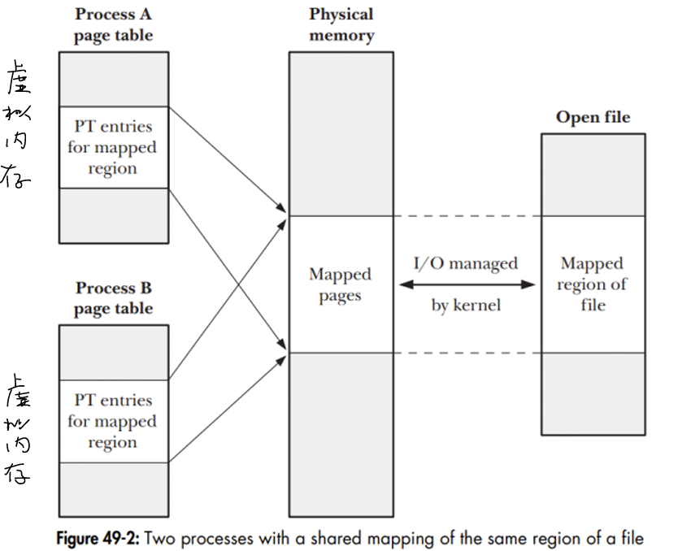
* Linux内核中大部分也是使用虚拟内存，内核和进程的虚拟内存都可以映射到同一物理内存
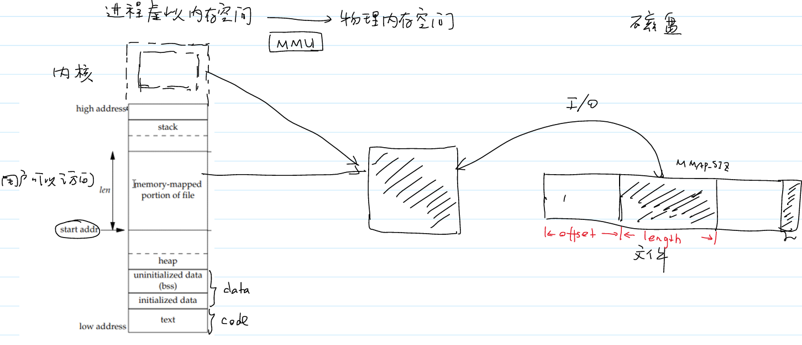
**实际应用场景**
* 共享内存：内核分配一块物理内存，同时映射到多个进程的用户虚拟地址空间，且内核自身也会映射该物理内存（用于管理），实现「进程间共享数据」或「内核与进程共享数据」
* 设备驱动的内存映射：硬件设备的 I/O 内存通常会被内核映射到内核虚拟地址（内核操作硬件），同时驱动可通过 mmap() 接口，将**同一块设备物理内存**映射到用户态的虚拟地址，让应用程序直接操作硬件（无需系统调用中转，效率极高）
```cpp
// addr 映射其实地址,图中start addr
// pro_t保护位 PROT_EXEC PROT_READ PROT_WRITE PROT_NONE
// flags对内存映射区域的修改是否对映射了同一区域的其他进程可见
// MAP_SHARED 进程共享修改，修改同步底层文件，持久化
// MAP_PRIVATE 修改仅当前进程可见，copy-on-write写时复制，仅在进程写的时候复制
// 进程私有，修改后内容在进程退出后丢失，原文件内容不改变
void *mmap(void *addr, size_t length, int prot, int flags, int fd, off_t offset);
int munmap(void *addr, size_t length);
```
```cpp
#include <sys/mman.h>
#include <fcntl.h>
#include <unistd.h>
#include <iostream>
#include <sys/stat.h>
#include <cstring>
using namespace std;
#define MMAP_SIZE 4096

int main(int argc, char* argv[]) {
    if (argc < 2) {
        cerr << "Usage: " << argv[0] << " <src> <dest>" << endl;
        return 1;
    }
    int srcFd = open(argv[1], O_RDONLY);
    if (srcFd < 0) {
        cerr << "Failed to open source file: " << argv[1] << endl;
        return 1;
    }
    int destFd = open(argv[2], O_RDWR | O_CREAT | O_TRUNC, 0666);
    if (destFd < 0) {
        cerr << "Failed to open destination file: " << argv[2] << endl;
        return 1;
    }

    // 获取源文件大小
    struct stat srcStat;
    fstat(srcFd, &srcStat);
    off_t srcSize = srcStat.st_size;
    truncate(argv[2], srcSize);

    off_t offset = 0;
    while (offset < srcSize) {
        off_t length = 0;
        if (srcSize - offset < MMAP_SIZE) {
            length = srcSize - offset;
        } else {
            length = MMAP_SIZE;
        }
        void* srcAddr = mmap(nullptr, MMAP_SIZE, PROT_READ, MAP_SHARED, srcFd, offset);
        if (srcAddr == MAP_FAILED) {
            cerr << "mmap failed for source file" << endl;
            break;
        }
        void* destAddr = mmap(nullptr, MMAP_SIZE, PROT_READ | PROT_WRITE, MAP_SHARED, destFd, offset);
        if (destAddr == MAP_FAILED) {
            cerr << "mmap failed for destination file" << endl;
            break;
        }
        // 复制数据
        memcpy(destAddr, srcAddr, length);
        offset += MMAP_SIZE;

        // 解除映射
        int mun1 = munmap(srcAddr, length);
        if (mun1 != 0) {
            cerr << "munmap failed for source file" << endl;
        }
        int mun2 = munmap(destAddr, length);
        if (mun2 != 0) {
            cerr << "munmap failed for destination file" << endl;   
        }
    }
    return 0;
}
```

## 进程
* 在操作系统中，进程是分配资源的最小单位，每个进程占用的资源包括上下文、工作目录、寄存器值、打开文件表(fd表)等
* 进程之间是隔离的，进程通过系统调用执行上下文切换，每个进程无法感知其他进程的存在

### 相关命令
```bash
ps             # 显示与该终端关联的进程
ps x           # 显示与用户关联的进程
ps aux         # 与所有用户相关的进程
top            # 每秒统计进程信息，类似Windows任务管理器
pstree         # 打印进程树
kill -l        # 显示所有信号
kill -9 pid    # 以异常方式终止前台和后台进程
ctrl + c/z     # 当进程在前台运行时，终止/暂停信号
```
* 进程状态码
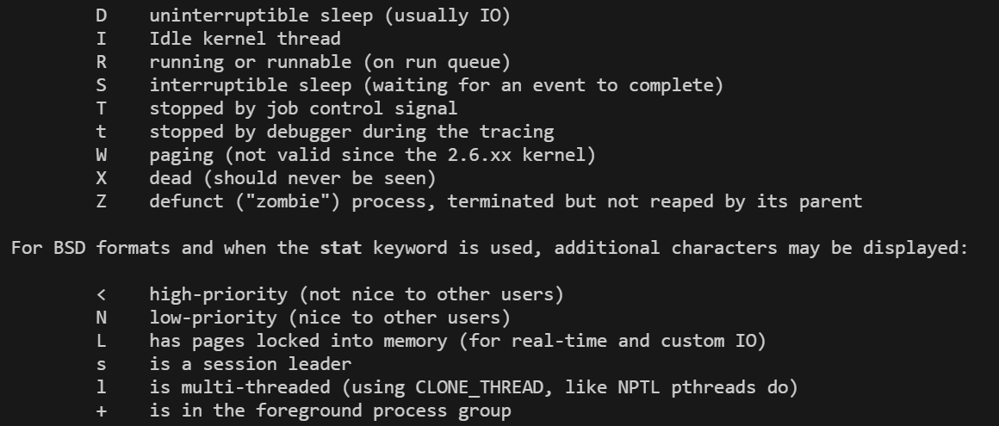

### 进程标识
* **PID(process identification)** 系统会为每个进程分配一个PID
* PID 前1024为长期运行系统进程保留，从1025-MAX循环分配
* 通过系统调用`pid_t getpid()`获取当前进程PID,`pid_t getppid()`获取父进程PID，如果父进程终止，会被`PID=1`进程接管。

### 进程创建
* `pid_t fork()`创建进程，创建成功在父进程中返回子进程的pid、子进程中返回0。创建失败返回-1
* 父子进程都是从fork后开始返回，子进程不会执行前面的代码
* 文件描述符表是进程私有的，共享打开文件(表项)

**fork原理：**
1. 复制父进程的进程控制块PCB(task_struct)，修改PID,PPID、运行状态等字段
2. 复制父进程的虚拟地址空间(代码段，数据段，堆、栈)和页表，设为只读、写时复制
3. 复制父进程的文件描述符表，指向同一个打开文件表项(引用+1)

```cpp
int a = 10;  // 数据段

int main() {

    cout << "Before Forking Process!\n";
    int b = 20; // 栈
    int* c = new int(30); // 堆
    pid_t pid = fork();
    if (pid < 0) {
        cerr << "Fork failed!" << endl;
        return 1;
    } else if (pid == 0) {
        // Child process
        a += 100, b += 100, *c += 100;
        printf("a: %d, b: %d, c: %d\n", a, b, *c);
        cout << "Hello from Child Process! PID: " << getpid()  << ", ParentPID: " << getppid() << endl;
    } else {
        // Parent process
        sleep(3);
        printf("a: %d, b: %d, c: %d\n", a, b, *c);
        cout << "Hello from Parent Process! PID: " << getpid() << ", Child PID: " << pid << endl;
    }
    return 0;
}
```
* 输出结果
```bash
Before Forking Process!
a: 110, b: 120, c: 130
Hello from Child Process! PID: 24935, ParentPID: 24934
a: 10, b: 20, c: 30
Hello from Parent Process! PID: 24934, Child PID: 24935
```
* 如果去掉`cout << "Before Forking Process!\n";`中的换行符，结果如下
```cpp
Before Forking Process!a: 110, b: 120, c: 130
Hello from Child Process! PID: 29893, ParentPID: 29892
Before Forking Process!a: 10, b: 20, c: 30
Hello from Parent Process! PID: 29892, Child PID: 29893
```
* 原因是stdin、stdout为行缓冲，没有读到换行符会一直留在用户态缓冲区(属于虚拟内存空间，实行COW)，会导致子进程也会复制一份。
* 使用`fflush(stdout)`手动刷新到内核缓存区

### 进程终止
* 正常终止(retutn -> exit(库函数) -> _exit(系统调用))
* 异常终止(abort -> SIGABRT)，内核给进程发信号`kill -6 pid`

exit执行过程
1. 执行atexit注册函数
2. 刷新用户态缓冲区
3. 调用_exit(status)终止进程
```cpp
void cleanup_function() {
    cout << "Executing cleanup function before exit.";
}

int main() {
    atexit(cleanup_function);
    cout << "Program is running. PID: " << getpid();
    // Program is running. PID: 38584Executing cleanup function before exit.
     exit(999);
    // 没有刷新用户态缓存，没有执行cleanup_function，无输出
    _exit(999); 
    return 0;
}
```

### wait/waitpid
* 父进程通过`fork`创建子进程，子进程推出后，会保留PCB，包含退出信息，资源使用情况等。由父进程调用`wait()`或`waitpid()`回收资源，否则会变成僵尸进程
* 孤儿进程：子进程存活，父进程终止，子进程会被`1`号进程收养，由`1`号进程回收资源
* 僵尸进程：子进程终止后，父进程未调用`wait/waitpid`回收资源，导致PCB残留在进程，占用系统资源
```cpp
// 返回终止子进程的pid 状态信息由wstatus传出
pid_t wait(int *wstatus);
// pid > 0 等待指定子进程 pid = -1 等待任意子进程 
// options为WNOHANG时不阻塞，立刻返回，如何没有子进程状态改变，返回0
pid_t waitpid(pid_t pid, int *wstatus, int options);
```
```cpp
void print_status(int status) {
    if (WIFEXITED(status)) { // 子进程是否正常终止
        cout << "Child exited with code: " << WEXITSTATUS(status) << endl;
    } else if (WIFSIGNALED(status)) { // 子进程是否异常终止
        cout << "Child terminated by signal: " << WTERMSIG(status) << endl;
    } else {
        cout << "Child stopped or continued" << endl;
    }
}

int main() {
    pid_t pid = fork();
    if (pid < 0) {
        cerr << "Fork failed!" << endl;
        return 1;
    } else if (pid == 0) {
        // Child process
        cout << "Hello from Child Process! PID: " << getpid() << endl;
        exit(122);
        // sleep(5);
    } else {
        // Parent process
        sleep(10);
        int status;
        pid_t waitedPid = wait(&status);
        cout << "Hello from Parent Process! " << waitedPid << " terminated" << endl;
        print_status(status);
    }
    return 0;
}
```
```bash
# 正常终止
Hello from Child Process! PID: 81864
Hello from Parent Process! 81864 terminated
Child exited with code: 122
```

### exec
* 替换当前进程的代码段、数据段和堆栈，执行一个新程序，程序完全替换为新程序，但进程的PID不变
```cpp
// pathname 可执行文件的路径或相对路径
// file 文件名，会自动搜索 PATH 环境变量指定的目录
// environment 会替换环境变量
extern char **environ;
int execl(const char *pathname, const char *arg, .../*, (char *) NULL */);
int execlp(const char *file, const char *arg, .../*, (char *) NULL */);
int execle(const char *pathname, const char *arg, .../*, (char *) NULL, char *const envp[] */);
int execv(const char *pathname, char *const argv[]);
int execvp(const char *file, char *const argv[]);
int execvpe(const char *file, char *const argv[], char *const envp[]);

char* env[] = { (char*)"PATH=/home/xiaotiangg/c++/build", nullptr };
char* argv[] = { (char*)"./test", (char*)"arg1", (char*)"arg2", nullptr };

int main() {
    // execl("/bin/ls", "ls", "-l", "/home", nullptr);
    // execlp("build/test", "./test", "arg1", "arg2", nullptr);
    // execle("build/test", "./test", "arg1", "arg2", nullptr, env);
    execvpe("build/test", argv, env);
    return 0;    
}
```

### 会话
* 会话是终端与进程之间的桥梁，关联一个终端，管理多个进程组,前台(终端)/后台(&命令)
* 终端接受用户输入，如关闭终端、输入信号会传递给会话所有进程
* 会话首进程(如shell，`setsid()`的调用进程)，SID=PID
**示例**
1. 终端启动后，首先创建bash进程，就是「会话首进程」（SID = bash 的 PID）
2. bash 中执行 ls -l、cat命令，都属于同一个进程组（前台进程组）
3. 若执行 sleep 100 &（后台运行），sleep 会被放入后台进程组，仍属于当前会话（SID 为终端会话 ID），但不接收终端输入
4. 关闭终端窗口时，系统会向会话内所有进程发送 SIGHUP 信号，导致所有进程终止（这也是普通后台进程 & 关闭终端后会退出的原因）

### 守护进程(daemon)
* 守护进程是一种脱离终端关联的独立会话（SID 为自身 PID）、独立进程组
1. fork + 父进程退出
2. 设置`setsid()`让子进程成为会话首进程，脱离终端
3. 修改工作目录到`/`，避免守护进程占用某个挂载目录
4. 设置文件权限掩码`umask(0)`，清除默认权限掩码，让守护进程创建的文件/目录拥有完整权限
5. 关闭标准输入 / 输出 / 错误
:::tip
现在Linux发行版本中不再手写`daemon`，让`Systemd(aemon)`管理运行、重启、日志等。
:::


## 进程间通信(IPC)
* **进程间通讯**(Inter-Process Communication)打破进程隔离，实现数据交换、状态同步、资源共享
* **传统IPC**(管道、信号)、**System V IPC**(消息队列、共享内存、信号量)、**Socket** 
* IPC核心作用是**打破进程隔离，实现数据交换、状态同步、资源共享。**

### 管道
* 半双工通讯，同一时间只能单向传输数据
* 面向字节流，数据之间无边际，需要定义分隔符，如`\n`
* 读端无数据时阻塞，写端缓存满时阻塞，关闭读端后写端收到`SIGPIPE`信号
#### 匿名管道
* 一般用于父子、兄弟进程专用，通过`int pipe(int pipefd[2])`,`pipefd`传入参数返回两个文件描述符，`fd[0]`表示读端，`fd[1]`表示写端。父子、兄弟间通讯通过`fork()`继承后分别关闭读端和写端进行通讯
* 仅存在内核中，无名字，不占用文件系统资源，用完后释放
```cpp
int main() {
    int pipefd[2];
    if (pipe(pipefd) == -1) {
        cerr << "Pipe creation failed" << endl;
        return 1;
    }
    pid_t cpid = fork();
    if (cpid == -1) {
        cerr << "Fork failed" << endl;
        return 1;
    }
    if (cpid == 0) {
        close(pipefd[0]);
        write(pipefd[1], "Hello from child", 16);
        cout << "Child sent message" << endl;
        return 0;
    } else if (cpid > 0) {
        close(pipefd[1]);
        wait(NULL); // Wait for child to finish
        char buffer[100];
        ssize_t n = read(pipefd[0], buffer, sizeof(buffer));
        cout << "Parent received: " << string(buffer, n) << endl;
        return 0;
    }
    return 0;
}
```

#### 命名管道(FIFO)
* 通过`mkfifo()`函数或者`mkfifo`命令创建命名管道，创建一个类型为`p`的系统文件
* 任意进程都可以打开文件进行读写进行通讯，使用完后需要手动删除文件或者使用`unlink()`函数
```cpp
int main()
{
    pid_t pid = fork();
    if (pid < 0) {
        cerr << "Fork failed" << endl;
        return 1;
    } else if (pid == 0) {
        int fd = open("named_pipe", O_WRONLY);

        sleep(5);
        cout << "Child process writing to pipe..." << endl;
        write(fd, "Hello from child process", 24);
        close(fd);
    } else {
        int fd = open("named_pipe", O_RDONLY);
        char buffer[100];
        ssize_t n = read(fd, buffer, sizeof(buffer));
        cout << "Parent received: " << string(buffer, n) << endl;
        close(fd);
    }
    unlink("named_pipe"); // 删除管道文件
    return 0;
}
```
```cpp
pid_t pid = fork();
if (pid == 0) {
    int fd = open("named_pipe", O_WRONLY);
    write(fd, "Hello from child process", 24);
    close(fd);
} else {
    int fd = open("named_pipe", O_RDONLY);
    wait(NULL); // 阻塞 等待子进程写,应该删除
    read(fd, buffer, sizeof(buffer)); // 如果没有内容读会阻塞，直到子进程写入内容
}
```
:::tip
管道是无缓冲、单向流的。
当所有写端关闭后，读端的`read()`就会立刻返回`0（EOF）`，即使子进程曾经写过内容，只要读之前没人读，数据就会被内核缓冲区清空（EOF信号触发）。
:::

### 信号
* 信号是Linux的一种事件通知机制，内核感知事件源，当事件源发生某个事件时，内核会发送信号给进程，进程可以自定义处理函数
  1. 事件源包括硬件(`SIGSEGV`段错误、`SEGFPE`浮点错误)、内核(`SEGPIPE`读端关闭，写管道)、应用程序(`SEGABRT`进程终止)、用户(`ctrl + c \ z SEGINT SEGQUIT SEGTSTOP`)
  2. `kill(pid_t pid, int sig)`向指定进程发送信号、`raise(int sig)`给自身进程发信号，也可以通过`kill -[signum] pid`命令发送信号
  3. 进程自定义处理函数
  ```cpp
  typedef void (*sighandler_t)(int);
  // signum 要捕获的信号  SIG_IGN忽略 SIG_DFL执行默认处理
  // 默认行为 Term终止 Ign忽略 Core终止并生成核心文件 Stop暂停 Cont恢复
  sighandler_t signal(int signum, sighandler_t handler);
  The signals SIGKILL and SIGSTOP cannot be caught or ignored.
  ```
* 信号是异步的：信号可以在任意时刻发送，进程什么时候收到信号是不确定的，进程收到信号后立刻处理信号
* 信号是不稳定的：事件产生信号到内核递送信号(往往在进程调度前)之间信号可能丢失。发送相同信号多次，仅处理一次也会丢失信号。
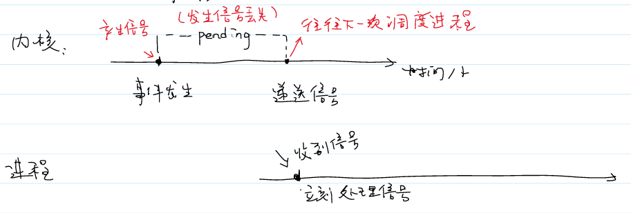
* 不同系统关于信号的语义不一样
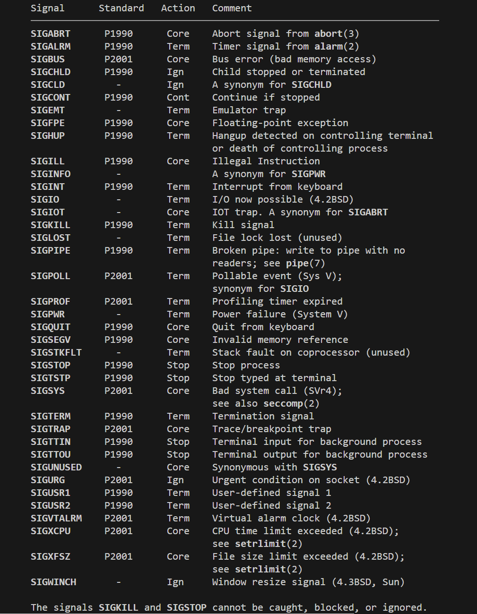
```cpp
void handle(int signum) {
    switch(signum) {
        case SIGINT:
            cout << "Caught SIGINT (Ctrl+C)." << endl;  
            break;
        case SIGTSTP:
            cout << "Caught SIGTSTP (Ctrl+Z)." << endl;
            break;
        case SIGKILL:
            cout << "Caught SIGKILL." << endl;
            break;
        default:
            cout << "Caught signal " << signum << endl;
    }
}

int main()
{
    if (signal(SIGINT, handle) == SIG_ERR) {
        cerr << "Error setting signal handler for SIGINT" << endl;
        return 1;
    }
    if (signal(SIGTSTP, handle) == SIG_ERR) {
        cerr << "Error setting signal handler for SIGTSTP" << endl;
        return 1;
    }
    if (signal(SIGQUIT, handle) == SIG_ERR) {
        cerr << "Error setting signal handler for SIGQUIT" << endl;
        return 1;
    }
    // Note: SIGKILL cannot be caught or ignored, so this is just for demonstration
    if (signal(SIGKILL, handle) == SIG_ERR) {
        cerr << "Error setting signal handler for SIGKILL" << endl;
    }
    cout << "Process ID: " << getpid() << endl;
    while (true) {
        // Keep the program running to catch signals
    }
    return 0;
}
```
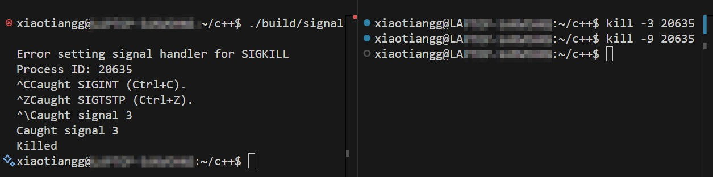
* `SIGINT、SIGTSTP、SIGQUIT`都被捕获，`SIGKILL`无法被捕获，是为了确保进程一定可以被终止

### 共享内存 + 信号量
* 共享内存是指内核将同一块物理内存映射到不同进程各自的虚拟地址空间，实现进程间共享数据，无需将内核将数据拷贝到用户态。
* 内核不保证进程访问的互斥性，需要配合信号量和互斥锁实现同步，避免**竞态条件**
* System V IPC 相关命令
```bash
ipcs            # 查看IPC相关信息 -l 查看各个IPC的限制
ipcrm -m shmid  # 删除指定共享内存段
ipcrm -s semid  # 删除指定信号量集合
ipcrm -q msgid  # 删除指定信号量集合
```
```cpp
// 根据文件和项目id生成一个键
key_t ftok(const char *pathname, int proj_id);
// 创建或返回已有的共享内存段，key取IPC_PRIVATE时进程私有，shmflg为权限和选项
int shmget(key_t key, size_t size, int shmflg);
// 共享内存段映射到进程虚拟地址空间，addr为null自动选择合适空间，
void *shmat(int shmid, const void *shmaddr, int shmflg);
int shmdt(const void *shmaddr); // 解除链接
// op: PC_STAT 来获取共享段信息的数据结构(buf返回) IPC_RMID 删除共享段
int shmctl(int shmid, int op, struct shmid_ds *buf);


#define SHM_KEY 0x1234  // 定义共享内存键值
#define SHM_SIZE 1024  // 定义共享内存大小
int main(int argc, char* argv[])
{
    int shmid = shmget(SHM_KEY, SHM_SIZE, IPC_CREAT | 0666);
    if (shmid < 0) {
        cerr << "shmget failed" << endl;
        return 1;
    }
    
    char* shm_addr = (char *)shmat(shmid, nullptr, 0);
    if (argc == 2) {
        strcpy(shm_addr + strlen(shm_addr), argv[1]);
        cout << "Written to shared memory: " << argv[1] << endl;
        shmid_ds buf;
        shmctl(shmid, IPC_STAT, &buf);
        printf("cuid = %d, perm = %o, size = %lu nattch = %lu\n",
            buf.shm_perm.cuid, buf.shm_perm.mode, buf.shm_segsz, buf.shm_nattch);
        shmdt(shm_addr);
        return 0;
    } else {
        cout << "Read from shared memory: " << shm_addr << endl;
        shmctl(shmid, IPC_RMID, nullptr);
    }
    return 0;
}
```
```cpp
// nsems 信号量个数 shmflg为权限和选项
int semget(key_t key, int nsems, int semflg);
// semnum 信号量在信号集合中的索引 op: SETVAL获取 GETVAL查询 IPC_RMID删除
int semctl(int semid, int semnum, int op, ...);
int semop(int semid, struct sembuf *sops, size_t nsops);
// sem_num表示信号量值在集合的索引 sem_op信号量数值的变化，sem_flg其他控制信息
struct sembuf{
    unsigned short sem_num;  /* semaphore number */
    short          sem_op;   /* semaphore operation */
    short          sem_flg;  /* operation flags */
}


const int N = 100000;
void sem_p(int semid) {
    struct sembuf p = {0, -1, SEM_UNDO};
    semop(semid, &p, 1);
}
void sem_v(int semid) {
    struct sembuf v = {0, 1, SEM_UNDO};
    semop(semid, &v, 1);
}
int main()
{
    int key_t = ftok("/semaphore.cpp", 'S');
    // Create semaphore
    int semid = semget(key_t, 1, IPC_CREAT | 0666);
    if (semid < 0) {
        cerr << "semget failed" << endl;
        return 1;
    }
    // Initialize semaphore to 1
    semctl(semid, 0, SETVAL, 1);

    int shmid = shmget(SHM_KEY, SHM_SIZE, IPC_CREAT | 0666);
    if (shmid < 0) {
        cerr << "shmget failed" << endl;
        return 1;
    }
    int* shm_addr = (int *)shmat(shmid, nullptr, 0);
    shm_addr[0] = 0;

    pid_t pid = fork();
    if (pid < 0) {
        cerr << "Fork failed" << endl;
        return 1;
    } else if (pid == 0) {
        for (int i = 0; i < N; i++) {
            sem_p(semid);
            shm_addr[0]++;
            sem_v(semid);
        }
        exit(0);
    } else {
        for (int i = 0; i < N; i++) {
            sem_p(semid);
            shm_addr[0]++;
            sem_v(semid);
        }
        wait(nullptr);
        cout << "Final value: " << shm_addr[0] << endl;
    } 
    shmdt(shm_addr);
    shmctl(shmid, IPC_RMID, nullptr);
    semctl(semid, 0, IPC_RMID);
    return 0;
}
```

### 消息队列
* 消息队列适用于带类型的消息传输，由内核维护的链表结构
* 数据有边界，每个消息是独立的单元
* 进程发送消息后存在内核中，进程退出后消息不丢失
* 数据需要拷贝到内核，速度比共享内存慢
```cpp
int msgget(key_t key, int msgflg);
//  msgp参数总是指向消息数据 第一个成员必须是长整型表示类型 msgsz表示消息数组大小
int msgsnd(int msqid, const void *msgp, size_t msgsz, int msgflg);
ssize_t msgrcv(int msqid, void *msgp, size_t msgsz, long msgtyp, int msgflg)
int msgctl(int msqid, int op, struct msqid_ds *buf);


struct mymsg {
    long mtype;
    char mtext[100];
};

int main() 
{
    int key = ftok("msg_queue.cpp", 'A');
    int msgid = msgget(key, IPC_CREAT | 0666);
    if (msgid < 0) {
        cerr << "msgget failed" << endl;
        return 1;
    }
    pid_t pid = fork();
    mymsg msg;
    if (pid < 0) {
        cerr << "Fork failed" << endl;
        return 1;
    } else if (pid == 0) {
        msg.mtype = 1;
        strcpy(msg.mtext, "Hello, this is a message queue example.");
        msgsnd(msgid, &msg, sizeof(msg.mtext), 0);
        cout << "Message sent from child process." << endl;
        exit(0);
    } else {
        msgrcv(msgid, &msg, sizeof(msg.mtext), 1, 0);
        cout << "Message received in parent process: " << msg.mtext << endl;
    }
    msgctl(msgid, IPC_RMID, nullptr);
    return 0;
}
```

### 套接字(socket)


## 线程

