# Linux 网络编程

## 网络模型和协议
* 采用分层模型实现网络通讯和数据交换，OSI网络模型分为七层，从上到下分别是应用层、表示层、会话层、传输层、网络层、数据链路层和物理层。而目前广泛应用的是TCP/IP网络模型，从上到下分别是应用层、传输层、网路层、网络接口层。
* 一般在学习开发中，结合两者，采用五层网络模型，从上到下分别是应用层、传输层、网路层、数据链路层、物理层。本文基于五层模型进行学习理解。
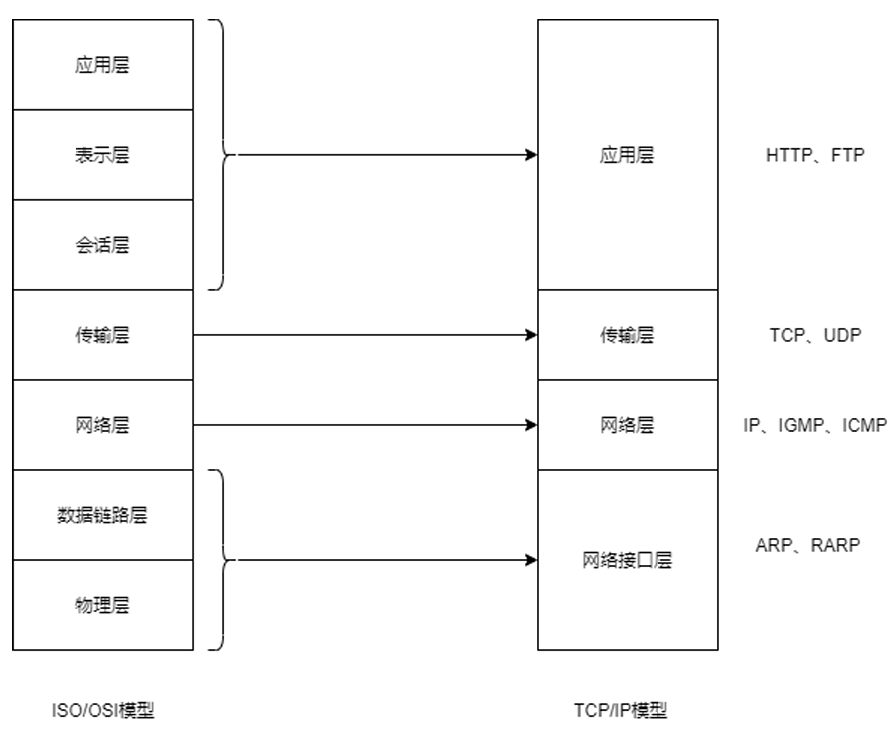
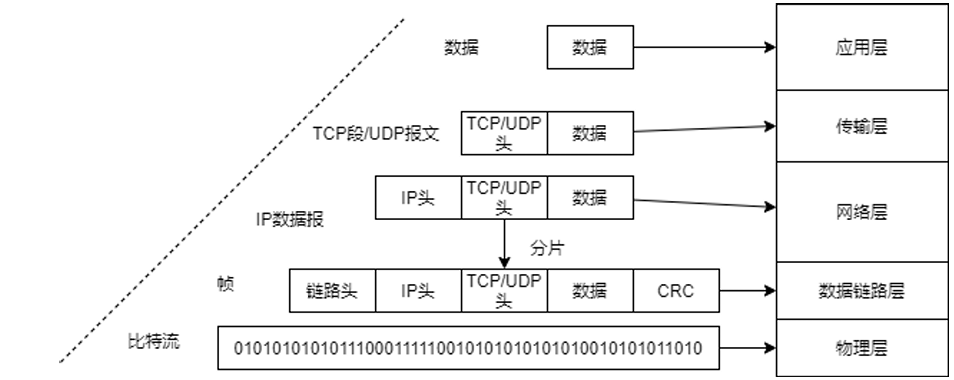

### 物理层
* 负责比特流的传输，把 0 和 1 真实地发送到电缆、光纤、无线电中

### 数据链路层
* 保证在同一局域网(同一链路)内的设备之间可靠传输数据帧。交换机、网卡工作在这一层
* 核心功能包括封装成帧(Frame)，差错检测，MAC寻址(ARP, RRAP)，主要协议有Ethernet(以太网)
* 以太网帧的一般格式如下,地址是指主机的MAC地址，数据部分不足46字节的补0
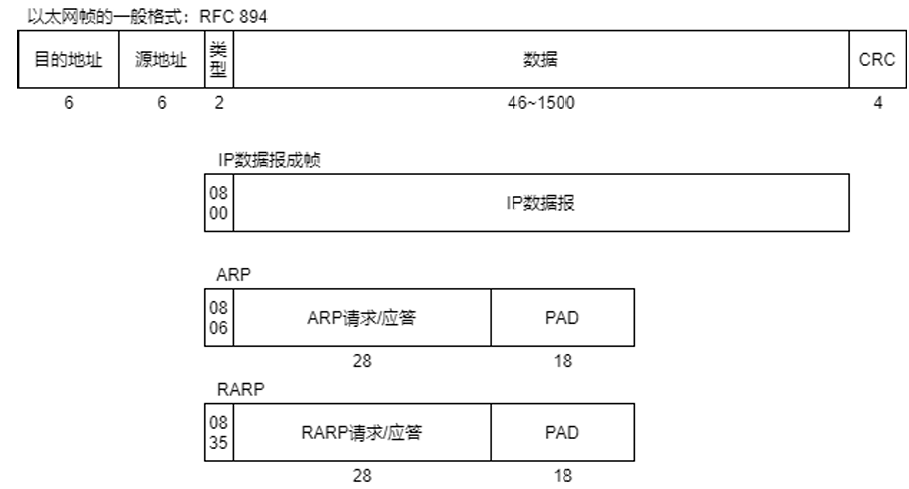

#### ARP地址解析协议
* 负责将IP数据报中的IP地址转换为MAC地址填入帧头，通过广播向当前网段的主机发送ARP请求(who has x.x.x.x? tell x.x.x.x)，收到请求的目的主机会响应请求(x.x.x.x is at MAC)
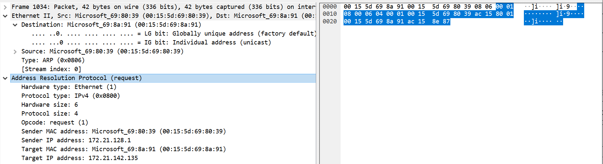
* wireshark抓取的请求如图，前14个字节为以太网头，数据部分包含28字节，源地址，广播地址FF:FF:FF:FF:FF:FF(图中为定向arp request)，剩余18字节为PAD未显示

### 网络层
* 决定数据包从源到目的需要走哪条路，负责路由与转发，路由器，部分三层交换机工作在这一层
* 核心功能包括IP地址、路由选择、IP分片重组，主要协议有IP、ICMP、OSPF/RIP/BGP

#### IP
* IP地址采用**CIDR无分类域间路由选择**进行地址划分，采用网络前缀和主机号划分网段，特殊的IP地址如下

| IP网段 | 用途 |
| :----: | :----: |
| 0.0.0.0/8 | 作为源地址时表示本地主机；作为目的地址时，表示任意IP地址 |
| 10.0.0.0/8 | 局域网IP地址 |
| 172.16.0.0/12 | 局域网IP地址 |
| 192.168.0.0/16 | 局域网IP地址 |
| 127.0.0.0/8 | 本地回环地址 |
| 255.255.255.255/32 | 本地网络广播地址 |
* IP数据报格式如图
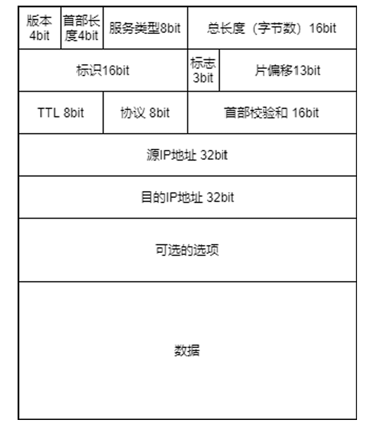
* 分片重组，由于IP数据报的长度限制65536字节，而数据链路层MTU为1500字节，因此IP数据包进入链路层时会进行分片，在网络中传输到目的主机，在网络层会进行重组
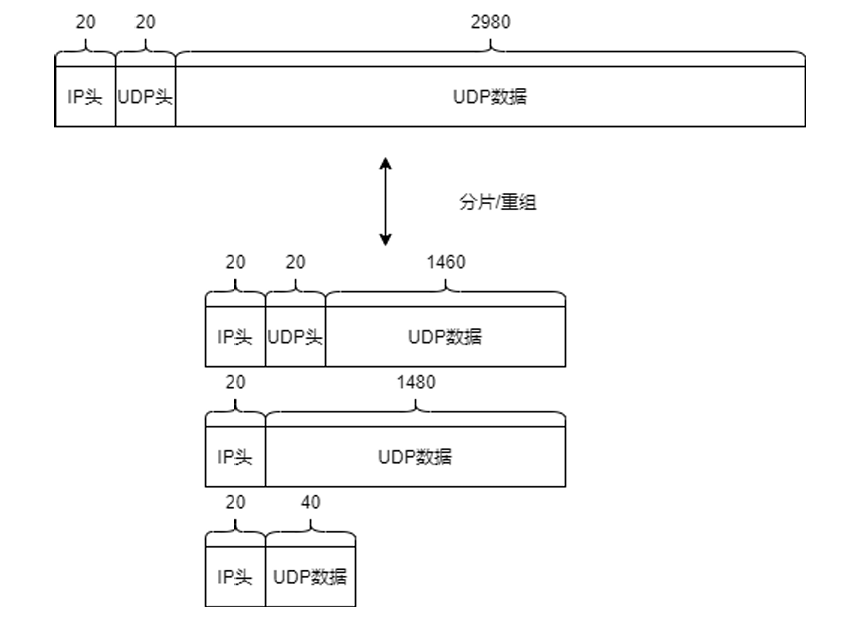
::: tip
因此一些协议会避免让数据报长度超过MTU，如TCP协议会在选项中设置最大段长度MSS为1460字节(MSS = MTU - TCP头 - IP头)
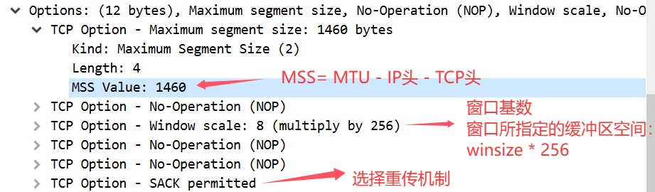
:::
* 通过路由表告诉设备收到的数据包该往哪个方向转发，实现跨网段、跨网络的通信。Linux使用`route -n`查看主机的路由表

#### NAT网络地址转换
NAT就是在离开内部网络的时候重写数据报的源地址为公网地址，进入内部网络的时候将目的地址从公网地址改成内网地址

#### ICMP网际控制报文协议
* ICMP（Internet Control Message Protocol）是一种网络层协议，主要用于传递控制消息与错误信息，用来让网络设备报告错误、测试连通性、控制网络行为。
* `ping`和`traceroute`（Windows下为`tracert`）

### 传输层
* 提供端到端通信，建立程序之间的“逻辑连接”，主要协议有TCP、UDP

#### TCP协议
* TCP是一个可靠、面向连接、字节流的协议
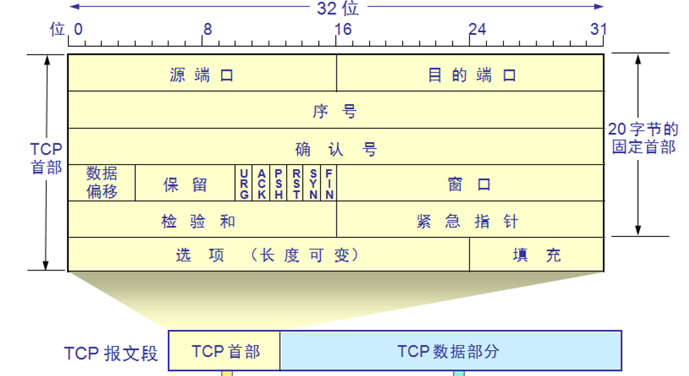

**序号：** 对于应用层的数据按字节进行编号，防止达到对端后发生乱序情况
**确认号：** 对已经发送的数据进行确认，表示确认号之前的数据已经到达，保证数据可靠到达
**数据偏移:** 表示TCP的报文头长度，(5 ~ 15) * 4(Base)= 20 ~ 60，TCP报文头至少20字节，最多60字节，TCP协议是一个可以扩展的协议

**标志位:**
* ***SYN:*** 建立连接请求，并设置序号
* ***ACK:*** 确认报文，设为`1`时，确认号有效
* ***FIN:*** 断开连接请求

**窗口：** 使用**滑动窗口机制**来实现**流量控制**和**拥塞控制**，发送方和接收方都维护一个滑动窗口，发送方窗口大小根据接收方窗口大小和当前网络状况动态调整，避免双方发送速率不一致或网络问题。

* TCP连接过程及状态变化
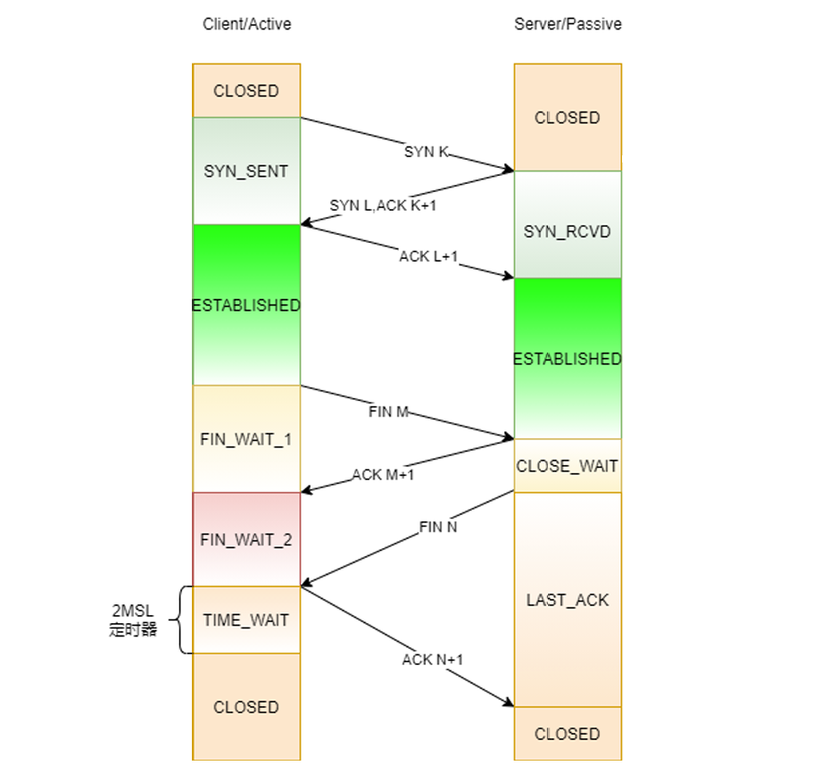

* 建立连接抓包如下
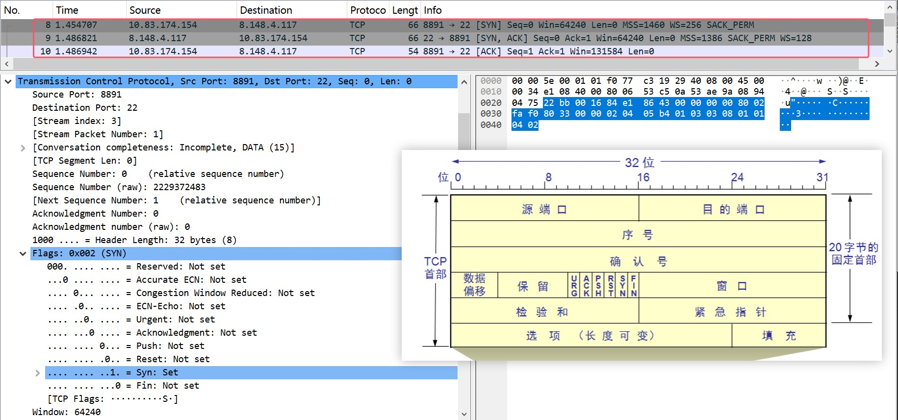

::: tip 
**Q1: 建立连接采用三次握手而不是两次的原因?** \
A1: 采用两次握手无法保证双方状态一致。 \
1.当客户端SYN请求未及时到达服务端时，客户端重发请求，服务器接受请求并建立连接，然后完成传输断开连接后，此时，第一次SYN请求延迟到达服务器时，服务器返回ACK并建立连接后，客户端并未建立连接。\
2.两次握手当服务端ACK返回丢失后，服务器不会重传ACK报文，会导致服务端已经建立连接，而客户端未建立连接。
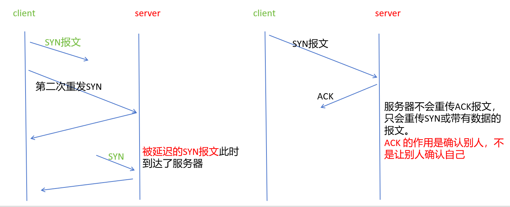

**Q2: 断开连接为什么采用四次挥手?** \
A2: TCP是全双工通信，但TCP的关闭是单向的，两端都必须独立的关闭自己的发送方向，因此需要两次FIN+ACK，特殊情况下，当发送方也没有数据发送时，会合并第二三次挥手。

**Q3: 服务端可以主动断开连接吗?** \
A3: 可以，服务端断开连接后进入TIME_WAIT状态，持续2MSL的超时时间，此时服务器资源被浪费，一般情况下不主动断开连接。\
主动关闭连接(发送FIN)的一方会进入TIME_WAIT状态，与客户端服务端无关。

**Q4: 为什么需要TIME_WAIT状态?** \
A4: 1. 防止最后一个ACK丢失，对端重传FIN报文情况。如直接关闭，此时无法接收到对端重传FIN报文，导致两边状态不一致。2MSL ≈ ACK(丢失) + 重传FIN。 \
2. 等待2MSL(Maximum Segment Lifetime)让网络中延迟的报文自然消失，避免污染新连接。
:::

#### UDP协议
* UDP是一个无连接、不可靠、面向报文、高效的协议。
* 无连接：通信前无需建立连接，意味着支持一对一、一对多通信。
* 不可靠：不保证消息一定送达、消息有序、消息不重复。
* 面向报文：对于应用层传来的数据视为完整的数据包，交给IP层分片，一次发送就是一条消息
* 头部信息如下
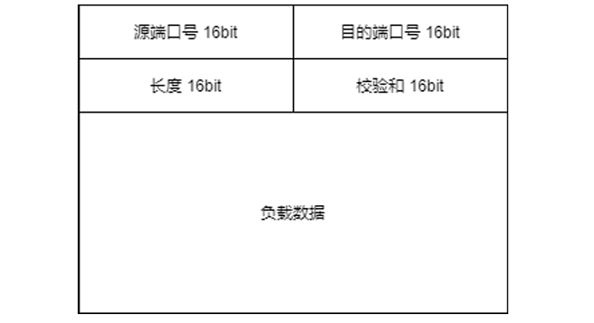

### 应用层

## socket编程

### 地址信息
* 字节序：字节数据在内存中存放的数据，网络协议采用(TCP/IP)大端序，x86/x64、ARM架构通常采用小端序
* 大端序：高地址存低字节、低地址存高字节，如0x12345678，地址由低到高，存放12 34 56 78
* 小端序：高地址存高字节、低地址存低字节，如上，地址由低到高，存放78 56 34 12
```cpp
struct sockaddr_in {
    sa_family_t sin_family; /* address family: AF_INET */
    in_port_t sin_port;   /* port in network byte order */
    struct in_addr sin_addr;   /* internet address */
};
 /* Internet address. */
struct in_addr {
    uint32_t       
};

// 网络字节序与主机字节序转换 
// h --> host n --> net l --> 32bit s --> 16bit
uint32_t htonl(uint32_t hostlong);
uint16_t htons(uint16_t hostshort);
uint32_t ntohl(uint32_t netlong);
uint16_t ntohs(uint16_t netshort);

// #include <arpa/inet.h>
// 将字符串转换为网络地址二进制格式
int inet_aton(const char *cp, struct in_addr *inp);
int inet_pton(int af, const char *cp, void *buf);
// 将二进制网络地址转换为字符串格式
char *inet_ntoa(struct in_addr in);
const char *inet_ntop(int af, const void *cp, char buf, socklen_t len);

// 设置服务器地址
struct sockaddr_in server_addr;
memset(&server_addr, 0, sizeof(server_addr));
server_addr.sin_family = AF_INET;
server_addr.sin_port = htons(8080);  // 服务器端口

// 方式一 inet_pton/inet_addr赋值结果已是网络字节序
server_addr.sin_addr.s_addr = inet_addr("192.168.1.1");  // 服务器IP地址
inet_pton(AF_INET, "192.168.1.1", &server_addr.sin_addr); // 服务器IP地址
// 方式二 直接赋值主机字节序后转换为网络字节序
server_addr.sin_addr.s_addr = htonl(0xc0a80101); // 在内存中为01 01 A8 C0而hostl会进行字节序转换

// 验证地址和端口
char ip_buf[INET_ADDRSTRLEN];
printf("服务器地址：%s:%d\n", 
    inet_ntop(AF_INET, &server_addr.sin_addr, ip_buf, sizeof(ip_buf)),
    ntohs(server_addr.sin_port)); // 网络字节序→主机字节序，方便阅读
```

### 通过域名获取IP地址
```cpp
int main(int argc, char *argv[]) {
    struct hostent *host;
    host = gethostbyname("www.baidu.com");
    
    cout << "host name: " << host->h_name << endl;
    for (int i = 0; host->h_aliases[i] != nullptr; i++) {
        cout << "aliase: " << host->h_aliases[i] << endl;
    }
    cout << "address type: " << (host->h_addrtype == AF_INET ? "AF_INET" : "AF_INET6") << endl;
    cout << "address length: " << host->h_length << endl;
    char buf[128] = {0};
    for (int i = 0; host->h_addr_list[i] != nullptr; i++) {
        memset(buf, 0, sizeof(buf));
        inet_ntop(host->h_addrtype, host->h_addr_list[i], buf, sizeof(buf));
        cout << "address " << i + 1 << ": " << buf << endl;
    }
    return 0;
}
```

### 系统调用
* TCP通信流程图
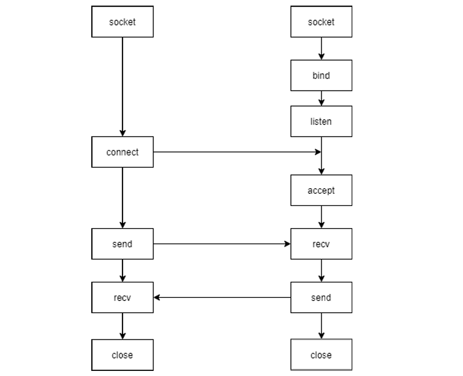

```cpp
// domain AF_INET --> IPv4 AF_INET6 --> IPv6
// type SOCK_STREAM --> TCP SOCK_DGRAM --> UDP
// protocol IPPROTO_TCP --> TCP IPPROTO_UDP -->UDP
// 创建socket设备，返回设备的文件描述符
int socket(int domain, int type, int protocol);
// 通过connect由客户端随机选择一个端口与服务器进行通讯，完成TCP三次握手
int connect(int sockfd, const struct sockaddr *addr, socklen_t addrlen);
// 给套接字绑定IP和端口号
int bind(int sockfd, const struct sockaddr *addr, socklen_t addrlen);
// 开始监听客户端连接，操作系统知道是服务端的套接字，关闭发送、接受缓冲区，维护半连接、全连接队列
// backlog在早期unix系统中为SYN队列长度，现代系统(Linux 2.2+)中，仅指定ACCEPT (全连接队列)的最大长度
int listen(int sockfd, int backlog);
// 从已连接队列中取出连接，返回已连接的套接字
int accept(int sockfd, struct sockaddr *addr, socklen_t *addrlen);
// 在用户态与内核态之间传输数据，传输时机取决于内核
// 使用 read 和 write 可以实现同样的效果，相当于 flags 参数为 0。
// 有可能多个消息会在一次传输中被发送和接收（"粘包"），
// 也有有可能一个消息需要多个传输才能被完整的发送和接收("半包")。
ssize_t send(int sockfd, const void *buf, size_t len, int flags);
ssize_t recv(int sockfd, void *buf, size_t len, int flags);
// 关闭文件描述符
int close(int fd);
```

### socket实践
* 服务端
```cpp
int main() {
    signal(SIGPIPE, SIG_IGN); // 忽略SIGPIPE信号，防止写入已关闭的socket时程序崩溃
    int listenfd = socket(AF_INET, SOCK_STREAM, 0);

    int on = 1;
    setsockopt(listenfd, SOL_SOCKET, SO_REUSEADDR, &on, sizeof(on));

    struct sockaddr_in serverAddr;
    memset(&serverAddr, 0, sizeof(serverAddr));
    serverAddr.sin_family = AF_INET;
    serverAddr.sin_addr.s_addr = INADDR_ANY;
    serverAddr.sin_port = htons(8080);
    // 绑定地址和端口
    int ret = bind(listenfd, (struct sockaddr *)&serverAddr, sizeof(serverAddr));
    if (ret != 0) {
        cerr << "Failed to bind socket." << endl;
        return 1;
    }
    // 开始监听客户端连接
    listen(listenfd, 10);
    cout << "Server is listening on port 8080..." << endl;

    sockaddr_in clientAddr;
    socklen_t clientLen = sizeof(clientAddr);
    char buf[1024] = {0};
    while (1) {
        memset(&clientAddr, 0, sizeof(clientAddr));
        // 从全连接队列中取出一个连接
        int connfd = accept(listenfd, (struct sockaddr*)&clientAddr, &clientLen);
        if (connfd < 0) {
            cerr << "Failed to accept connection." << endl;
            return 1;
        }
        printf("Accepted connection from %s:%d\n", inet_ntoa(clientAddr.sin_addr), ntohs(clientAddr.sin_port));

        memset(buf, 0, sizeof(buf));
        recv(connfd, buf, sizeof(buf), 0);
        printf("Received message: %s\n", buf);
        // 回显消息
        send(connfd, buf, strlen(buf), 0);
        close(connfd);
    } 
    close(listenfd);
    return 0;
}
```
* 客户端
```cpp
int main() {
    signal(SIGPIPE, SIG_IGN); // 忽略SIGPIPE信号，防止写入已关闭的socket时程序崩溃
    int clientfd = socket(AF_INET, SOCK_STREAM, 0);

    struct sockaddr_in servaddr;
    memset(&servaddr, 0, sizeof(servaddr));
    servaddr.sin_family = AF_INET;
    servaddr.sin_addr.s_addr = inet_addr("127.0.0.1");
    servaddr.sin_port = htons(8080);
    // 连接服务端
    int ret = connect(clientfd, (struct sockaddr *)&servaddr, sizeof(servaddr));
    if (ret != 0) {
        cerr << "Failed to connect to server." << endl;
        return 1;
    }
    cout << "Connected to server successfully." << endl;
    // 发送消息
    char buf[1024] = "Hello from client";
    int bytes_sent = send(clientfd, buf, strlen(buf), 0);
    cout << "Sent " << bytes_sent << " bytes to server." << endl;

    bytes_sent = send(clientfd, buf, strlen(buf), 0);
    cout << "Sent " << bytes_sent << " bytes to server." << endl;

    bytes_sent = send(clientfd, buf, strlen(buf), 0);
    cout << "Sent " << bytes_sent << " bytes to server." << endl;

    memset(buf, 0, sizeof(buf));
    recv(clientfd, buf, sizeof(buf), 0);
    cout << "Received from server: " << buf << endl;
    while (1);
    close(clientfd);
    return 0;
}
```
1. 向一个已断开的连接中发送消息，第一次内核会返回RST报文，第二次会收到SIGPIPE信号直接终止进程，使用`signal(SIGPIPE, SIG_IGN)`防止已关闭的socket程序时崩溃
2. 粘包问题，多次发送可能对应一次或多次接收，接收次数是不确定的
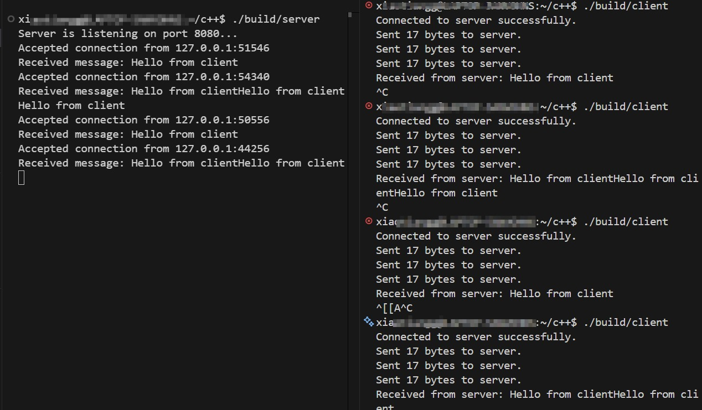
3. 服务端主动断开连接会进入timewait状态，此时无法再次启动相同服务端，使用`intsetsockopt(int sockfd, int level, int optname, const void *optval, socklen_t optlen)`设置套接字属性
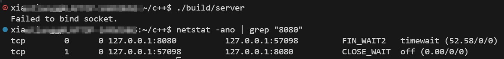


### select实现聊天室功能