# 机器学习基础

## 概论

机器学习（Machine Learning）是人工智能的一个分支，它的核心思想是让计算机从数据中自动学习规律，而不是由人手工编写规则。

## 监督学习（Supervised Learning）

监督学习是指：**训练数据中每个样本都带有"标准答案"（标签  label），模型通过学习输入特征 X 到输出 y 的映射关系，从而对新数据做出预测**。

形式化地说：给定训练集 $D = \{(x_1, y_1), (x_2, y_2), ..., (x_n, y_n)\}$，学习一个函数 $f: X \rightarrow Y$，使得对新的 $x$ 能准确预测 $y$。

*  **回归（Regression）**： 预测连续数值

- **分类（Classification）**：预测离散类别


## 无监督学习（Unsupervised Learning）

无监督学习是指：**训练数据没有标签（没有"标准答案"），模型只能从数据本身的分布和结构中发现规律。**

形式化地说：给定训练集 $D = \{x_1, x_2, ..., x_n\}$（没有 $y$），学习数据中隐含的结构、模式或表示。

- **聚类（Clustering）**：把相似样本归为一组，组内相似、组间差异大。如用户分群、新闻聚合、图像分割。
- **降维（Dimensionality Reduction）**：把高维数据压缩到低维，保留主要信息。目的：去噪、加速计算、可视化、缓解"维度灾难"。
- **异常检测（Anomaly Detection）**：找出与大多数样本明显不同的"离群点"。如信用卡欺诈检测、设备故障预警。
- **关联规则挖掘（Association Rules）**：发现事物之间的共现关系。经典例子："啤酒与尿布"购物篮分析。


## 回归（Regression）

### 一元线性回归 Linear Regression with One Variable

线性回归的模型表示为  $f_{w,b}(x^{(i)}) = wx^{(i)} + b \tag{1}$

- $w$：权重，$x$ 每增加 1 个单位，$y$ 平均变化 $w$
- $b$：偏置，$x = 0$ 时的预测值
- (x$^{(i)}$, y$^{(i)}$)：表示第 $i$ 个训练样本

只有一个特征 $x$，用一条直线去拟合它与目标值 $y$ 的关系称为一元线性回归


### 代价函数 Cost Function

Cost Function是机器学习中用来**衡量模型预测结果与真实结果之间差距的函数**。用来评价模型的好坏

一元线性回归中我们选择的参数 $w$、 $b$ 决定了我们得到的直线相对于我们的训练集的准确程度，模型所预测的值与训练集中实际值之间的差距就是**建模误差**（**损失**）。

使用**平方误差代价函数（Squared Error Cost Function）** 作为代价函数，公式为：

$$
J(w,b) = \frac{1}{2m} \sum\limits_{i = 0}^{m-1} (f_{w,b}(x^{(i)}) - y^{(i)})^2 
$$
其中： $f_{w,b}(x^{(i)}) = wx^{(i)} + b$

- $f_{w,b}(x^{(i)})$ 是我们使用参数 $w,b$ 对第 $i$ 个样本的预测值。
- $(f_{w,b}(x^{(i)}) - y^{(i)})^2$ 是目标值与预测值之间的平方差。
- 将所有 $m$ 个样本的这些差值求和，再除以 `2m`，即得到代价 $J(w,b)$。

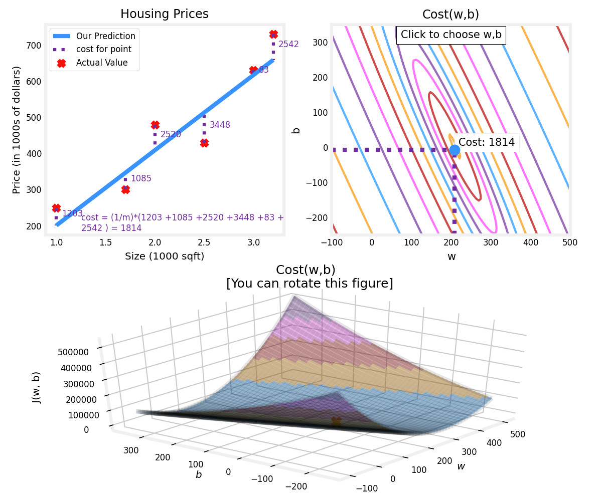

> [!note]
>
> 损失函数对损失值做平方处理这一特性，能保证 “误差曲面” 呈汤碗状的凸曲面。该曲面始终存在最小值，沿所有维度的梯度方向迭代都能找到这个最小值。

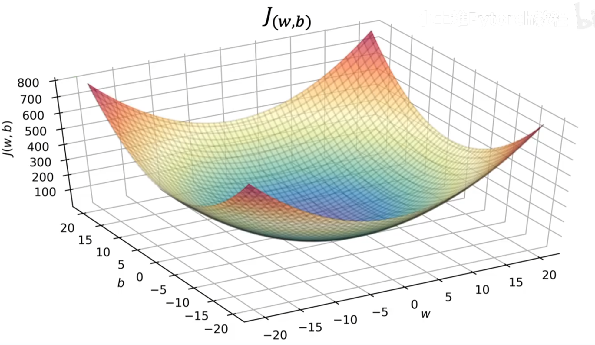


### 梯度下降 Gradient Descent

**求解最小二乘法**就是在线性回归中，它对应的就是让 Cost Function 最小。这个优化问题可以通过解析方法（正规方程）直接求解，也可以通过迭代优化方法（如梯度下降）求解。在机器学习实践中，当数据规模较大或模型复杂时，通常更倾向使用梯度下降 

梯度下降背后的思想是：开始时我们随机选择一个参数的组合，计算代价函数，然后我们寻找下一个能让代价函数值下降最多的参数组合。我们持续这么做直到到到一个局部最小值（**local minimum**）。因为我们并没有尝试完所有的参数组合，所以不能确定我们得到的局部最小值是否便是全局最小值（**global minimum**），选择不同的初始参数组合，可能会找到不同的局部最小值。

代价函数： $J(w,b) = \frac{1}{2m} \sum\limits_{i = 0}^{m-1} (f_{w,b}(x^{(i)}) - y^{(i)})^2$

批量梯度下降（**batch gradient descent**）算法的公式为：

$$\begin{align*} \text{重复执行直到收敛：} \; \lbrace \newline
\;  w &= w -  \alpha \frac{\partial J(w,b)}{\partial w}  \; \newline 
 b &= b -  \alpha \frac{\partial J(w,b)}{\partial b}  \newline \rbrace
\end{align*}$$

梯度的定义为：

$$
\begin{align}
\frac{\partial J(w,b)}{\partial w}  &= \frac{1}{m} \sum\limits_{i = 0}^{m-1} (f_{w,b}(x^{(i)}) - y^{(i)})x^{(i)} \\
  \frac{\partial J(w,b)}{\partial b}  &= \frac{1}{m} \sum\limits_{i = 0}^{m-1} (f_{w,b}(x^{(i)}) - y^{(i)}) \\
\end{align}
$$

在梯度下降中，在计算微分求导项时，我们需要进行求和运算，所以，在每一个单独的梯度下降中，我们最终都要计算所有个训练样本求和。因此，批量梯度下降法这个名字说明了我们需要考虑所有这一"批"训练样本，而事实上，有时也有其他类型的梯度下降法，不是这种"批量"型的，不考虑整个的训练集，而是每次只关注训练集中的一些小的子集，称为**小批量梯度下降（Mini-batch Gradient Descent）**

### 一元回归代码实现

```python
import numpy as np
import matplotlib.pyplot as plt

x = np.array([])
y = np.array([])

with open("./dataset/ex1data1.txt", "r", encoding="utf-8") as f:
    for line in f.readlines():
        data = line.strip().split(',')
        x = np.append(x, float(data[0]))
        y = np.append(y, float(data[1]))

m = len(x)
# print(np.hstack([np.ones((m, 1)), x.reshape(-1, 1)]))
X = np.c_[np.ones(m), x]

n = 5000
a = 0.01
# [b, w]
W = np.zeros((2, 1))
# print(W)
for _ in range(n):
    y_pred = X @ W
    # print(X.shape)
    # print(W.shape)
    grad = X.T @ (y_pred - y.reshape(-1, 1))
    W = W - (grad / m) * a

print(W)
plt.scatter(x, y)
x_plot = np.array([np.min(x), np.max(x)])
y_plot = W[0] + x_plot * W[1]
plt.plot(x_plot, y_plot, c="m")
plt.show()
```

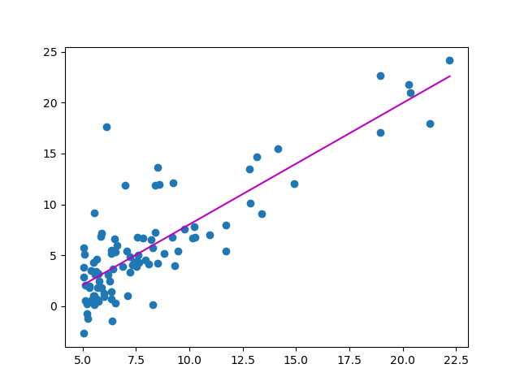

### 多元线性回归 Multiple Linear Regression

模型表示为： $f_{\mathbf{w},b}(\mathbf{x}) =  w_0x_0 + w_1x_1 +... + w_{n-1}x_{n-1} + b$

向量表示为 $f_{\mathbf{w},b}(\mathbf{x}) = \mathbf{w} \cdot \mathbf{x} + b$ ，where $\cdot$ is a vector `dot product`

代价函数 $J(\mathbf{w},b) = \frac{1}{2m} \sum\limits_{i = 0}^{m-1} (f_{\mathbf{w},b}(\mathbf{x}^{(i)}) - y^{(i)})^2$ 。其中: $f_{\mathbf{w},b}(\mathbf{x}^{(i)}) = \mathbf{w} \cdot \mathbf{x}^{(i)} + b$ 

梯度下降算法

$$\begin{align*} \text{重复执行直到收敛：} \; \lbrace \newline\;
& w_j = w_j -  \alpha \frac{\partial J(\mathbf{w},b)}{\partial w_j}  \; & \text{for j = 0..n-1}\newline
&b\ \ = b -  \alpha \frac{\partial J(\mathbf{w},b)}{\partial b}  \newline \rbrace
\end{align*}$$

特征数量为n, 参数$w_j$,  $b$, 同步更新如下

$$
\begin{align}
\frac{\partial J(\mathbf{w},b)}{\partial w_j}  &= \frac{1}{m} \sum\limits_{i = 0}^{m-1} (f_{\mathbf{w},b}(\mathbf{x}^{(i)}) - y^{(i)})x_{j}^{(i)} \\
\frac{\partial J(\mathbf{w},b)}{\partial b}  &= \frac{1}{m} \sum\limits_{i = 0}^{m-1} (f_{\mathbf{w},b}(\mathbf{x}^{(i)}) - y^{(i)}) 
\end{align}
$$


###  特征缩放与标准化

当不同自变量取值范围相差较大时，绘制的等高线图上的椭圆会变得瘦长，而梯度下降算法收敛将会很慢，因为每一步都可能会跨过这个椭圆导致振荡。此时，我们需要把所有自变量进行缩放、标准化，使其落在 -1 到 1 之间。

> [!note]
>
> 标准化改变数据分布，让均值为 0、标准差为 1；归一化改变数据范围，把数据压缩到固定区间。
>
> 在机器学习中，标准化是更常用的手段，归一化的应用场景是有限的。因为「**仅由极值决定**」这个做法过于危险，如果样本中有一个异常大的值，则会将所有正常值挤占到很小的区间，而标准化方法则更加「弹性」，会兼顾所有样本

1. **特征缩放（Feature scaling）**：
   - 简单版：将每个正特征除以其最大值 ，结果 [0, 1]
   - 通用版：`(x - min) / (max - min)`，适用于任意特征，结果 [0, 1]
   - 两种方式都将特征归一化到 -1 到 1 范围内。
2. **均值归一化（Mean normalization）**： $x_i := \frac{x_i - \mu_i}{\max - \min}$ ，结果约 [-0.5, 0.5]，数据居中
3. **Z-score 标准化（Z-score normalization）**： $x^{(i)}_j = \dfrac{x^{(i)}_j - \mu_j}{\sigma_j} \tag{4}$ ，$$j$$ 为某个特征，结果均值 0、方差 1，最常用，其中

$$
\begin{align}
\mu_j &= \frac{1}{m} \sum_{i=0}^{m-1} x^{(i)}_j \tag{5}\\
\sigma^2_j &= \frac{1}{m} \sum_{i=0}^{m-1} (x^{(i)}_j - \mu_j)^2  \tag{6}
\end{align}
$$

> 其中 $\mu_i$ 是第 $i$ 个特征的均值，$\sigma_i$ 是标准差。

> [!warning]
>
> 此外，线性回归并不适用于所有情形，有时我们需要曲线来适应我们的数据，这时候我们也要对特征进行**构造**，如二次函数、三次函数、幂函数、对数函数等。构造后的新变量就可以当作一个新的特征来使用，这就是**多项式回归**（Polynomial Regression）。新变量的取值范围可能更大，此时，特征缩放就非常有必要！


### 多元回归代码实现

```python
import numpy as np
import matplotlib.pyplot as plt

x = []
y = []

with open("./dataset/ex1data2.txt", "r", encoding="utf-8") as f:
    for line in f.readlines():
        data = list(map(float, line.strip().split(',')))
        x.append(data[:-1])
        y.append(data[-1])

x = np.array(x)
y = np.array(y)
# print(x.shape, y.shape)

# 标准化
u = np.mean(x, axis=0)
sigma = np.std(x, axis=0)
x = (x - u) / sigma
# print(x)

m, n = x.shape
X = np.c_[np.ones(m), x]
W = np.zeros((n + 1, 1))

niter = 1500
a = 0.01
J_history = []
for i in range(niter):
    y_pred = X @ W
    error = y_pred - y.reshape(-1, 1)
    grad = X.T @ error
    W = W - a * (grad / m)
    J_history.append(np.sum(error ** 2) / (2 * m))

print(W)
# 面积，房间数
input_data = np.array([1650, 3])
input_data = (input_data - u) / sigma
pred = np.r_[np.ones(1), input_data] @ W
print(pred.sum())


# plot the convergence graph
plt.plot(np.arange(len(J_history)), J_history)
plt.xlabel('Number of iterations')
plt.ylabel('Cost J')
plt.show()
```

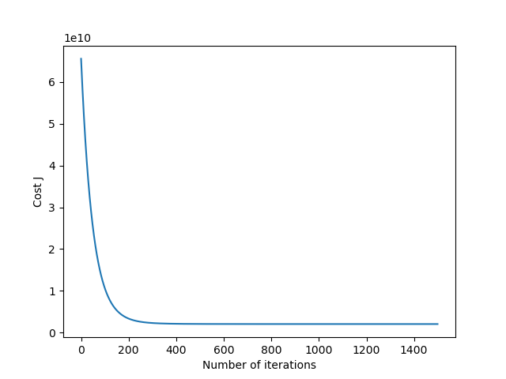


## 分类（Classification）

在分类问题中，我们尝试预测的结果是否属于某一个类，最基础的就是**二元**的分类问题，更为复杂的则是预测**多元**的分类问题。

如果用线性回归来解决，即用一条直线拟合结果，当预测值大于阈值时归为正向类，反之归为负向类。然而，当阈值确定时，「反常样本」用于拟合直线时会对其**决策边界**造成一定偏移，以至于正常样本被归为错误类别。

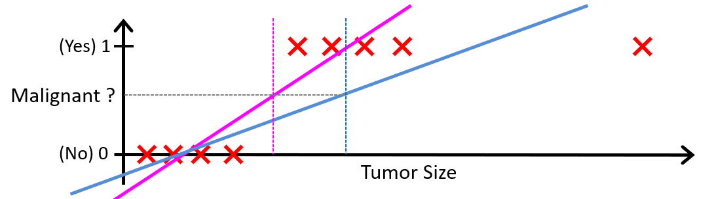

### 逻辑回归 Logistic Regression

#### 模型

线性回归和逻辑回归都属于**广义线性模型**（Generalized Linear Model）的特殊形式。但由于**逻辑函数**（Losistic Function，也叫 Sigmoid 函数）将结果映射到 **Bernoulli 分布**，因此逻辑回归更常用于分类问题。

模型表示为：
$$
f_{\mathbf{w},b}(\mathbf{x}^{(i)}) = g(\mathbf{w} \cdot \mathbf{x}^{(i)} + b )，  其中 g(z) = \frac{1}{1+e^{-z}}
$$
  if $f_{\mathbf{w},b}(x) >= 0.5$, $z >= 0$ ，预测 $y=1$

  if $f_{\mathbf{w},b}(x) < 0.5$, $z < 0$，预测 $y=0$

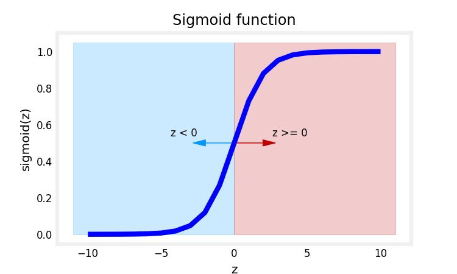

$z = \mathbf{w} \cdot \mathbf{x}^{(i)} + b = 0$ 解出来的线被称为**决策边界**，它将整个空间划分成两块区域（region），各自属于一个分类。

<div style="display:flex; gap:16px; justify-content:center; align-items:center; flex-wrap:wrap;">
  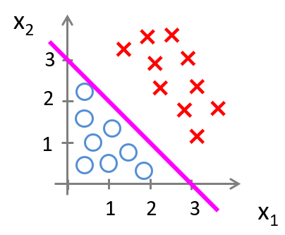
  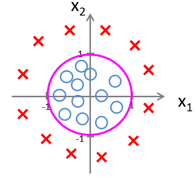
</div>

#### 代价函数

从训练集中拟合逻辑回归的参数 $w$ $b$。仍然采用代价函数的思想——找到使代价最小的参数即可。

> [!important] 
>
> 本文定义：损失用于衡量单个样本与其目标值之间的差异，而代价则是训练集上所有损失的综合度量

在线性回归中我们使用平方误差函数作为损失函数，如果继续使用会造成损失曲面**非凸**（坑坑洼洼很多局部最优），梯度下降会卡住。

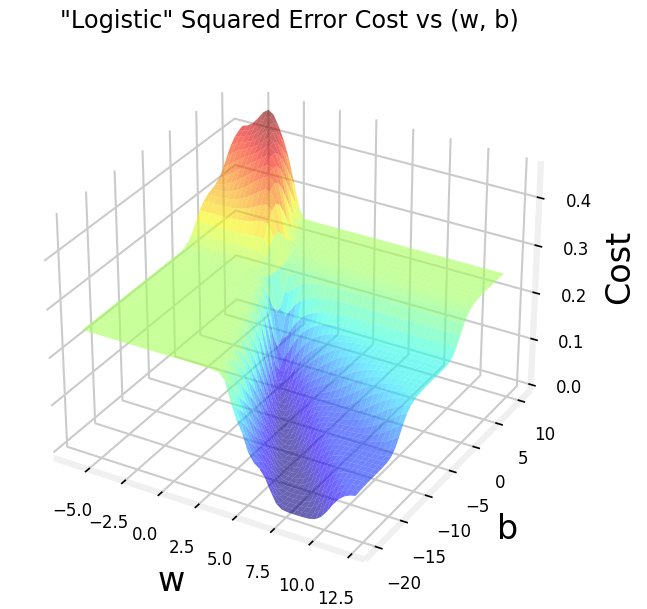

广义上定义的代价函数如下
$$
J(\mathbf{w},b) = \frac{1}{m} \sum_{i=0}^{m-1} \left[ loss(f_{\mathbf{w},b}(\mathbf{x}^{(i)}), y^{(i)}) \right]
$$
在逻辑回归中，我们使用**二元交叉熵**作为代价函数，而交叉熵与 Sigmoid复合后，始终保持凸性
$$
loss(f_{\mathbf{w},b}(\mathbf{x}^{(i)}), y^{(i)}) =
\begin{cases}
-\log\left(f_{\mathbf{w},b}(\mathbf{x}^{(i)})\right), & y^{(i)}=1 \\
-\log\left(1-f_{\mathbf{w},b}(\mathbf{x}^{(i)})\right), & y^{(i)}=0
\end{cases}
$$

*  $f_{\mathbf{w},b}(\mathbf{x}^{(i)})$ 为模型预测,  $y^{(i)}$ 为第 $i$ 个标签
*  $f_{\mathbf{w},b}(\mathbf{x}^{(i)}) = g(\mathbf{w} \cdot\mathbf{x}^{(i)}+b)$ where function $g$ is the sigmoid function.

写成一个式子后如下
$$
loss(f_{\mathbf{w},b}(\mathbf{x}^{(i)}), y^{(i)}) = -y^{(i)} \log\left(f_{\mathbf{w},b}(\mathbf{x}^{(i)})\right) - \left(1-y^{(i)}\right) \log\left(1-f_{\mathbf{w},b}(\mathbf{x}^{(i)})\right)
$$
其中
$$
f_{\mathbf{w},b}(\mathbf{x}^{(i)}) = g(z^{(i)}),\quad
g(z^{(i)}) = \frac{1}{1+e^{-z^{(i)}}},\quad
z^{(i)} = \mathbf{w} \cdot \mathbf{x}^{(i)} + b
$$
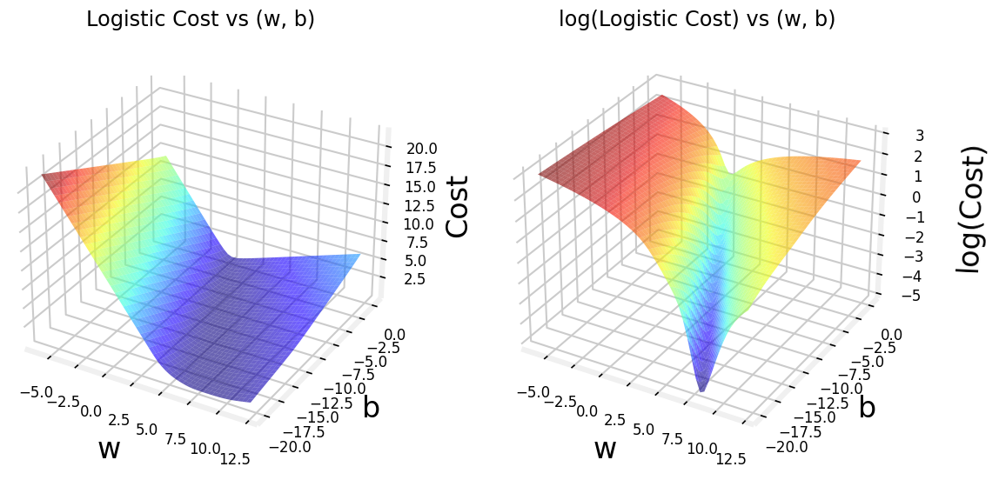

#### 梯度下降

$$
J(\mathbf{w},b) = \frac{1}{m} \sum_{i=0}^{m-1} \left[
(-y^{(i)} \log\left(f_{\mathbf{w},b}\left( \mathbf{x}^{(i)} \right) \right) - \left( 1 - y^{(i)}\right) \log \left( 1 - f_{\mathbf{w},b}\left( \mathbf{x}^{(i)} \right) \right)
\right]
$$

对代价函数求偏导后和线性回归的偏导形式完全相同，但$f_{\mathbf{w},b}(x^{(i)})$ 的定义不同，它在线性回归的函数基础上套了一层sigmoid函数
$$
\begin{align*}
\frac{\partial J(\mathbf{w},b)}{\partial w_j}  &= \frac{1}{m} \sum\limits_{i = 0}^{m-1} (f_{\mathbf{w},b}(\mathbf{x}^{(i)}) - y^{(i)})x_{j}^{(i)} \tag{2} \\
\frac{\partial J(\mathbf{w},b)}{\partial b}  &= \frac{1}{m} \sum\limits_{i = 0}^{m-1} (f_{\mathbf{w},b}(\mathbf{x}^{(i)}) - y^{(i)}) \tag{3} 
\end{align*}
$$

#### 代码实现

```python
import numpy as np
import matplotlib.pyplot as plt

data = np.loadtxt("./dataset/ex2data1.txt", delimiter=",")

# print(type(data))
x = data[:,0:-1]
y = data[:,-1].reshape(-1, 1)
m, n = x.shape

x = (x - x.mean(axis=0)) / x.std(axis=0)
X = np.c_[np.ones(m), x]


a = 0.01
niter = 10000
W = np.zeros((n + 1, 1))
J_history = []

for _ in range(niter):
    z = X @ W
    y_pred = 1 / (1 + np.exp(-z))
    grad = X.T @ (y_pred - y)
    W = W - a * (grad / m)

    cost = -np.mean(y * np.log(y_pred) + (1 - y) * np.log(1 - y_pred))
    J_history.append(cost)


print(W)

fig, (p1, p2) = plt.subplots(1, 2,figsize=(12, 5))
neg_pos = np.where(y == 0)[0]
pos_neg = np.where(y == 1)[0]
p1.scatter(x[neg_pos, 0], x[neg_pos, 1], c='red')
p1.scatter(x[pos_neg, 0], x[pos_neg, 1], c='blue')
p1.set_xlabel('feature 1 - norm')
p1.set_ylabel('feature 2 - norm')
x_plot = np.linspace(x[:, 0].min(), x[:, 0].max(), 100)
p1.plot(x_plot, (-W[1] * x_plot - W[0]) / W[2])

p2 = plt.subplot(1, 2, 2)
p2.plot(np.arange(len(J_history)), J_history)
p2.set_xlabel('Number of iterations')
p2.set_ylabel('Cost J')
plt.show()
```

决策边界和收敛结果如图

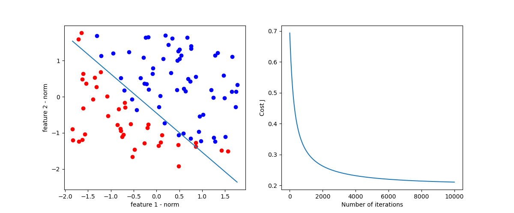


## 欠拟合和过拟合

**欠拟合（Underfitting）** 就是模型过于简单，没有充分学习训练数据中的规律。

**过拟合（Overfitting）** 就是模型把训练数据学得“太细”了，甚至把数据中的噪声和偶然性也当成了规律。

可以从以下几个方面解决过拟合

- 从模型层面，可以通过 Early Stop、L1/L2 Regularization、Batchnorm、Dropout 等方法；
- 从特征层面，可以丢弃一些不能帮助我们正确预测的特征，通过手工筛选或 PCA 等降维方法；
- 从数据层面，可以获取更大的数据集，也可以进行数据增强（Data Augmentation），通过一定规则来扩充数据。

## 正则化（Regularization）

正则化是一种能够**保留所有特征**（不必降维而丢失信息）的有效解决过拟合的方法。其思想是在损失函数上加上某些规则（限制），限制参数的解空间，从而减少求出过拟合参数的可能性。

以线性回归为例，在代价函数后加入正则项 $\frac{\lambda}{2m}  \sum_{j=0}^{n-1} w_j^2$，加入这一项会促使梯度下降尽可能减小参数的大小。

$$
J(\mathbf{w},b) = \frac{1}{2m} \sum\limits_{i = 0}^{m-1} (f_{\mathbf{w},b}(\mathbf{x}^{(i)}) - y^{(i)})^2  + \frac{\lambda}{2m}  \sum_{j=0}^{n-1} w_j^2
$$
 $\lambda$ 是**正则化参数**，如果 $\lambda$很大，意味着正则化项占主要地位，有可能导致所有的 $w_j$ 都太小了而欠拟合；如果 $\lambda$很小，意味着损失函数占主要地位，就有可能过拟合

> [!note]
>
> 根据正则项的形式，又可分为：二次正则项、一般正则项。**二次正则项**即为前文提到的形式，更一般的形式为 $\lambda \sum_{j=0}^{n-1} w_j^q$，当 $q$ 取不同值**等高线图**的形状为：
>
> 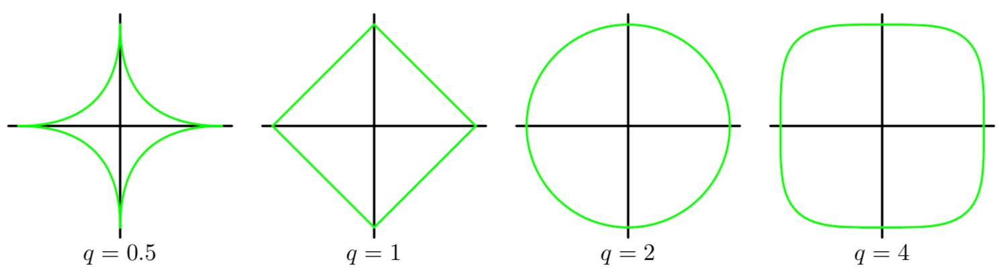
>
> 从几何空间上来看，损失函数的碗状曲面和正则化项的曲面叠加之后，就是我们要求极值的曲面。特别地，当 $q=1$ 时，称其为 **L1** 正则化，也叫 **Lasso 回归**；当 $q=2$ 时，称其为 **L2** 正则化，也叫**岭回归**。L2 由于其处处可微的特性，在实际中更常用。


### 线性回归的正则化

含有正则化的代价函数为
$$
J(\mathbf{w},b) = \frac{1}{2m} \sum\limits_{i = 0}^{m-1} (f_{\mathbf{w},b}(\mathbf{x}^{(i)}) - y^{(i)})^2  + \frac{\lambda}{2m}  \sum_{j=0}^{n-1} w_j^2 \\
$$
梯度（求导后）
$$
\begin{align*}
\frac{\partial J(\mathbf{w},b)}{\partial w_j}  &= \frac{1}{m} \sum\limits_{i = 0}^{m-1} (f_{\mathbf{w},b}(\mathbf{x}^{(i)}) - y^{(i)})x_{j}^{(i)}  +  \frac{\lambda}{m} w_j  \\
\frac{\partial J(\mathbf{w},b)}{\partial b}  &= \frac{1}{m} \sum\limits_{i = 0}^{m-1} (f_{\mathbf{w},b}(\mathbf{x}^{(i)}) - y^{(i)})
\end{align*}
$$


### 逻辑回归的正则化

含有正则化的代价函数为
$$
J(\mathbf{w},b) = \frac{1}{m}  \sum_{i=0}^{m-1} \left[ -y^{(i)} \log\left(f_{\mathbf{w},b}\left( \mathbf{x}^{(i)} \right) \right) - \left( 1 - y^{(i)}\right) \log \left( 1 - f_{\mathbf{w},b}\left( \mathbf{x}^{(i)} \right) \right) \right] + \frac{\lambda}{2m}  \sum_{j=0}^{n-1} w_j^2
$$
梯度表达形式同线性回归
$$
\begin{align*}
\frac{\partial J(\mathbf{w},b)}{\partial w_j}  &= \frac{1}{m} \sum\limits_{i = 0}^{m-1} (f_{\mathbf{w},b}(\mathbf{x}^{(i)}) - y^{(i)})x_{j}^{(i)}  +  \frac{\lambda}{m} w_j  \\
\frac{\partial J(\mathbf{w},b)}{\partial b}  &= \frac{1}{m} \sum\limits_{i = 0}^{m-1} (f_{\mathbf{w},b}(\mathbf{x}^{(i)}) - y^{(i)})
\end{align*}
$$


### 代码

```python
import numpy as np
import matplotlib.pyplot as plt

data = np.genfromtxt("./dataset/ex2data2.txt", delimiter=',')
x = data[:,:-1]
x1 = data[:, 0]
x2 = data[:, 1]
y = data[:,-1].reshape(-1,1)

neg_pos = np.where(y == 0)[0]
pos_pos = np.where(y == 1)[0]
plt.scatter(x[neg_pos,0], x[neg_pos,1], c='red', marker='o')
plt.scatter(x[pos_pos,0], x[pos_pos,1], c='blue', marker='x')


m, n = x.shape
def map_feature(x1, x2):
    X = np.ones((len(x1),1))
    for i in range(1, 6 + 1):
        for j in range(0, i + 1):
            X = np.c_[X, (x1 ** j) * (x2 ** (i - j))]
    return X

X = map_feature(x1, x2) # (118, 28)
W = np.zeros((28, 1))
a = 0.01
lamda = 5
niter = 10000

for _ in range(niter):
    Z = X @ W
    y_pred = 1 / (1 + np.exp(-Z))
    grad = X.T @ (y_pred - y) / m
    regular = (lamda / m) * np.r_[np.zeros((1,1)), W[1:, :]]
    W = W - a * (grad + regular)

print(W)
f1 = np.linspace(-1, 1.25, 50)
f2 = np.linspace(-1, 1.25, 50)
xv,yv = np.meshgrid(f1, f2)
Z = map_feature(xv.flatten(), yv.flatten()) @ W
plt.contour(xv,yv,Z.reshape(50, 50), levels=[0], colors='pink')
plt.title(f"$\lambda = {lamda}$")
plt.xlabel("x0")
plt.ylabel("x1")
plt.show()
```

增大正则化参数 $\lambda$ 可以防止模型过拟合

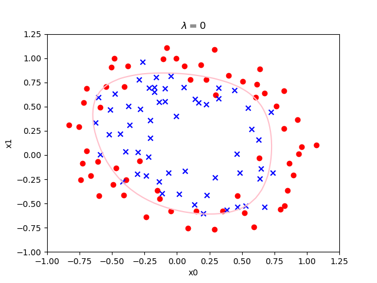

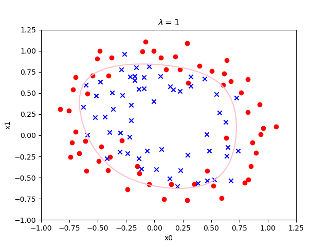

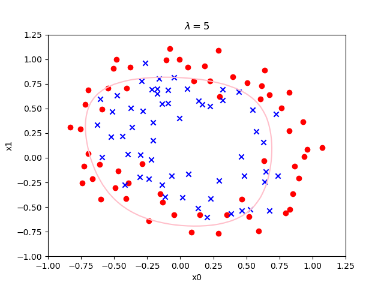


## 深度学习（Deep Learning）

### 神经网络


## 强化学习（Reinforcement Learning）

