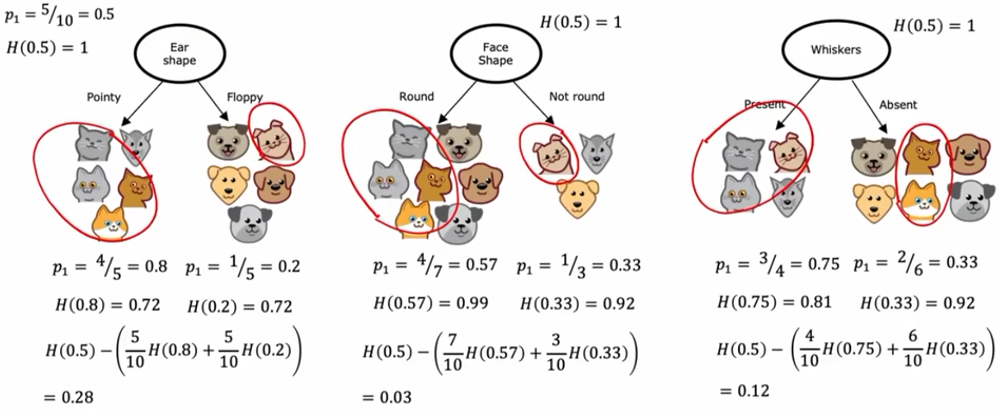
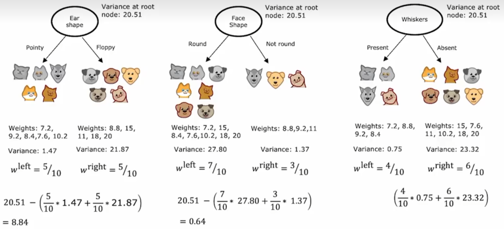
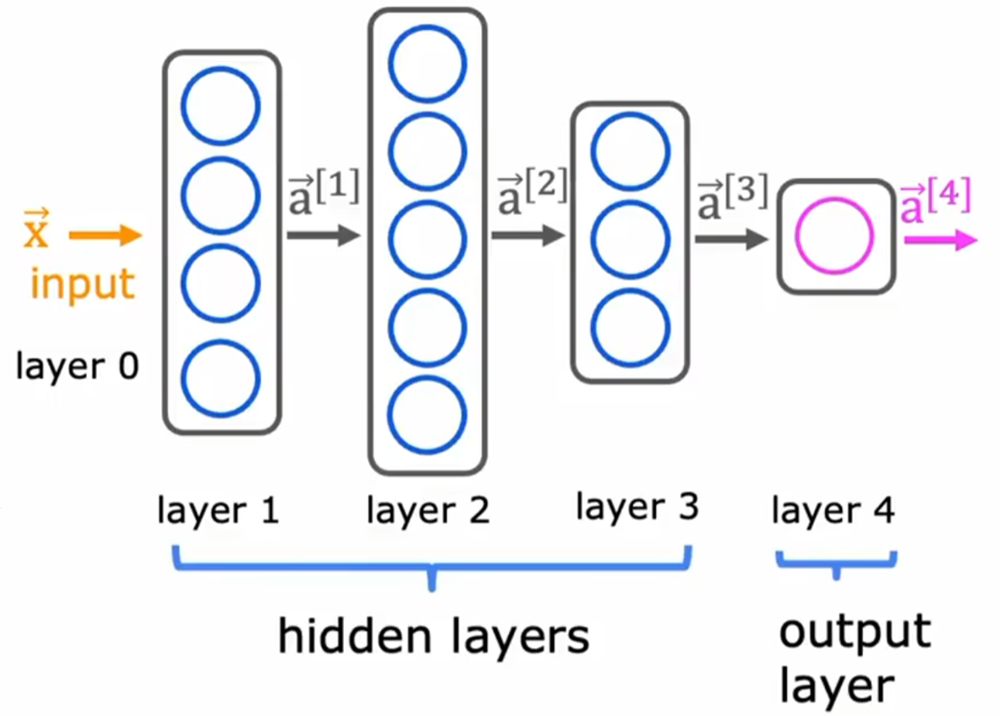
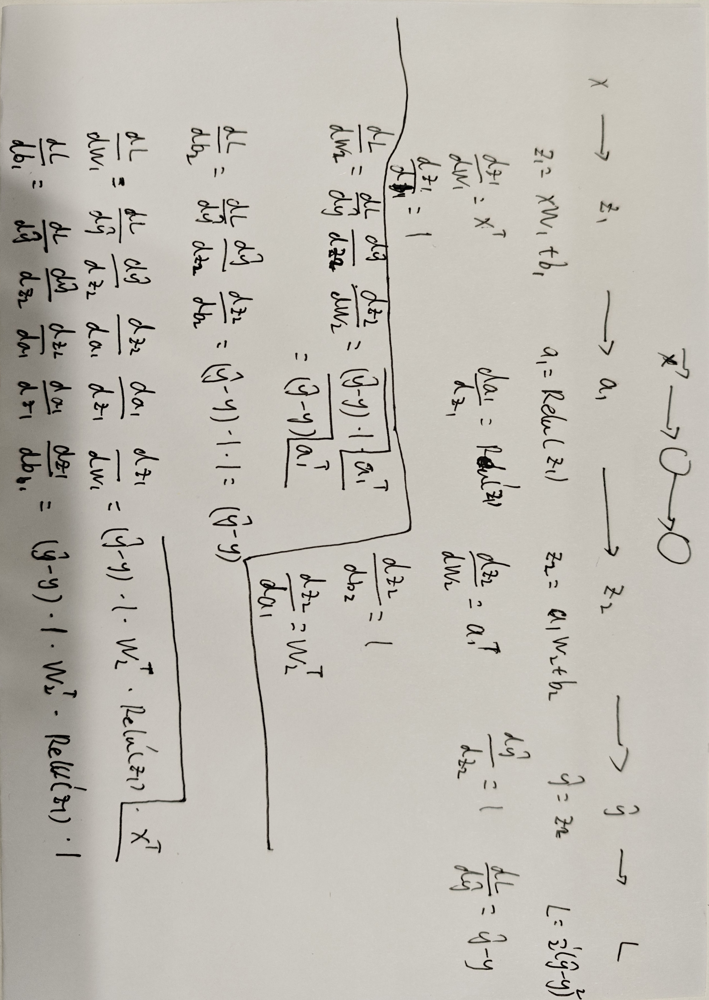
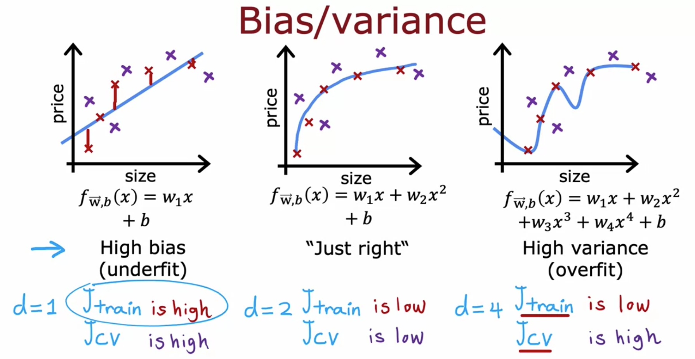
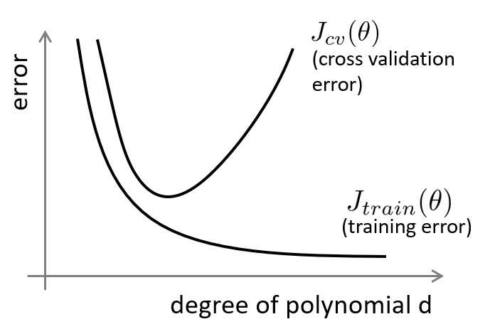
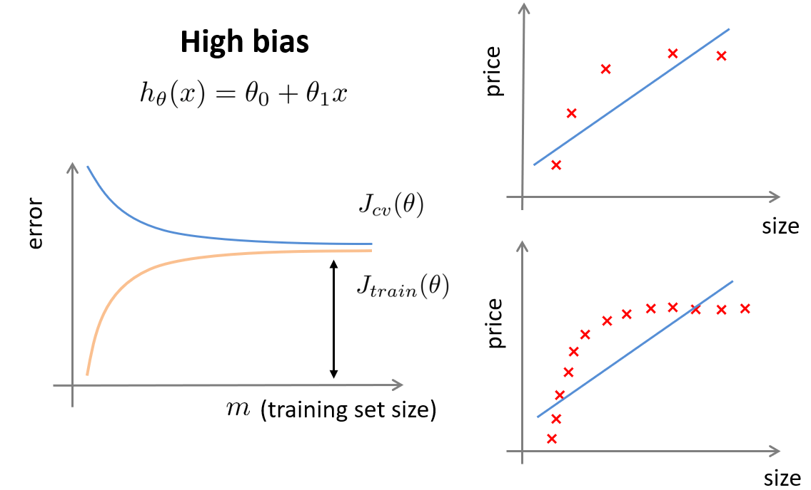
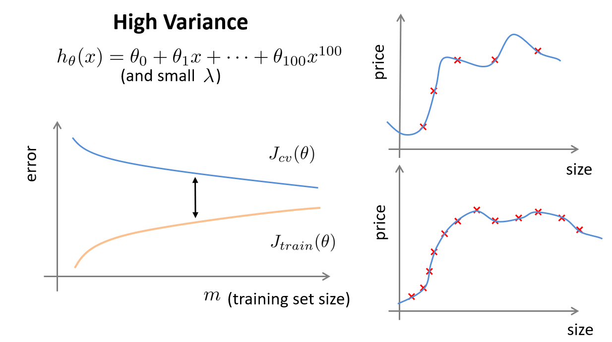

# 机器学习基础

## 概论

机器学习（Machine Learning）是人工智能的一个分支，它的核心思想是让计算机从数据中自动学习规律，而不是由人手工编写规则。

## 监督学习（Supervised Learning）

监督学习是指：**训练数据中每个样本都带有"标准答案"（标签  label），模型通过学习输入特征 X 到输出 y 的映射关系，从而对新数据做出预测**。

形式化地说：给定训练集 $D = \{(x_1, y_1), (x_2, y_2), ..., (x_n, y_n)\}$，学习一个函数 $f: X \rightarrow Y$，使得对新的 $x$ 能准确预测 $y$。

*  **回归（Regression）**： 预测连续数值

- **分类（Classification）**：预测离散类别


## 无监督学习（Unsupervised Learning）

无监督学习是指：**训练数据没有标签（没有"标准答案"），模型只能从数据本身的分布和结构中发现规律。**

形式化地说：给定训练集 $D = \{x_1, x_2, ..., x_n\}$（没有 $y$），学习数据中隐含的结构、模式或表示。

- **聚类（Clustering）**：把相似样本归为一组，组内相似、组间差异大。如用户分群、新闻聚合、图像分割。
- **降维（Dimensionality Reduction）**：把高维数据压缩到低维，保留主要信息。目的：去噪、加速计算、可视化、缓解"维度灾难"。
- **异常检测（Anomaly Detection）**：找出与大多数样本明显不同的"离群点"。如信用卡欺诈检测、设备故障预警。
- **关联规则挖掘（Association Rules）**：发现事物之间的共现关系。经典例子："啤酒与尿布"购物篮分析。


## 回归（Regression）

### 一元线性回归 Linear Regression with One Variable

线性回归的模型表示为  $f_{w,b}(x^{(i)}) = wx^{(i)} + b \tag{1}$

- $w$：权重，$x$ 每增加 1 个单位，$y$ 平均变化 $w$
- $b$：偏置，$x = 0$ 时的预测值
- (x$^{(i)}$, y$^{(i)}$)：表示第 $i$ 个训练样本

只有一个特征 $x$，用一条直线去拟合它与目标值 $y$ 的关系称为一元线性回归


### 代价函数 Cost Function

Cost Function是机器学习中用来**衡量模型预测结果与真实结果之间差距的函数**。用来评价模型的好坏

一元线性回归中我们选择的参数 $w$、 $b$ 决定了我们得到的直线相对于我们的训练集的准确程度，模型所预测的值与训练集中实际值之间的差距就是**建模误差**（**损失**）。

使用**平方误差代价函数（Squared Error Cost Function）** 作为代价函数，公式为：

$$
J(w,b) = \frac{1}{2m} \sum\limits_{i = 0}^{m-1} (f_{w,b}(x^{(i)}) - y^{(i)})^2 
$$
其中： $f_{w,b}(x^{(i)}) = wx^{(i)} + b$

- $f_{w,b}(x^{(i)})$ 是我们使用参数 $w,b$ 对第 $i$ 个样本的预测值。
- $(f_{w,b}(x^{(i)}) - y^{(i)})^2$ 是目标值与预测值之间的平方差。
- 将所有 $m$ 个样本的这些差值求和，再除以 `2m`，即得到代价 $J(w,b)$。


> [!note]
>
> 损失函数对损失值做平方处理这一特性，能保证 “误差曲面” 呈汤碗状的凸曲面。该曲面始终存在最小值，沿所有维度的梯度方向迭代都能找到这个最小值。


### 梯度下降 Gradient Descent

**求解最小二乘法**就是在线性回归中，它对应的就是让 Cost Function 最小。这个优化问题可以通过解析方法（正规方程）直接求解，也可以通过迭代优化方法（如梯度下降）求解。在机器学习实践中，当数据规模较大或模型复杂时，通常更倾向使用梯度下降 

梯度下降背后的思想是：开始时我们随机选择一个参数的组合，计算代价函数，然后我们寻找下一个能让代价函数值下降最多的参数组合。我们持续这么做直到到到一个局部最小值（**local minimum**）。因为我们并没有尝试完所有的参数组合，所以不能确定我们得到的局部最小值是否便是全局最小值（**global minimum**），选择不同的初始参数组合，可能会找到不同的局部最小值。

代价函数： $J(w,b) = \frac{1}{2m} \sum\limits_{i = 0}^{m-1} (f_{w,b}(x^{(i)}) - y^{(i)})^2$

批量梯度下降（**batch gradient descent**）算法的公式为：

$$\begin{align*} \text{重复执行直到收敛：} \; \lbrace \newline
\;  w &= w -  \alpha \frac{\partial J(w,b)}{\partial w}  \; \newline 
 b &= b -  \alpha \frac{\partial J(w,b)}{\partial b}  \newline \rbrace
\end{align*}$$

梯度的定义为：

$$
\begin{align}
\frac{\partial J(w,b)}{\partial w}  &= \frac{1}{m} \sum\limits_{i = 0}^{m-1} (f_{w,b}(x^{(i)}) - y^{(i)})x^{(i)} \\
  \frac{\partial J(w,b)}{\partial b}  &= \frac{1}{m} \sum\limits_{i = 0}^{m-1} (f_{w,b}(x^{(i)}) - y^{(i)}) \\
\end{align}
$$

在梯度下降中，在计算微分求导项时，我们需要进行求和运算，所以，在每一个单独的梯度下降中，我们最终都要计算所有个训练样本求和。因此，批量梯度下降法这个名字说明了我们需要考虑所有这一"批"训练样本，而事实上，有时也有其他类型的梯度下降法，不是这种"批量"型的，不考虑整个的训练集，而是每次只关注训练集中的一些小的子集，称为**小批量梯度下降（Mini-batch Gradient Descent）**

### 一元回归代码实现

```python
import numpy as np
import matplotlib.pyplot as plt

x = np.array([])
y = np.array([])

with open("./dataset/ex1data1.txt", "r", encoding="utf-8") as f:
    for line in f.readlines():
        data = line.strip().split(',')
        x = np.append(x, float(data[0]))
        y = np.append(y, float(data[1]))

m = len(x)
# print(np.hstack([np.ones((m, 1)), x.reshape(-1, 1)]))
X = np.c_[np.ones(m), x]

n = 5000
a = 0.01
# [b, w]
W = np.zeros((2, 1))
# print(W)
for _ in range(n):
    y_pred = X @ W
    # print(X.shape)
    # print(W.shape)
    grad = X.T @ (y_pred - y.reshape(-1, 1))
    W = W - (grad / m) * a

print(W)
plt.scatter(x, y)
x_plot = np.array([np.min(x), np.max(x)])
y_plot = W[0] + x_plot * W[1]
plt.plot(x_plot, y_plot, c="m")
plt.show()
```


### 多元线性回归 Multiple Linear Regression

模型表示为： $f_{\mathbf{w},b}(\mathbf{x}) =  w_0x_0 + w_1x_1 +... + w_{n-1}x_{n-1} + b$

向量表示为 $f_{\mathbf{w},b}(\mathbf{x}) = \mathbf{w} \cdot \mathbf{x} + b$ ，where $\cdot$ is a vector `dot product`

代价函数 $J(\mathbf{w},b) = \frac{1}{2m} \sum\limits_{i = 0}^{m-1} (f_{\mathbf{w},b}(\mathbf{x}^{(i)}) - y^{(i)})^2$ 。其中: $f_{\mathbf{w},b}(\mathbf{x}^{(i)}) = \mathbf{w} \cdot \mathbf{x}^{(i)} + b$ 

梯度下降算法

$$\begin{align*} \text{重复执行直到收敛：} \; \lbrace \newline\;
& w_j = w_j -  \alpha \frac{\partial J(\mathbf{w},b)}{\partial w_j}  \; & \text{for j = 0..n-1}\newline
&b\ \ = b -  \alpha \frac{\partial J(\mathbf{w},b)}{\partial b}  \newline \rbrace
\end{align*}$$

特征数量为n, 参数$w_j$,  $b$, 同步更新如下

$$
\begin{align}
\frac{\partial J(\mathbf{w},b)}{\partial w_j}  &= \frac{1}{m} \sum\limits_{i = 0}^{m-1} (f_{\mathbf{w},b}(\mathbf{x}^{(i)}) - y^{(i)})x_{j}^{(i)} \\
\frac{\partial J(\mathbf{w},b)}{\partial b}  &= \frac{1}{m} \sum\limits_{i = 0}^{m-1} (f_{\mathbf{w},b}(\mathbf{x}^{(i)}) - y^{(i)}) 
\end{align}
$$


###  特征缩放与标准化

当不同自变量取值范围相差较大时，绘制的等高线图上的椭圆会变得瘦长，而梯度下降算法收敛将会很慢，因为每一步都可能会跨过这个椭圆导致振荡。此时，我们需要把所有自变量进行缩放、标准化，使其落在 -1 到 1 之间。

> [!note]
>
> 标准化改变数据分布，让均值为 0、标准差为 1；归一化改变数据范围，把数据压缩到固定区间。
>
> 在机器学习中，标准化是更常用的手段，归一化的应用场景是有限的。因为「**仅由极值决定**」这个做法过于危险，如果样本中有一个异常大的值，则会将所有正常值挤占到很小的区间，而标准化方法则更加「弹性」，会兼顾所有样本

1. **特征缩放（Feature scaling）**：
   - 简单版：将每个正特征除以其最大值 ，结果 [0, 1]
   - 通用版：`(x - min) / (max - min)`，适用于任意特征，结果 [0, 1]
   - 两种方式都将特征归一化到 -1 到 1 范围内。
2. **均值归一化（Mean normalization）**： $x_i := \frac{x_i - \mu_i}{\max - \min}$ ，结果约 [-0.5, 0.5]，数据居中
3. **Z-score 标准化（Z-score normalization）**： $x^{(i)}_j = \dfrac{x^{(i)}_j - \mu_j}{\sigma_j} \tag{4}$ ，$$j$$ 为某个特征，结果均值 0、方差 1，最常用，其中

$$
\begin{align}
\mu_j &= \frac{1}{m} \sum_{i=0}^{m-1} x^{(i)}_j \tag{5}\\
\sigma^2_j &= \frac{1}{m} \sum_{i=0}^{m-1} (x^{(i)}_j - \mu_j)^2  \tag{6}
\end{align}
$$

> 其中 $\mu_i$ 是第 $i$ 个特征的均值，$\sigma_i$ 是标准差。

> [!warning]
>
> 此外，线性回归并不适用于所有情形，有时我们需要曲线来适应我们的数据，这时候我们也要对特征进行**构造**，如二次函数、三次函数、幂函数、对数函数等。构造后的新变量就可以当作一个新的特征来使用，这就是**多项式回归**（Polynomial Regression）。新变量的取值范围可能更大，此时，特征缩放就非常有必要！


### 多元回归代码实现

```python
import numpy as np
import matplotlib.pyplot as plt

x = []
y = []

with open("./dataset/ex1data2.txt", "r", encoding="utf-8") as f:
    for line in f.readlines():
        data = list(map(float, line.strip().split(',')))
        x.append(data[:-1])
        y.append(data[-1])

x = np.array(x)
y = np.array(y)
# print(x.shape, y.shape)

# 标准化
u = np.mean(x, axis=0)
sigma = np.std(x, axis=0)
x = (x - u) / sigma
# print(x)

m, n = x.shape
X = np.c_[np.ones(m), x]
W = np.zeros((n + 1, 1))

niter = 1500
a = 0.01
J_history = []
for i in range(niter):
    y_pred = X @ W
    error = y_pred - y.reshape(-1, 1)
    grad = X.T @ error
    W = W - a * (grad / m)
    J_history.append(np.sum(error ** 2) / (2 * m))

print(W)
# 面积，房间数
input_data = np.array([1650, 3])
input_data = (input_data - u) / sigma
pred = np.r_[np.ones(1), input_data] @ W
print(pred.sum())


# plot the convergence graph
plt.plot(np.arange(len(J_history)), J_history)
plt.xlabel('Number of iterations')
plt.ylabel('Cost J')
plt.show()
```


## 分类（Classification）

在分类问题中，我们尝试预测的结果是否属于某一个类，最基础的就是**二元**的分类问题，更为复杂的则是预测**多元**的分类问题。

如果用线性回归来解决，即用一条直线拟合结果，当预测值大于阈值时归为正向类，反之归为负向类。然而，当阈值确定时，「反常样本」用于拟合直线时会对其**决策边界**造成一定偏移，以至于正常样本被归为错误类别。


### 逻辑回归 Logistic Regression

#### 模型

线性回归和逻辑回归都属于**广义线性模型**（Generalized Linear Model）的特殊形式。但由于**逻辑函数**（Losistic Function，也叫 Sigmoid 函数）将结果映射到 **Bernoulli 分布**，因此逻辑回归更常用于分类问题。

模型表示为：
$$
f_{\mathbf{w},b}(\mathbf{x}^{(i)}) = g(\mathbf{w} \cdot \mathbf{x}^{(i)} + b )，  其中 g(z) = \frac{1}{1+e^{-z}}
$$
  if $f_{\mathbf{w},b}(x) >= 0.5$, $z >= 0$ ，预测 $y=1$

  if $f_{\mathbf{w},b}(x) < 0.5$, $z < 0$，预测 $y=0$


$z = \mathbf{w} \cdot \mathbf{x}^{(i)} + b = 0$ 解出来的线被称为**决策边界**，它将整个空间划分成两块区域（region），各自属于一个分类。

<div style="display:flex; gap:16px; justify-content:center; align-items:center; flex-wrap:wrap;">
  
  
</div>

#### 代价函数

从训练集中拟合逻辑回归的参数 $w$ $b$。仍然采用代价函数的思想——找到使代价最小的参数即可。

> [!important] 
>
> 本文定义：损失用于衡量单个样本与其目标值之间的差异，而代价则是训练集上所有损失的综合度量

在线性回归中我们使用平方误差函数作为损失函数，如果继续使用会造成损失曲面**非凸**（坑坑洼洼很多局部最优），梯度下降会卡住。


广义上定义的代价函数如下
$$
J(\mathbf{w},b) = \frac{1}{m} \sum_{i=0}^{m-1} \left[ loss(f_{\mathbf{w},b}(\mathbf{x}^{(i)}), y^{(i)}) \right]
$$
在逻辑回归中，我们使用**二元交叉熵**作为代价函数，而交叉熵与 Sigmoid复合后，始终保持凸性
$$
loss(f_{\mathbf{w},b}(\mathbf{x}^{(i)}), y^{(i)}) =
\begin{cases}
-\log\left(f_{\mathbf{w},b}(\mathbf{x}^{(i)})\right), & y^{(i)}=1 \\
-\log\left(1-f_{\mathbf{w},b}(\mathbf{x}^{(i)})\right), & y^{(i)}=0
\end{cases}
$$

*  $f_{\mathbf{w},b}(\mathbf{x}^{(i)})$ 为模型预测,  $y^{(i)}$ 为第 $i$ 个标签
*  $f_{\mathbf{w},b}(\mathbf{x}^{(i)}) = g(\mathbf{w} \cdot\mathbf{x}^{(i)}+b)$ where function $g$ is the sigmoid function.

写成一个式子后如下
$$
loss(f_{\mathbf{w},b}(\mathbf{x}^{(i)}), y^{(i)}) = -y^{(i)} \log\left(f_{\mathbf{w},b}(\mathbf{x}^{(i)})\right) - \left(1-y^{(i)}\right) \log\left(1-f_{\mathbf{w},b}(\mathbf{x}^{(i)})\right)
$$
其中
$$
f_{\mathbf{w},b}(\mathbf{x}^{(i)}) = g(z^{(i)}),\quad
g(z^{(i)}) = \frac{1}{1+e^{-z^{(i)}}},\quad
z^{(i)} = \mathbf{w} \cdot \mathbf{x}^{(i)} + b
$$


#### 梯度下降

$$
J(\mathbf{w},b) = \frac{1}{m} \sum_{i=0}^{m-1} \left[
(-y^{(i)} \log\left(f_{\mathbf{w},b}\left( \mathbf{x}^{(i)} \right) \right) - \left( 1 - y^{(i)}\right) \log \left( 1 - f_{\mathbf{w},b}\left( \mathbf{x}^{(i)} \right) \right)
\right]
$$

对代价函数求偏导后和线性回归的偏导形式完全相同，但$f_{\mathbf{w},b}(x^{(i)})$ 的定义不同，它在线性回归的函数基础上套了一层sigmoid函数
$$
\begin{align*}
\frac{\partial J(\mathbf{w},b)}{\partial w_j}  &= \frac{1}{m} \sum\limits_{i = 0}^{m-1} (f_{\mathbf{w},b}(\mathbf{x}^{(i)}) - y^{(i)})x_{j}^{(i)} \tag{2} \\
\frac{\partial J(\mathbf{w},b)}{\partial b}  &= \frac{1}{m} \sum\limits_{i = 0}^{m-1} (f_{\mathbf{w},b}(\mathbf{x}^{(i)}) - y^{(i)}) \tag{3} 
\end{align*}
$$

#### 代码实现

```python
import numpy as np
import matplotlib.pyplot as plt

data = np.loadtxt("./dataset/ex2data1.txt", delimiter=",")

# print(type(data))
x = data[:,0:-1]
y = data[:,-1].reshape(-1, 1)
m, n = x.shape

x = (x - x.mean(axis=0)) / x.std(axis=0)
X = np.c_[np.ones(m), x]


a = 0.01
niter = 10000
W = np.zeros((n + 1, 1))
J_history = []

for _ in range(niter):
    z = X @ W
    y_pred = 1 / (1 + np.exp(-z))
    grad = X.T @ (y_pred - y)
    W = W - a * (grad / m)

    cost = -np.mean(y * np.log(y_pred) + (1 - y) * np.log(1 - y_pred))
    J_history.append(cost)


print(W)

fig, (p1, p2) = plt.subplots(1, 2,figsize=(12, 5))
neg_pos = np.where(y == 0)[0]
pos_neg = np.where(y == 1)[0]
p1.scatter(x[neg_pos, 0], x[neg_pos, 1], c='red')
p1.scatter(x[pos_neg, 0], x[pos_neg, 1], c='blue')
p1.set_xlabel('feature 1 - norm')
p1.set_ylabel('feature 2 - norm')
x_plot = np.linspace(x[:, 0].min(), x[:, 0].max(), 100)
p1.plot(x_plot, (-W[1] * x_plot - W[0]) / W[2])

p2 = plt.subplot(1, 2, 2)
p2.plot(np.arange(len(J_history)), J_history)
p2.set_xlabel('Number of iterations')
p2.set_ylabel('Cost J')
plt.show()
```

决策边界和收敛结果如图


### 决策树 Decision Tree

决策树用一连串 **if-else 判断**把数据逐步细分，最终把每个样本分到一个"最纯"的叶子里。

每个**内部节点**是一次特征测试，每条**分支**是一个取值，每个**叶节点**是最终预测（分类：多数类；回归：均值）。学习过程即**挑最有效的特征不断划分，直到子集足够"纯"**。

#### 模型算法

1. 若当前节点样本全属同一类（或特征用完/达到限制）→ 设为叶节点
2. 否则：在所有特征的所有划分点中，选"纯度提升最大"的划分
3. 按该划分把数据分到各子节点，对每个子节点递归执行 1-3

#### 信息熵与信息增益

**信息熵（Entropy）**: 衡量"不纯"的程度

$$H(D) = -\sum_{k=1}^{K} p_k \log_2 p_k$$

- $p_k$：第 $k$ 类样本占比
- **越纯熵越小**：全是同一类 → $H = 0$；二分类各占一半 → $H = 1$（最大）

**信息增益（Information Gain）**: 用特征 a 划分后，熵下降了多少

$$\text{Gain}(D, a) = H(D) - \underbrace{\sum_{v} \frac{|D^v|}{|D|} H(D^v)}_{\text{条件熵 } H(D|a)}$$

条件熵: 按分支样本占比**加权平均**各子集的熵。增益越大，划分越好。

#### 示例

$\text{Information Gain} = H(p_1^\text{node})- \left(w^{\text{left}}H\left(p_1^\text{left}\right) + w^{\text{right}}H\left(p_1^\text{right}\right)\right),$



#### 推广为回归算法（CART 回归树）

- **叶节点输出**：该叶子样本的目标**均值**
- **划分标准**：不用熵/基尼，而是最小化**平方误差的下降**



### 随机森林 Random Forest

#### 决策树缺点

1. **极易过拟合**：树深了就把噪声背下来（训练集 100%，测试集崩）
2. **不稳定**：数据微小的变化能长出完全不同的树
3. **贪心**：每次只做局部最优划分，看不到全局

单棵树剪枝能缓解，但治标不治本。**不只依赖一个模型，而是把多个模型组合起来，让最终预测更稳定、更准确，这就是集成学习。**

|          | **Bagging**              | **Boosting**               |
| -------- | ------------------------ | -------------------------- |
| 树的关系 | **并行**独立训练         | **串行**，后树纠正前树错误 |
| 数据采样 | 有放回 Bootstrap 抽样    | 全量数据，但错误样本加权   |
| 降低什么 | 主要降**方差**（过拟合） | 主要降**偏差**（欠拟合）   |
| 代表算法 | 随机森林                 | AdaBoost、GBDT、XGBoost    |

#### 算法思想

* 样本随机（Bootstrap）：从 $n$ 个样本中**有放回**地抽 $n$ 次，得到一棵树的训练集。每棵树用不同的采样集训练。
* 特征随机：每个节点分裂时，**只从随机选出的 $k$ 个特征里挑最优**，而不是从全部 $d$ 个特征里挑
  - 分类默认 $k = \sqrt{d}$，回归默认 $k = d/3$

```
重复 B 次（B 棵树）:
    ① Bootstrap 采样得到训练子集
    ② 种一棵"自由生长"的决策树（不剪枝或轻剪枝）:
         每个节点分裂时，随机抽 k 个特征，从中选最优划分
预测:
    分类 → B 棵树投票，多数类获胜
    回归 → B 棵树预测取平均
```

#### 方差分析

设每棵树预测的方差为 $\sigma^2$，树两两之间的相关系数为 $\rho$，共 $B$ 棵树。平均后的方差：

$$\text{Var}(\text{森林}) = \rho\sigma^2 + \frac{1-\rho}{B}\sigma^2$$

两个启示：

1. **树越多（$B$ 大），第二项越小**——但第一项 $\rho\sigma^2$ 是地板，树再多也降不下去
2. **决定地板的是树间相关性 $\rho$**——随机特征子集正是为了压低 $\rho$

所以随机森林的两条优化路线：**加树数量**（治标，有上限）、**降树间相关**（治本，靠特征随机）。

* 保留深树的强拟合能力，用大量“彼此不太相同”的树做平均，降低方差，把不稳定性消掉。

### GBDT / XGBoost

**GBDT（Gradient Boosting Decision Tree，梯度提升决策树）**基本思想是：一棵树一棵树地训练，后面的树专门修正前面模型犯的错误。GBDT 是一种算法思想，XGBoost 是对 GBDT 思想做了更强工程化和数学优化的实现。

#### GBDT算法思想

```
第 1 棵树: 用原始数据训练 → 有一批样本预测错了
第 2 棵树: 把重点放在第 1 棵树预测错的样本上 → 纠正部分错误
第 3 棵树: 再重点照顾前两棵还搞不定的样本 → 继续纠错
...
最终预测 = 所有树的加权求和
```

GBDT 每一轮（第 $i$ 棵树）拟合的是：\[ r_i^{(t)} = - \left[ \frac{\partial L(y_i,\hat y_i)} {\partial \hat y_i} \right]_{\hat y_i=\hat y_i^{(t-1)}} \] 即**损失函数关于预测结果的负梯度**。

对于平方误差损失 \[ L(y,\hat y)=\frac12(y-\hat y)^2 \] 。求梯度：\[ \frac{\partial L}{\partial \hat y} = \hat y-y \] ，负梯度就是：\[ -\frac{\partial L}{\partial \hat y} = y-\hat y \] 刚好就是**残差**。即下一棵树拟合上一轮的残差，每棵新树专门拟合前面所有树预测剩下的"没解释干净的部分"。

```
1. 初始化: F₀(x) = 所有 y 的均值（或常数 c 最小化损失）
2. 重复 M 轮:
   a. 计算每个样本的负梯度
   b. 用 (x_i, r_i) 训练一棵浅树（回归树），叶子节点输出使损失最小的值
   c. 更新: F_m(x) = F_{m-1}(x) + η · 树_m(x)     （η 是学习率，每棵树只迈一小步。典型 η = 0.1）
3. 输出: F_M(x) = Σ η·树_m(x)
```

#### XGBoost 算法思想

**XGBoost（eXtreme Gradient Boosting）**在 GBDT 框架上做了大量**工程与算法双重优化**

1. **目标函数升级**：损失 + 正则

$$\mathcal{L} = \underbrace{\sum_i L(y_i, \hat{y}_i)}_{\text{损失}} + \underbrace{\sum_m \Omega(f_m)}_{\text{正则}}, \qquad \Omega(f) = \gamma T + \frac12\lambda\sum w_j^2$$

- $T$：叶子数，$\gamma$ 控制"长一个新叶子要付出多大代价"（预剪枝）
- $\lambda$：叶权重 L2 正则
- \(w_j\)：第 \(j\) 个叶子的预测值

2. **二阶泰勒展开**：更快更准地找最优分裂

GBDT 只用**一阶**梯度（负梯度方向）。XGBoost 把损失在当前位置做**二阶泰勒展开**：

$$\mathcal{L}^{(m)} \approx \sum_i \left[g_i f_m(x_i) + \frac12 h_i f_m^2(x_i)\right] + \Omega(f_m)$$ ，其中 $g_i = \frac{\partial L}{\partial \hat{y}_i}$（一阶）、$h_i = \frac{\partial^2 L}{\partial \hat{y}_i^2}$（二阶）。展开后，叶子节点的最优权重： \[ w_j^* = -\frac{\sum_{i \in \text{leaf}_j} g_i}{\sum_{i \in \text{leaf}_j} h_i + \lambda} \]，最优权重带入函数后得到收益，可以快速计算每个候选分裂能降低多少损失（带来多少收益）。

### SVM 支持向量机

#todo

### KNN

#todo

## 欠拟合和过拟合

**欠拟合（Underfitting）** 就是模型过于简单，没有充分学习训练数据中的规律。

**过拟合（Overfitting）** 就是模型把训练数据学得“太细”了，甚至把数据中的噪声和偶然性也当成了规律。

可以从以下几个方面解决过拟合

- 从模型层面，可以通过 Early Stop、L1/L2 Regularization、Batchnorm、Dropout 等方法；
- 从特征层面，可以丢弃一些不能帮助我们正确预测的特征，通过手工筛选或 PCA 等降维方法；
- 从数据层面，可以获取更大的数据集，也可以进行数据增强（Data Augmentation），通过一定规则来扩充数据。

## 正则化（Regularization）

正则化是一种能够**保留所有特征**（不必降维而丢失信息）的有效解决过拟合的方法。其思想是在损失函数上加上某些规则（限制），限制参数的解空间，从而减少求出过拟合参数的可能性。

以线性回归为例，在代价函数后加入正则项 $\frac{\lambda}{2m}  \sum_{j=0}^{n-1} w_j^2$，加入这一项会促使梯度下降尽可能减小参数的大小。

$$
J(\mathbf{w},b) = \frac{1}{2m} \sum\limits_{i = 0}^{m-1} (f_{\mathbf{w},b}(\mathbf{x}^{(i)}) - y^{(i)})^2  + \frac{\lambda}{2m}  \sum_{j=0}^{n-1} w_j^2
$$
 $\lambda$ 是**正则化参数**，如果 $\lambda$很大，意味着正则化项占主要地位，有可能导致所有的 $w_j$ 都太小了而欠拟合；如果 $\lambda$很小，意味着损失函数占主要地位，就有可能过拟合

> [!note]
>
> 根据正则项的形式，又可分为：二次正则项、一般正则项。**二次正则项**即为前文提到的形式，更一般的形式为 $\lambda \sum_{j=0}^{n-1} w_j^q$，当 $q$ 取不同值**等高线图**的形状为：
>
> 
>
> 从几何空间上来看，损失函数的碗状曲面和正则化项的曲面叠加之后，就是我们要求极值的曲面。特别地，当 $q=1$ 时，称其为 **L1** 正则化，也叫 **Lasso 回归**；当 $q=2$ 时，称其为 **L2** 正则化，也叫**岭回归**。L2 由于其处处可微的特性，在实际中更常用。


### 线性回归的正则化

含有正则化的代价函数为
$$
J(\mathbf{w},b) = \frac{1}{2m} \sum\limits_{i = 0}^{m-1} (f_{\mathbf{w},b}(\mathbf{x}^{(i)}) - y^{(i)})^2  + \frac{\lambda}{2m}  \sum_{j=0}^{n-1} w_j^2 \\
$$
梯度（求导后）
$$
\begin{align*}
\frac{\partial J(\mathbf{w},b)}{\partial w_j}  &= \frac{1}{m} \sum\limits_{i = 0}^{m-1} (f_{\mathbf{w},b}(\mathbf{x}^{(i)}) - y^{(i)})x_{j}^{(i)}  +  \frac{\lambda}{m} w_j  \\
\frac{\partial J(\mathbf{w},b)}{\partial b}  &= \frac{1}{m} \sum\limits_{i = 0}^{m-1} (f_{\mathbf{w},b}(\mathbf{x}^{(i)}) - y^{(i)})
\end{align*}
$$


### 逻辑回归的正则化

含有正则化的代价函数为
$$
J(\mathbf{w},b) = \frac{1}{m}  \sum_{i=0}^{m-1} \left[ -y^{(i)} \log\left(f_{\mathbf{w},b}\left( \mathbf{x}^{(i)} \right) \right) - \left( 1 - y^{(i)}\right) \log \left( 1 - f_{\mathbf{w},b}\left( \mathbf{x}^{(i)} \right) \right) \right] + \frac{\lambda}{2m}  \sum_{j=0}^{n-1} w_j^2
$$
梯度表达形式同线性回归
$$
\begin{align*}
\frac{\partial J(\mathbf{w},b)}{\partial w_j}  &= \frac{1}{m} \sum\limits_{i = 0}^{m-1} (f_{\mathbf{w},b}(\mathbf{x}^{(i)}) - y^{(i)})x_{j}^{(i)}  +  \frac{\lambda}{m} w_j  \\
\frac{\partial J(\mathbf{w},b)}{\partial b}  &= \frac{1}{m} \sum\limits_{i = 0}^{m-1} (f_{\mathbf{w},b}(\mathbf{x}^{(i)}) - y^{(i)})
\end{align*}
$$


### 代码

```python
import numpy as np
import matplotlib.pyplot as plt

data = np.genfromtxt("./dataset/ex2data2.txt", delimiter=',')
x = data[:,:-1]
x1 = data[:, 0]
x2 = data[:, 1]
y = data[:,-1].reshape(-1,1)

neg_pos = np.where(y == 0)[0]
pos_pos = np.where(y == 1)[0]
plt.scatter(x[neg_pos,0], x[neg_pos,1], c='red', marker='o')
plt.scatter(x[pos_pos,0], x[pos_pos,1], c='blue', marker='x')


m, n = x.shape
def map_feature(x1, x2):
    X = np.ones((len(x1),1))
    for i in range(1, 6 + 1):
        for j in range(0, i + 1):
            X = np.c_[X, (x1 ** j) * (x2 ** (i - j))]
    return X

X = map_feature(x1, x2) # (118, 28)
W = np.zeros((28, 1))
a = 0.01
lamda = 5
niter = 10000

for _ in range(niter):
    Z = X @ W
    y_pred = 1 / (1 + np.exp(-Z))
    grad = X.T @ (y_pred - y) / m
    regular = (lamda / m) * np.r_[np.zeros((1,1)), W[1:, :]]
    W = W - a * (grad + regular)

print(W)
f1 = np.linspace(-1, 1.25, 50)
f2 = np.linspace(-1, 1.25, 50)
xv,yv = np.meshgrid(f1, f2)
Z = map_feature(xv.flatten(), yv.flatten()) @ W
plt.contour(xv,yv,Z.reshape(50, 50), levels=[0], colors='pink')
plt.title(f"$\lambda = {lamda}$")
plt.xlabel("x0")
plt.ylabel("x1")
plt.show()
```

增大正则化参数 $\lambda$ 可以防止模型过拟合


## 深度学习（Deep Learning）

### 神经元

神经网络的灵感来自大脑神经元：接收多个输入信号，加权整合，超过阈值就"激活"输出。数学上一个人工神经元就是：$z = w_1x_1 + w_2x_2 + \cdots + w_dx_d + b = w^Tx + b$，$a = f(z)$

- $w$：权重（连接强度），$b$：偏置（激活难易程度）
- $f$：**激活函数**（非线性变换）
- **一个神经元 + sigmoid 激活 = 逻辑回归**。神经网络本质上就是把成千上万个"逻辑回归单元"层层堆叠、首尾相连。

**如果没有激活函数（或用线性激活），无论堆多少层，整体都等价于一个单层线性模型**（矩阵连乘仍是矩阵）。非线性激活是神经网络能拟合复杂函数的根本原因。

| 激活函数       | 公式                             | 导数                      | 特点                                                         |
| -------------- | -------------------------------- | ------------------------- | ------------------------------------------------------------ |
| **ReLU**       | $\max(0, z)$                     | $z>0$ 为 1，否则 0        | **隐藏层默认选择**；缺点：$z<0$ 时梯度为 0（"死亡 ReLU"）    |
| **Leaky ReLU** | $\max(\alpha z, z)$              | $z>0$ 为 1，否则 $\alpha$ | 给负区间一个小斜率（如 0.01），解决死亡 ReLU                 |
| **Sigmoid**    | $\frac{1}{1+e^{-z}}$             | $\sigma(z)(1-\sigma(z))$  | 输出 (0,1) 可作概率；两端梯度≈0 导致**梯度消失**；现主要用于输出层（二分类） |
| **Softmax**    | $\frac{e^{z_k}}{\sum_j e^{z_j}}$ | —                         | 多分类输出层专用，输出概率分布                               |

### 神经网络与前向传播

- **单层感知机**：单个神经元模型（只有输入层 + 输出层，无隐藏层，激活函数为跃迁函数，无法解决XOR线性不可分）
- **多层感知机（MLP）**：感知机叠加隐藏层 + 非线性激活 + 反向传播训练，即"经典的前馈全连接神经网络"
- **神经网络**：一般由输入层、隐藏层、输出层构成——MLP 是最基础的一种，还有 CNN、RNN、Transformer 等变体



- **输入层**：接收特征，不算"层数"
- **隐藏层**：自动学习数据的中间特征表示（深度学习的"深度"就指隐藏层多）
- **输出层**：按任务设计

> [!note]
>
> 理论上：**一个隐藏层 + 足够多的神经元 + 非线性激活，可以逼近任意连续函数**。但"能逼近"不等于"容易训练"，实践中用更深的网络换取参数效率。

以一个隐藏层的网络为例，前向传播（矩阵形式，$X$ 形状 $n\times d$，$n$ 样本，$d$ 特征）：

$$Z^{[1]} = XW^{[1]} + b^{[1]}, \qquad A^{[1]} = \text{ReLU}(Z^{[1]})$$
$$Z^{[2]} = A^{[1]}W^{[2]} + b^{[2]}, \qquad \hat{Y} = A^{[2]} = g(Z^{[2]})$$

```python
import matplotlib.pyplot as plt
import numpy as np
def load_coffee_data():
    """ Creates a coffee roasting data set.
        roasting duration: 12-15 minutes is best
        temperature range: 175-260C is best
    """
    rng = np.random.default_rng(2)
    X = rng.random(400).reshape(-1, 2)
    X[:, 1] = X[:, 1] * 4 + 11.5  # 12-15 min is best
    X[:, 0] = X[:, 0] * (285 - 150) + 150  # 350-500 F (175-260 C) is best
    Y = np.zeros(len(X))

    i = 0
    for t, d in X:
        y = -3 / (260 - 175) * t + 21
        if (t > 175 and t < 260 and d > 12 and d < 15 and d <= y):
            Y[i] = 1
        else:
            Y[i] = 0
        i += 1

    return (X, Y.reshape(-1, 1))

X, Y = load_coffee_data()
u = X.mean(axis=0)
sigma = X.std(axis=0)
X = (X - u) / sigma
print(f"Temperature Max, Min post normalization: {np.max(X[:,0]):0.2f}, {np.min(X[:,0]):0.2f}")
print(f"Duration    Max, Min post normalization: {np.max(X[:,1]):0.2f}, {np.min(X[:,1]):0.2f}")
print(X.shape, Y.shape)

neg_pos = np.where(Y == 0)
pos_pos = np.where(Y == 1)
plt.scatter(X[neg_pos, 0], X[neg_pos, 1], marker='x', c='r')
plt.scatter(X[pos_pos, 0], X[pos_pos, 1], marker='o', c='b')

def sigmoid(x):
    return 1 / (1 + np.exp(-x))

def my_dense(a_in, W, b):
    return sigmoid(a_in @ W + b)

def forward_prop(X):
    W1_tmp = np.array([[-8.93, 0.29, 12.9], [-0.1, -7.32, 10.81]])
    b1_tmp = np.array([-9.82, -9.28, 0.96])
    W2_tmp = np.array([[-31.18], [-27.59], [-32.56]])
    b2_tmp = np.array([15.41])
    A1 = my_dense(X, W1_tmp, b1_tmp)
    A2 = my_dense(A1, W2_tmp, b2_tmp)
    return A2

X_tst = np.array([
    [200,13.9],  # postive example
    [200,17]])   # negative example
X_tst = (X_tst - u) / sigma
predictions = forward_prop(X_tst)
print(predictions)
yhat = (predictions > 0.5).astype(int)
print(yhat)
plt.show()
```

### 反向传播 Back propagation

前向传播算出预测和损失；反向传播用**链式法则**从输出层往回，逐层算出每个参数对损失的梯度，然后用梯度下降更新。

```
前向传播(forward) → 计算损失(loss) → 反向传播(backward) → 参数更新(update)
```

链式法则： $\frac{\partial L}{\partial W^{[1]}} = \frac{\partial L}{\partial \hat{y}} \cdot \frac{\partial \hat{y}}{\partial Z^{[2]}} \cdot \frac{\partial Z^{[2]}}{\partial A^{[1]}} \cdot \frac{\partial A^{[1]}}{\partial Z^{[1]}} \cdot \frac{\partial Z^{[1]}}{\partial W^{[1]}}$

* 两层网络的标准反向传播公式（交叉熵 + softmax/sigmoid）

定义每层的误差项 $\delta$，从后往前递推：

$\delta^{[2]} = \hat{Y} - Y \quad (\text{输出层，标准搭配下的漂亮结果})$

$\frac{\partial L}{\partial W^{[2]}} = \frac{1}{n}(A^{[1]})^T\delta^{[2]}, \qquad \frac{\partial L}{\partial b^{[2]}} = \frac{1}{n}\sum\delta^{[2]}$

$\delta^{[1]} = \big(\delta^{[2]}(W^{[2]})^T\big) \odot g'(Z^{[1]}) \quad (\odot \text{是逐元素乘})$

$\frac{\partial L}{\partial W^{[1]}} = \frac{1}{n}X^T\delta^{[1]}，\qquad \frac{\partial L}{\partial b^{[1]}} = \frac{1}{n}\sum\delta^{[1]}$

**规律**：本层误差 = 后层误差"穿过"权重传回来 × 本层激活的导数；参数梯度 = 本层误差 × 本层输入。



### 代码实现

```python
import matplotlib.pyplot as plt
import numpy as np


def load_coffee_data():
    pass # 同前向传播

X, Y = load_coffee_data()
u = X.mean(axis=0)
sigma = X.std(axis=0)
X = (X - u) / sigma
print(f"Temperature Max, Min post normalization: {np.max(X[:,0]):0.2f}, {np.min(X[:,0]):0.2f}")
print(f"Duration    Max, Min post normalization: {np.max(X[:,1]):0.2f}, {np.min(X[:,1]):0.2f}")
print(X.shape, Y.shape)

m, n = X.shape
J_history = []
# INPUT(m, 2) --> Hidden layer(3个神经元,ReLU) --> Output layer(1个神经元,Sigmoid+二元交叉熵)

W1 = np.array([[-8.93, 0.29, 12.9], [-0.1, -7.32, 10.81]])
b1 = np.array([-9.82, -9.28, 0.96])
W2 = np.array([[-31.18], [-27.59], [-32.56]])
b2 = np.array([15.41])

# --- 随机初始化，从头训练 ---
# np.random.seed(0)  # 固定随机种子，保证每次运行结果可复现
# W1 = np.random.randn(2, 3) * np.sqrt(2 / 2)  # He 初始化：ReLU 激活推荐 √(2/n_in)
# b1 = np.zeros(3)
# W2 = np.random.randn(3, 1) * np.sqrt(2 / 3)
# b2 = np.zeros(1)

def sigmoid(x):
    x = np.clip(x, -500, 500)
    return 1 / (1 + np.exp(-x))

def ReLU(x):
    return np.maximum(0, x)


def back_prop(X, Y, W1, b1, W2, b2, lr):
    # forward prop
    # (m,2) (2, 3)
    Z1 = X @ W1 + b1
    A1 = ReLU(Z1)
    # (m, 3) (3, 1)
    Z2 = A1 @ W2 + b2
    y_hat = sigmoid(Z2)

    y_hat = np.clip(y_hat, 1e-9, 1-1e-9)
    cost = -np.sum(Y * np.log(y_hat) + (1 - Y) * np.log(1 - y_hat)) / m
    J_history.append(cost)

    # back prop
    # (m, 1)
    dZ2 = y_hat - Y

    dW2 = (A1.T @ dZ2) / m
    db2 = np.mean(dZ2, axis=0)
    # db2_test = np.mean(dZ2, axis=0, keepdims=True)
    # print(b2, db2, db2_test)

    dZ1 = (dZ2 @ W2.T) * (Z1 > 0)
    dW1 = (X.T @ dZ1) / m
    db1 = np.mean(dZ1, axis=0)
    # print(b1, db1)

    W1 = W1 - lr * dW1
    b1 = b1 - lr * db1
    W2 = W2 - lr * dW2
    b2 = b2 - lr * db2
    return W1, b1, W2, b2

lr = 0.01
epochs = 1000

for _ in range(epochs):
    W1, b1, W2, b2 = back_prop(X, Y, W1, b1, W2, b2, lr)

plt.plot(J_history)
plt.xlabel("Epoch")
plt.ylabel("Cost")
plt.show()
```

### 训练常见问题

#### 参数初始化

* 参数初始化0或相同值时所有神经元会永远学出相同特征（对称性无法打破）
* 常用：Xavier 初始化（适合 tanh）、He 初始化（适合 ReLU），按层宽缩放方差

#### 梯度消失 / 梯度爆炸

- 反向传播连乘很多小导数 → 浅层梯度趋近 0，梯度消失**
- 对策：ReLU 激活、**Batch Normalization**、残差连接（ResNet）、合理初始化、梯度裁剪

#### 过拟合

- **Dropout**：训练时随机"关掉"一部分神经元，强迫网络不依赖单个神经元
- L2 正则（weight decay）、早停（early stopping）、数据增强

#### 优化器

SGD（Stochastic Gradient Descent，随机梯度下降）→ Momentum（动量加速）→ **Adam**（自适应学习率）

### 数据集

一般分为训练 / 验证 / 测试

- **训练集**决定参数（$w, b$，梯度下降）
- **验证集**决定超参数（学习率、网络层数、正则化参数 $\lambda$）,用来比较不同模型和选最终模型。训练集中训练到收敛，再在测试集中测试并选取最好的结果，也称**交叉验证**（Cross Validation）
- **测试集**：只允许在所有决策（选模型、调参）完成后，跑**一次**评估。任何"看测试集结果后回头改模型"的行为都会让测试集悄悄变成验证集，评估结果虚高。

### 高偏差与高方差

*	欠拟合（Under-Fitting）对应的模型是**高偏差**（high bias）

* 过拟合（Over-Fitting）对应的模型是**高方差**（high variance）



最左侧的图展示的是高偏差问题，此时模型无法捕捉训练数据中的规律。因此，训练误差和交叉验证误差都会很高。与之相对，最右侧的图展示的是高方差问题，模型对训练集发生了过拟合。所以，尽管它的训练误差很低，但在新样本上表现很差，交叉验证误差较高。理想的模型对应中间的图，该模型既能从训练集中有效学习，又能很好地泛化到未见过的数据。

以多项式回归为例，随着多项式系数的增加，我们从欠拟合逐渐过渡到过拟合，训练集上的代价函数 $J_{train}$ 逐渐减小，而验证集上的代价函数 $J_{cv}$ 先减小后增大，形成下图所示情况



当 $J_{cv}≈J_{train}$ 时，模型处于欠拟合（高偏差）；当  $J_{cv}>>J_{train}$ 时，模型处于过拟合（高方差）

### 学习曲线

此外，作出学习曲线也有利于帮助我们分析模型拟合情况。学习曲线是误差函数关于「**训练集规模**」的曲线。

* 如果我们尝试用一条直线来拟合曲线数据，显然，此时模型欠拟合，**无论训练集有多么大**误差都不会有太大改观：
* 随着训练集增大，最终收敛在很大的误差，且远高于基线



* 而如果我们使用一个非常高次的多项式模型，并且正则化非常小，显然，此时模型过拟合。可以看出，训练集不够时交叉验证集误差远大于训练集误差，此时增加更多数据可以提高模型的效果，最终误差收敛到基线附近



### 误差分析与评价

除了通过观察学习曲线判断拟合情况，还可以人工检查**验证集预测出错的样本**（Bad Cases），分析这些错误样本是否存在某种系统化的趋势。从而思考如何改进，通过加入不同特征、尝试不同模型、设计不同网络结构来针对性训练。

因此，快速开发出一个不完美但可用的模型是很有必要的，它可以指导你的下一步该怎么走，比起花费大量时间思考显然高效很多。当然，如果能有一个**数值化的评价指标**，那实验的进度也能大大加快。

#### 类偏斜的误差度量 Skewed Classes

过去我们常用预测的**准确率**（Accuracy）或**错误率**（Error Rate）来评价一个分类模型，既适用于二分类任务，也适用于多分类任务。然而，Accuracy 却无法满足所有的分类需求，例如以下情形：

- 癌症患者识别任务，患者为正例，正常人为负例。显然患者的比例远小于正常人的比例，例如 $1\%$，如果我们模型将所有样例都识别为正常人，那么该模型的 Accuracy 将高达 $99\%$，但显然这不是我们想要的结果。

这些任务的特点是**类别分布极不均衡**，即存在**类偏斜**问题（Skewed Class），在多分类任务中也被称为**长尾分布**问题（Long Tailed Distribution。构建一个**混淆矩阵**（Confusion Matrix）会很用，如下

| /                    | 实际为正例 \(P\) | 实际为负例 \(N\) |
| -------------------- | ---------------- | ---------------- |
| **预测为正例 \(P\)** | \(TP\)           | \(FP\)           |
| **预测为负例 \(N\)** | \(FN\)           | \(TN\)           |

定义**精确率（Precision）**，也称**查准率、精度**，从**预测结果角度**出发，所有预测为正例 \(P\) 的样本中，实际正例的占比：

\[
Precision \triangleq \frac{TP}{TP+FP}
\]

定义**召回率（Recall）**，也称**查全率**，从**实际结果角度**出发，所有实际为正例 \(P\) 的样本中，被预测为正例的占比：

\[
Recall \triangleq \frac{TP}{TP+FN}
\]
Precision 和 Recall 通常是一对矛盾、此消彼长的性能度量指标。一般来说，Precision 越高时，Recall 往往越低，反之亦然。因此**精确率和召回率的权衡**很重要。

以癌症患者识别任务为例，假设我们的算法会输出一个 \([0,1]\) 的概率值，默认以 0.5 作为阈值。如果将一个正常人诊断为癌症患者，则会使其承担不必要的治疗。因此我们可以在保持模型不变的情况下**提高阈值**，如 0.7 或 0.9，进而**提高精确率**——即只在非常有把握的情况下诊断为癌症。然而，如果漏识了一个潜在的癌症患者，带来的灾难可能是更巨大的。因此我们也可以**降低阈值**，进而**提高召回率**——即让所有潜在病人都得到进一步地检查。

为此，我们定义了一个统一的指标来衡量模型的召回率与精确率，即：

\[
\text{F-score}
=
(1+\beta^2)
\frac{\text{Precision}\cdot\text{Recall}}
{\beta^2\cdot\text{Precision}+\text{Recall}}
\]

其中 \(\beta\) 越大表示越强调精确率，反之则强调召回率。当 \(\beta=1\) 时，得到我们最常用的 F1 值（调和平均）：

\[
\text{F1-score}
=
2\cdot
\frac{\text{Precision}\cdot\text{Recall}}
{\text{Precision}+\text{Recall}}
\]

对于一个模型来说，如果想要在精确率和召回率之间取得一个较好的平衡，最大化 F1 值是一个有效的方法。

如果我们有**多个模型**，通过固定模型后调整阈值大小，我们可以得到一系列精确率和召回率并绘制成一条曲线，而这条曲线就被称为 **PR-曲线**（Precision-Recall Curve）。较高的 **PR-AUC（Area Under the Curve）** 表示模型在不同分类阈值下，能够整体保持较好的 Precision-Recall 权衡。


## 聚类（Clustering）


## 强化学习（Reinforcement Learning）

